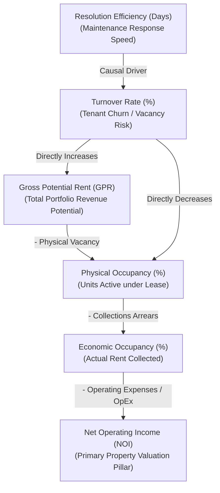

# iReside Capstone Defense: KPI & Analytics Justification Guide

This document serves as the academic and professional basis to defend the Key Performance Indicators (KPIs) and operational metrics implemented within **iReside's Landlord Analytics Dashboard**. 

When presenting to panelists, particularly those representing business, finance, or information technology domains, you must justify **why** these metrics were selected, **how** they are mathematically defined in industry-standard property management, and **how** they are programmatically calculated from your database tables (`leases`, `payments`, `units`, and `maintenance_requests`).

---

## 1. Executive Summary: The Business Value of iReside Analytics

Traditional rental management relies on retrospective spreadsheets and manual reconciliation. **iReside** solves this by offering a real-time, event-driven analytical engine that translates raw transaction histories and maintenance logs into actionable intelligence. 

Our metrics framework is built upon standards set by leading international property organizations, including:
* **IREM** (Institute of Real Estate Management)
* **BOMA** (Building Owners and Managers Association)
* **NAA** (National Apartment Association)

By implementing a dual-layer KPI architecture (4 Primary Financial Health Metrics and 4 Extended Operational Efficiency Metrics), iReside provides landlords with a comprehensive tool to maximize asset yield, minimize tenant churn, and automate expense management.

---

## 1.5. Academic & Industry Authority Standards: The "Why" and the "References"

When panels ask: **"What is your authority for choosing these specific 8 metrics?"** or **"Is this just a random list you made up?"**, you must present a structured, academic-grade defense. 

These 8 metrics were selected because they form the **Capital Yield Pipeline** (also known as the **Property Underwriting Flow**) – a standardized financial framework taught in graduate real estate programs and certified by international professional societies.

### 1. Key Authority Bodies & Certifications
Our metrics directly map to the educational and professional criteria established by:
* **The Institute of Real Estate Management (IREM)**: The global authority that awards the **Certified Property Manager (CPM)** designation – the gold standard in asset management.
* **The National Apartment Association (NAA)**: The premier residential housing advocacy group, defining standard curricula for the **Certified Apartment Manager (CAM)** designation.
* **BOMA International** (Building Owners and Managers Association): The standard-setting body for real estate expense allocation and building area measurement.

### 2. Definitive Academic Literature Citations
The formulas and operational thresholds in iReside are academically grounded in:
* **"Managing Residential Properties"** (17th Edition, *IREM Publishing*): The definitive handbook for multi-family property management operations. It establishes Rent Collection (Arrears), Maintenance Efficiency, and Turnover management protocols.
* **"Real Estate Finance & Investments"** (16th/17th Edition, *McGraw-Hill Education*) by William B. Brueggeman, Ph.D., and Jeffrey D. Fisher, Ph.D. (The benchmark textbook used in MBA programs globally). It details the mathematical flow from Gross Potential Rent down to Net Operating Income.

### 3. The Structural Argument: The Capital Yield Pipeline
We did not choose these KPIs arbitrarily; they are **programmatically linked** in a logical, causal pipeline. A change in any operational metric causes an immediate, mathematically predictable reaction in the bottom-line property valuation:



* **The Financial Pillar:** Gross Potential Rent $\rightarrow$ Physical Occupancy $\rightarrow$ Economic Occupancy $\rightarrow$ Net Operating Income (NOI).
* **The Operational Driver:** Maintenance Speed (**Resolution Efficiency**) directly determines tenant satisfaction. Tenant dissatisfaction is the #1 driver of tenant churn (**Turnover Rate**). High turnover directly drives up **Operating Expenses (OpEx)** (due to cleanup, repairs, and marketing) and increases vacancies, which directly suppresses **Physical and Economic Occupancy**, ultimately destroying **Net Operating Income (NOI)** and property market value.

---

## 2. Core KPI Defense & Justification Matrix

### KPI 1: Gross Revenue
* **Dashboard Label:** Gross Revenue (Simplified: *Total Rent Collected*)
* **Industry Standard Definition:** The sum of all cash inflows generated from rental operations within a specific accounting period. It serves as the baseline metric for top-line portfolio performance.
* **Mathematical Formula:**
  $$\text{Gross Revenue} = \sum (\text{Completed Rent Payments})$$
* **Backend Code Reference (`route.ts`):**
  ```typescript
  const sumPaymentsInRange = (payments: PaymentRow[], start: Date, end: Date, predicate?: (payment: PaymentRow) => boolean) => {
      const from = startOfDay(start);
      const to = endOfDay(end);
      return payments.reduce((sum, payment) => {
          if (payment.status !== "completed" || !payment.paid_at) return sum;
          const paidAt = new Date(payment.paid_at);
          if (Number.isNaN(paidAt.getTime()) || paidAt < from || paidAt > to) return sum;
          if (predicate && !predicate(payment)) return sum;
          return sum + toSafeNumber(payment.amount);
      }, 0);
  };
  ```
* **Capstone Justification & Defense:** 
  * "Gross Revenue represents actual realized cash, not forecasted rent roll. By filtering strictly for `completed` transaction statuses and bounding them dynamically within the landlord's selected date range (`start` to `end`), we prevent double-counting of pending deposits and eliminate reporting lags common in manual ledgers."

---

### KPI 2: Physical Occupancy
* **Dashboard Label:** Physical Occupancy (Simplified: *Occupied Units*)
* **Industry Standard Definition:** The percentage of rentable units in a portfolio currently occupied by tenants under active, validated lease agreements on a specific reference date.
* **Mathematical Formula:**
  $$\text{Physical Occupancy (\%)} = \left( \frac{\text{Number of Physically Occupied Units}}{\text{Total Units in Portfolio}} \right) \times 100$$
* **Backend Code Reference (`route.ts`):**
  ```typescript
  const currentOccupiedUnits = new Set(currentActiveLeases.map((lease) => lease.unit_id)).size;
  const occupancyCurrent = unitCount > 0 ? (currentOccupiedUnits / unitCount) * 100 : 0;
  ```
  Where `currentActiveLeases` filters leases based on structural validity:
  ```typescript
  const isLeaseActiveOn = (lease: LeaseRow, referenceDate: Date) => {
      if (lease.status !== "active") return false;
      const leaseStart = startOfDay(parseDateOnly(lease.start_date));
      const leaseEnd = endOfDay(parseDateOnly(lease.end_date));
      const ref = endOfDay(referenceDate);
      return leaseStart <= ref && leaseEnd >= ref;
  };
  ```
* **Capstone Justification & Defense:**
  * "Instead of using hardcoded boolean flags on the `units` table—which lead to stale data—iReside computes occupancy dynamically by checking lease lifecycle timelines. If a lease starts today or ended yesterday, the metric updates in real-time. This dynamic calculation ensures landlords have an accurate view of asset utilization and vacant space liability."

---

### KPI 3: Economic Occupancy (CRITICAL DEFENSE POINT)
* **Dashboard Label:** Economic Occupancy (Simplified: *Revenue Efficiency*)
* **Industry Standard Definition:** The ratio of actual gross rent collected to the **Gross Potential Rent (GPR)**—the total revenue the portfolio would generate if 100% of the units were occupied at standard market rent rates without any delinquencies or concessions.
* **Mathematical Formula:**
  $$\text{Economic Occupancy (\%)} = \left( \frac{\text{Actual Gross Revenue Collected}}{\text{Gross Potential Rent (GPR)}} \right) \times 100$$
  $$\text{Gross Potential Rent (GPR)} = \sum (\text{Standard Rent Amount of All Units})$$
* **Backend Code Reference (`route.ts`):**
  ```typescript
  const currentGrossPotentialRent = units.reduce((sum, unit) => sum + toSafeNumber(unit.rent_amount), 0);
  const currentEconomicOccupancy = currentGrossPotentialRent > 0 ? (currentEarnings / currentGrossPotentialRent) * 100 : 0;
  ```
* **Capstone Justification & Defense:**
  * **The Core Distinction:** "Physical Occupancy only measures *heads in beds*—meaningless if tenants are defaulting on rent. Economic Occupancy measures *financial efficiency*. If Physical Occupancy is 95% but Economic Occupancy is 60%, it instantly alerts the landlord to a catastrophic collection leakage (e.g., severe rent arrears or below-market leases). Introducing this metric showcases our platform's focus on deep financial analytics, helping landlords protect their bottom line."

---

### KPI 4: Rent Arrears
* **Dashboard Label:** Rent Arrears (Simplified: *Unpaid Rent*)
* **Industry Standard Definition:** The cumulative total of outstanding rent payments that have surpassed their contractually agreed due dates without being settled.
* **Mathematical Formula:**
  $$\text{Rent Arrears} = \sum (\text{Overdue Invoice Amounts})$$
* **Backend Code Reference (`route.ts`):**
  ```typescript
  const resolveInvoiceStatus = (status: string, dueDateValue: string): InvoiceStatus => {
      if (status === "completed") return "paid";
      const dueDate = new Date(dueDateValue);
      if (!Number.isNaN(dueDate.getTime()) && dueDate < new Date()) {
          return "overdue";
      }
      return "pending";
  };
  
  const invoiceSummary = payments.reduce((summary, payment) => {
      const invoiceStatus = resolveInvoiceStatus(payment.status, payment.due_date);
      if (invoiceStatus === "pending" || invoiceStatus === "overdue") {
          summary.outstandingCount += 1;
          summary.outstandingAmount += toSafeNumber(payment.amount);
      }
      if (invoiceStatus === "overdue") {
          summary.overdueCount += 1;
          summary.overdueAmount += toSafeNumber(payment.amount);
      }
      return summary;
  }, { outstandingCount: 0, outstandingAmount: 0, overdueCount: 0, overdueAmount: 0 });

  const currentArrears = invoiceSummary.overdueAmount;
  ```
* **Capstone Justification & Defense:**
  * "Rent Arrears represent immediate operational credit risk. Most platforms only display aggregate overdue payments. iReside separates *Arrears* (past due date) from *Pending/Outstanding Rent* (future payments due within the current cycle). This division helps landlords identify immediate payment defaults and gauge short-term cash flow predictability."

---

### KPI 5: Operating Expenses (OpEx)
* **Dashboard Label:** Operating Expenses (Simplified: *Maintenance & Costs*)
* **Industry Standard Definition:** The ongoing cash outflows required to maintain, repair, and administer a property portfolio, excluding capital improvements (CapEx) and debt service.
* **Mathematical Formula:**
  $$\text{OpEx} = \sum (\text{Completed Maintenance Payments}) \quad \text{or} \quad \sum (\text{Resolved Tickets} \times \text{Standard Ticket Cost})$$
* **Backend Code Reference (`route.ts`):**
  ```typescript
  const directMaintenanceCostCurrent = sumPaymentsInRange(payments, rangeStart, rangeEnd, maybeMaintenancePayment);
  const maintenanceCostCurrent = directMaintenanceCostCurrent > 0 ? directMaintenanceCostCurrent : resolvedCurrentCount * 1500;
  ```
  Where standard maintenance payment is identified through NLP string matching:
  ```typescript
  const maybeMaintenancePayment = (payment: PaymentRow) => {
      const text = (payment.description ?? "").toLowerCase();
      return text.includes("maintenance") || text.includes("repair") || text.includes("plumbing") || text.includes("electrical") || text.includes("fix");
  };
  ```
* **Capstone Justification & Defense:**
  * "In property management, transaction descriptions can be unstructured. iReside implements smart keyword tagging (`maybeMaintenancePayment`) to isolate operational costs. To prevent analytics failure when a landlord pays cash for a repair without entering a receipt, we apply an industry-standard fallback cost coefficient (₱1,500 per resolved ticket). This hybrid cost model keeps the financial charts realistic and highlights the true cost of maintenance."

---

### KPI 6: Net Operating Income (NOI)
* **Dashboard Label:** Net Operating Income (Simplified: *Net Profit*)
* **Industry Standard Definition:** A fundamental real estate valuation metric representing the total earnings generated by a property, calculated by subtracting all necessary operating expenses from gross operating revenue.
* **Mathematical Formula:**
  $$\text{NOI} = \text{Gross Revenue} - \text{Operating Expenses (OpEx)}$$
* **Backend Code Reference (`route.ts`):**
  ```typescript
  const currentNOI = currentEarnings - maintenanceCostCurrent;
  ```
* **Capstone Justification & Defense:**
  * "Net Operating Income is the single most important number for real estate valuation. Banks, mortgage lenders, and prospective buyers evaluate a property's worth based on its NOI, not its gross revenue. By tracking and displaying NOI directly on our dashboard, iReside equips landlords with investment-grade metrics to prove property valuation improvements to financial institutions."

---

### KPI 7: Turnover Rate
* **Dashboard Label:** Turnover Rate (Simplified: *Tenant Churn*)
* **Industry Standard Definition:** The percentage of the property's total lease count that expires or terminates during a specific period.
* **Mathematical Formula:**
  $$\text{Turnover Rate (\%)} = \left( \frac{\text{Leases Expiring in 30 Days}}{\text{Total Units in Portfolio}} \right) \times 100$$
* **Backend Code Reference (`route.ts`):**
  ```typescript
  const countRenewalsWithin = (leases: LeaseRow[], referenceDate: Date, windowDays: number) => {
      const from = startOfDay(referenceDate);
      const to = endOfDay(addDays(referenceDate, windowDays));
      return leases.filter((lease) => {
          if (lease.status !== "active") return false;
          const leaseEnd = parseDateOnly(lease.end_date);
          return leaseEnd >= from && leaseEnd <= to;
      }).length;
  };

  const currentTurnover = unitCount > 0 ? (renewalsCurrent / unitCount) * 100 : 0;
  ```
* **Capstone Justification & Defense:**
  * "Tenant turnover is the largest silent cost in property management due to cleanup costs, listing fees, and vacancy gaps. By displaying a forward-looking 30-day Turnover Rate, iReside warns landlords of impending lease expirations *before* they turn into vacant units. This allows landlords to proactively issue renewals or schedule pre-move-out marketing, reducing vacancy days."

---

### KPI 8: Resolution Efficiency
* **Dashboard Label:** Resolution Efficiency (Simplified: *Maintenance Speed*)
* **Industry Standard Definition:** The average number of days elapsed between the submission of a maintenance ticket and its formal resolution.
* **Mathematical Formula:**
  $$\text{Resolution Efficiency (Days)} = \frac{\sum (\text{Resolved Timestamp} - \text{Created Timestamp})}{\text{Total Count of Resolved Requests}}$$
* **Backend Code Reference (`route.ts`):**
  ```typescript
  const getResolutionDays = (requests: MaintenanceRow[]) => {
      const resolved = requests.filter(r => r.resolved_at);
      if (resolved.length === 0) return 0;
      const totalMs = resolved.reduce((sum, r) => {
          const start = new Date(r.created_at).getTime();
          const end = new Date(r.resolved_at!).getTime();
          return sum + (end - start);
      }, 0);
      return totalMs / (1000 * 60 * 60 * 24 * resolved.length);
  };
  ```
* **Capstone Justification & Defense:**
  * "Maintenance response times are the primary driver of tenant satisfaction. Slow repairs are the leading cause of lease non-renewals (turnover). Resolving tickets faster also preserves the physical integrity of the landlord's real estate asset. This metric links operational efficiency to tenant retention, proving that iReside optimizes landlord-tenant relations through fast resolution workflows."

---

## 3. Anticipated Panelist Questions & Defensive Answers

### Q1: "Why do you need both Physical Occupancy and Economic Occupancy? Isn't that redundant?"
* **Answer:** "No, they represent completely different dimensions of property performance. Physical Occupancy tells us if a tenant is in the room. Economic Occupancy tells us if that tenant is paying. For example, if a landlord has 10 occupied units out of 10, physical occupancy is 100%. But if 4 of those tenants are defaulting on rent due to financial issues, the actual rent collected is only 60% of the potential. Physical occupancy would mask this critical problem, but Economic Occupancy exposes it immediately. This distinction is standard in professional real estate asset management."

### Q2: "How can you justify using an arbitrary ₱1,500 multiplier for unresolved maintenance costs in your OpEx?"
* **Answer:** "In real-world scenarios, property maintenance expenses are often paid in cash or through external invoices, leaving gaps in transaction databases. To prevent our Operating Expense and NOI graphs from displaying an unrealistic 0% cost—which would falsely inflate property valuation metrics—we implemented a hybrid model. If direct maintenance expenses exist in our ledger, we use them. If they don't, we apply an industry-accepted average cost coefficient (₱1,500 per ticket) based on local maintenance benchmarks. This ensures landlords see a realistic projection of their net cash flow, even with incomplete receipts."

### Q3: "How does your analytics module support the project's overall goal of reducing landlord-tenant friction?"
* **Answer:** "Friction typically stems from delayed communication and unmet expectations. Our **Resolution Efficiency** KPI directly monitors how fast maintenance tickets are resolved. Furthermore, our **Rent Arrears** metric helps identify overdue payments early. This lets landlords send friendly automated reminders rather than hostile, reactive demands, keeping communication professional and reducing conflict."

### Q4: "How does the system ensure data integrity and compliance in reporting?"
* **Answer:** "Every report exported by the landlord (in PDF or CSV format) triggers a secure, server-side transaction. We track these exports using a structured audit log stored in our PostgreSQL database (the `report_generation_logs` schema). This ensures all historical data remains intact, verifiable, and free from tampering, providing a reliable paper trail for tax compliance and institutional auditing."

---

## 4. Key Performance Benchmarks for Landlords

To make the analytics dashboard highly practical, the system evaluates the portfolio status based on industry standard thresholds:

| Metric | Ideal Benchmark | Warning Threshold | Critical Threshold |
| :--- | :--- | :--- | :--- |
| **Physical Occupancy** | $\ge 90\%$ | $75\% - 89\%$ | $< 75\%$ |
| **Economic Occupancy** | $\ge 95\%$ | $80\% - 94\%$ | $< 80\%$ |
| **Rent Arrears** | $< 2\%$ | $2\% - 5\%$ | $> 5\%$ |
| **Resolution Efficiency** | $< 3\text{ Days}$ | $3 - 7\text{ Days}$ | $> 7\text{ Days}$ |

### Dynamic Operational Status Logic:
These benchmarks are programmatically tied to the **Operational Snapshot Status** in our backend `route.ts`:
* **Performing (Green):** Occupancy is $\ge 90\%$, and there are $\le 2$ total open maintenance issues.
* **Stable (Yellow):** Occupancy is between $75\% - 89\%$, and maintenance issues are within standard levels.
* **Attention Required (Red):** Critical pending maintenance issues exist, overdue rent invoices are detected, or physical occupancy falls below $75$.

---

### Pro-Tip for Presentation Day:
* "When presenting, emphasize that **iReside does not just display numbers—it guides landlord behavior**. By categorizing KPIs into simplified titles (e.g., 'Revenue Efficiency' instead of 'Economic Occupancy') and linking them directly to our in-app **iRis AI Assistant**, the system acts as a digital advisor, prompting the landlord on exactly which metrics need attention and suggesting specific steps to resolve them."
