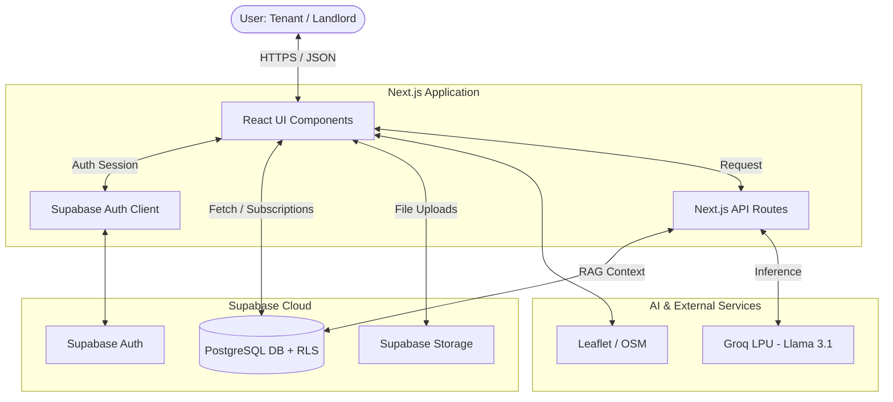
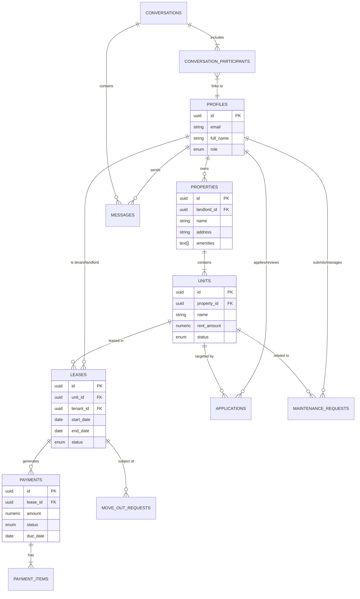

# iReside System Architecture

This document provides a comprehensive overview of the iReside architecture, including high-level system components, data flows, and the database schema.

---

## 🏗️ System Overview (Container Diagram)

iReside follows a modern serverless-first architecture, leveraging **Next.js** for the application layer and **Supabase** for the backend infrastructure.

### Key Components:
- **Next.js App Router**: Handles routing, server-side rendering (SSR), and server-side logic in API routes.
- **Supabase**: 
    - **PostgreSQL**: Stores all relational data with Row Level Security (RLS) ensuring data privacy.
    - **GoTrue (Auth)**: Manages JWT-based authentication and user sessions.
    - **Storage**: Hosts property images, tenant documents, and signatures.
- **Groq Llama 3.1**: Powers the iRis Assistant and Landlord Insights using a high-performance LPU inference engine.

---

## 🗄️ Database Schema (ER Diagram)

The following diagram illustrates the relationships between the core entities in the iReside database.

---

## 🔄 Core Data Flows

### 1. iRis AI Chat Flow (RAG)
1.  **User** sends a message to `/api/iris/chat`.
2.  **API Route** authenticates the user via Supabase.
3.  **Context Engine** fetches relevant data (Lease, Property, Profile) from Postgres.
4.  **Prompt Builder** formats the system prompt with retrieved context.
5.  **Groq API** processes the prompt and returns a response.
6.  **Next.js** returns the AI response to the UI.

### 2. Tenant Application Flow
1.  **Tenant** browses a property and clicks "Apply".
2.  **Application** record is created in `applications` table.
3.  **Supabase Realtime** or a **Trigger** notifies the Landlord.
4.  **Landlord** reviews documents and updates status.
5.  On **Approval**, a **Lease** draft is automatically generated.

---

## 🛡️ Security Architecture
- **Row Level Security (RLS)**: The database is locked down by default. Policies ensure that a tenant can only see *their own* lease, and a landlord can only see applications for *their own* properties.
- **JWT Authorization**: Frontend and API routes verify identity using Supabase-issued tokens.
- **Server-Side Validation**: Critical logic (like payment confirmation or lease signing) is handled in Next.js Server Actions or API routes to prevent client-side tampering.
