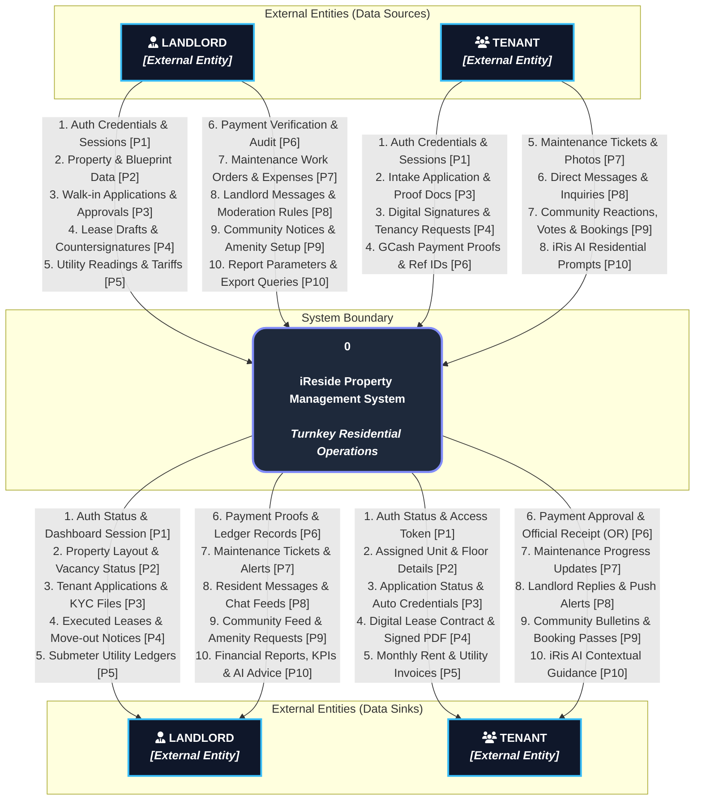
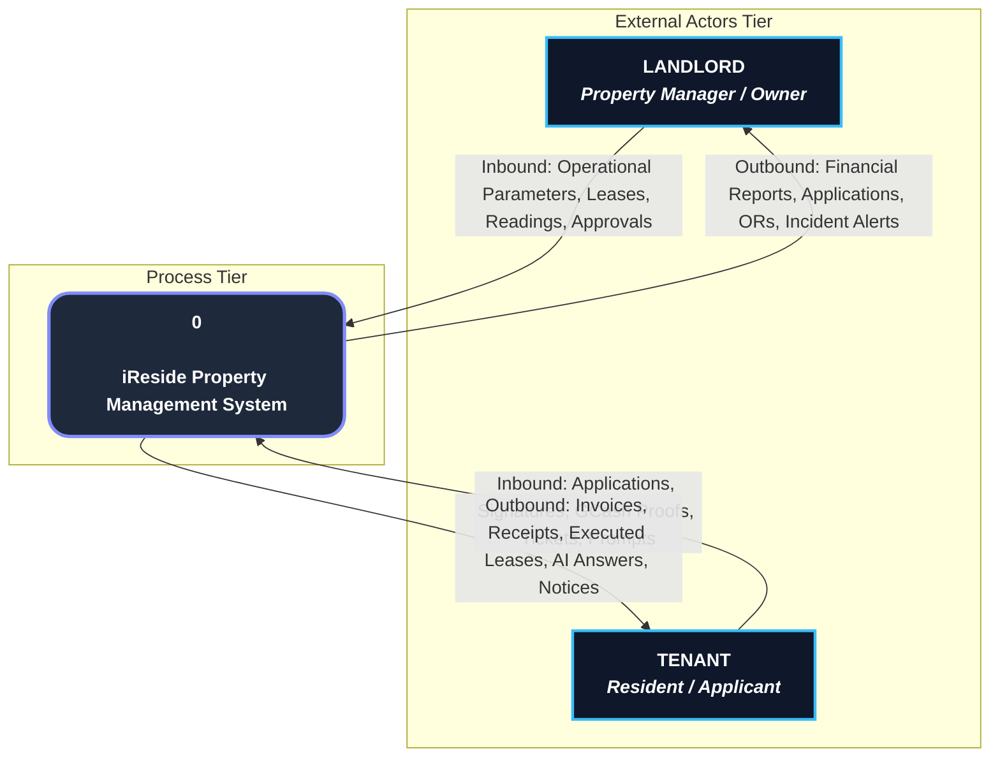

# iReside — Data Flow Diagram (DFD) Level 0 (Context Diagram)
**Model:** Gane and Sarson Notation  
**Orientation:** Hierarchical Downward Flow  
**Target Entities:** Landlord and Tenant *(No Admin external entity)*  
**Standard:** 100% Strict DFD Balancing with Level 1 Processes (P1 to P10)

---

## 1. Executive Summary & Gane-Sarson Modeling Principles

This document defines the official **Level 0 Data Flow Diagram (Context Diagram)** for the **iReside Turnkey Residential Management System**. 

In the Gane and Sarson methodology, the Context Diagram establishes the **system boundary**, treating the entire application as a single central process (**Process 0**) that interfaces with the external environment.

### 1.1 Gane and Sarson Graphical Conventions

| Element | Gane & Sarson Symbol | Representation in iReside DFD Level 0 |
| :--- | :--- | :--- |
| **External Entity** | **Double Square** *(Concentric or shaded boundary)* | **Landlord** and **Tenant**. Sources and sinks of data outside the system boundary. |
| **Central Process** | **Rectangle with Rounded Corners** *(Upper section for ID, lower for label)* | **`0` — iReside Property Management System**. Encapsulates all internal computations, workflows, and data stores. |
| **Data Flow** | **Directed Arrow** with descriptive noun label | Carries structured data packets across the system boundary. |
| **Data Store** | **Open-Ended Rectangle** *(Closed left, open right)* | **Encapsulated inside Process 0** *(Gane-Sarson rule: Data stores only appear in Level 1 and below)*. |

### 1.2 Core Architectural & DFD Rules Adhered To

1. **Strict Entity Boundary:** Only **Landlord** and **Tenant** exist as human external entities. As mandated by project specifications, the system does **not** feature an Admin external entity; platform administrative operations are consolidated within the sovereign Landlord workspace.
2. **Mandatory Processing:** All inbound data flows terminate at Process `0`, and all outbound data flows originate from Process `0`. No direct entity-to-entity flows exist.
3. **Strict Downward Flow:** The diagram flows hierarchically downwards:
   - **Upper Tier:** External Entities as data sources initiating interactions.
   - **Middle Tier:** Process `0` executing all transactions and data transformations.
   - **Lower Tier:** External Entities as data sinks receiving responses, documents, invoices, and alerts.
4. **DFD Balancing (Level 0 $\leftrightarrow$ Level 1):** Every data flow crossing the boundary in Level 0 has a direct 1:1 correspondence with the external input/output flows of processes **P1 through P10** in DFD Level 1.

---

## 2. DFD Level 0 Hierarchical Downward Diagram



---

## 3. High-Level Consolidated Context Diagram View

In standard Gane and Sarson single-node notation (where each external entity is depicted once around the central system), the bidirectional boundary flows are cleanly mapped as follows:



---

## 4. Comprehensive Data Dictionary & Balancing Matrix

This catalog details every data flow depicted on DFD Level 0 and demonstrates exact 1:1 balancing with the underlying **Level 1 System Processes (P1 to P10)**.

### 4.1 Landlord Inbound Data Flows (Sources $\to$ Process 0)

| Flow ID | Data Flow Name | Carried Data Elements / Payload | Destination Process in Level 1 |
| :--- | :--- | :--- | :--- |
| **DF-IN-L01** | `Authentication Credentials` | Landlord email, hashed password, 2FA challenge response, session restore tokens. | **P1: Authenticate & Authorize User** |
| **DF-IN-L02** | `Property & Blueprint Data` | Property title, address, building policies, floor configuration coordinates, unit dimensions, base pricing, amenity definitions. | **P2: Configure Property & Blueprint** |
| **DF-IN-L03** | `Walk-in Applications & Approvals` | Walk-in applicant details, emergency contacts, review decisions (`approved`, `rejected`), tenant account provisioning triggers. | **P3: Process Prospective Intake** |
| **DF-IN-L04** | `Lease Drafts & Countersignatures` | Custom lease clauses, deposit/advance schedule, landlord digital canvas countersignature, signing audit metadata. | **P4: Manage Leases & Contracting** |
| **DF-IN-L05** | `Utility Readings & Tariffs` | Submeter water cubic meter readings, electricity kWh readings, reading cycle dates, per-unit tariff calculations. | **P5: Record Utilities & Batch Invoices** |
| **DF-IN-L06** | `Payment Verification & Manual Entries` | Landlord review verification (`verified`, `rejected`), manual cash collection entries, official receipt confirmation. | **P6: Process Payments & Official Receipts** |
| **DF-IN-L07** | `Maintenance Work Orders & Expenses` | Technician dispatch instructions, ticket status updates (`in_progress`, `completed`), repair cost logs. | **P7: Triage & Dispatch Maintenance** |
| **DF-IN-L08** | `Landlord Messages & Moderation` | Direct 1-on-1 messages to tenants, building broadcast notices, banned keyword moderation settings. | **P8: Facilitate Realtime Chat & Moderation** |
| **DF-IN-L09** | `Community Notices & Amenity Setup` | Property bulletin announcements, amenity schedules, reservation acceptance/rejection decisions. | **P9: Manage Community Bulletin & Amenities** |
| **DF-IN-L10** | `Report Parameters & Export Queries` | Date range selectors (7D, 30D, 90D, 1Y), report type (`P&L`, `Rent Roll`, `Arrears`), export triggers (`CSV`, `PDF`). | **P10: Process iRis AI & Analytics** |

---

### 4.2 Landlord Outbound Data Flows (Process 0 $\to$ Sinks)

| Flow ID | Data Flow Name | Carried Data Elements / Payload | Source Process in Level 1 |
| :--- | :--- | :--- | :--- |
| **DF-OUT-L01** | `Auth Status & Dashboard Session` | Verified JWT session, landlord authorization role, dashboard initialization state. | **P1: Authenticate & Authorize User** |
| **DF-OUT-L02** | `Property Layout & Vacancy Status` | Interactive floor plan models, room occupancy status (`vacant`, `occupied`, `maintenance`), unit list summaries. | **P2: Configure Property & Blueprint** |
| **DF-OUT-L03** | `Tenant Applications & KYC Files` | Applicant profiles, government ID photo URLs, employment/income proofs, tokenized application queue. | **P3: Process Prospective Intake** |
| **DF-OUT-L04** | `Executed Leases & Tenancy Notices` | Signed digital contracts, renewal requests, unit transfer requests, move-out condition forms. | **P4: Manage Leases & Contracting** |
| **DF-OUT-L05** | `Submeter Utility Ledgers` | Historical utility usage summaries, computed consumption charges, unbilled usage alerts. | **P5: Record Utilities & Batch Invoices** |
| **DF-OUT-L06** | `Payment Proofs & Ledger Records` | Uploaded GCash screenshot proofs, transaction reference numbers, real-time rent roll ledger. | **P6: Process Payments & Official Receipts** |
| **DF-OUT-L07** | `Maintenance Tickets & Alerts` | Tenant service tickets, severity priority tags, photo evidence, unit location. | **P7: Triage & Dispatch Maintenance** |
| **DF-OUT-L08** | `Resident Messages & Chat Feeds` | Incoming tenant messages, unread message counts, delivery confirmations, chat history threads. | **P8: Facilitate Realtime Chat & Moderation** |
| **DF-OUT-L09** | `Community Feed & Amenity Requests` | Tenant comments, poll votes, community inquiries, pending facility reservation requests. | **P9: Manage Community Bulletin & Amenities** |
| **DF-OUT-L10** | `Financial Reports, KPIs & AI Advice` | Net operating income, occupancy rate %, overdue receivables summary, AI portfolio suggestions. | **P10: Process iRis AI & Analytics** |

---

### 4.3 Tenant Inbound Data Flows (Sources $\to$ Process 0)

| Flow ID | Data Flow Name | Carried Data Elements / Payload | Destination Process in Level 1 |
| :--- | :--- | :--- | :--- |
| **DF-IN-T01** | `Authentication Credentials` | Resident email, password, invitation token validation codes. | **P1: Authenticate & Authorize User** |
| **DF-IN-T02** | `Intake Application & Proof Docs` | Personal information, emergency contacts, identification card images, monthly income documentation. | **P3: Process Prospective Intake** |
| **DF-IN-T03** | `Digital Signatures & Tenancy Requests` | Biometric/canvas signature vectors, lease renewal submissions, unit transfer notices, move-out requests. | **P4: Manage Leases & Contracting** |
| **DF-IN-T04** | `GCash Payment Proofs & Ref IDs` | GCash transaction screenshot files, reference numbers, payment allocation choices (rent, electricity, water). | **P6: Process Payments & Official Receipts** |
| **DF-IN-T05** | `Maintenance Tickets & Photos` | Issue description, maintenance category, high-resolution damage photographs, tenant availability notes. | **P7: Triage & Dispatch Maintenance** |
| **DF-IN-T06** | `Direct Messages & Inquiries` | Direct resident inquiries to landlord, text content, image attachments. | **P8: Facilitate Realtime Chat & Moderation** |
| **DF-IN-T07** | `Community Reactions, Votes & Bookings`| Comments on bulletins, poll votes, reactions, requested amenity booking time slots. | **P9: Manage Community Bulletin & Amenities** |
| **DF-IN-T08** | `iRis AI Residential Prompts` | Natural language questions regarding lease rules, payment terms, facilities, and property guidelines. | **P10: Process iRis AI & Analytics** |

---

### 4.4 Tenant Outbound Data Flows (Process 0 $\to$ Sinks)

| Flow ID | Data Flow Name | Carried Data Elements / Payload | Source Process in Level 1 |
| :--- | :--- | :--- | :--- |
| **DF-OUT-T01** | `Auth Status & Access Token` | Authenticated tenant session, navigation permissions, redirect to `/tenant/dashboard`. | **P1: Authenticate & Authorize User** |
| **DF-OUT-T02** | `Assigned Unit & Floor Details` | Unit specifications, assigned room number, floor blueprint view, amenity inclusions. | **P2: Configure Property & Blueprint** |
| **DF-OUT-T03** | `Application Status & Auto Credentials`| Application approval notice, auto-provisioned Supabase account credentials. | **P3: Process Prospective Intake** |
| **DF-OUT-T04** | `Digital Lease Contract & Signed PDF` | Digital lease review document, signed contract PDF, countersignature confirmation. | **P4: Manage Leases & Contracting** |
| **DF-OUT-T05** | `Monthly Rent & Utility Invoices` | Itemized billing statement, electric meter kWh consumed, water submeter cu.m breakdown, due dates. | **P5: Record Utilities & Batch Invoices** |
| **DF-OUT-T06** | `Payment Approval & Official Receipt` | Payment verification status, digitally rendered Official Receipt (OR) with payment breakdown. | **P6: Process Payments & Official Receipts** |
| **DF-OUT-T07** | `Maintenance Progress Updates` | Ticket state updates (`reviewing`, `scheduled`, `in_progress`, `resolved`), landlord technician notes. | **P7: Triage & Dispatch Maintenance** |
| **DF-OUT-T08** | `Landlord Replies & Push Alerts` | Direct landlord chat replies, system announcements, overdue payment reminders. | **P8: Facilitate Realtime Chat & Moderation** |
| **DF-OUT-T09** | `Community Bulletins & Booking Passes`| Landlord announcements, community event details, confirmed amenity booking passes. | **P9: Manage Community Bulletin & Amenities** |
| **DF-OUT-T10** | `iRis AI Contextual Guidance` | Groq Cloud AI contextual answers synthesized from active lease conditions and building rules. | **P10: Process iRis AI & Analytics** |

---

## 5. DFD Balancing Verification Matrix (Level 0 vs Level 1)

This matrix validates that **100% of the Level 0 data flows** precisely match the decomposed Level 1 processes:

```
+-----------------------------------------------------------------------------------------+
|                                  DFD BALANCING AUDIT                                    |
+----+-----------------------------------------+--------------------+---------------------+
| ID | Level 1 System Process                  | Level 0 Inbound    | Level 0 Outbound    |
+----+-----------------------------------------+--------------------+---------------------+
| P1 | Authenticate & Authorize User           | DF-IN-L01, T01     | DF-OUT-L01, T01     |
| P2 | Configure Property & Blueprint          | DF-IN-L02          | DF-OUT-L02, T02     |
| P3 | Process Prospective Intake              | DF-IN-L03, T02     | DF-OUT-L03, T03     |
| P4 | Manage Leases & Contracting             | DF-IN-L04, T03     | DF-OUT-L04, T04     |
| P5 | Record Utilities & Batch Invoices       | DF-IN-L05          | DF-OUT-L05, T05     |
| P6 | Process Payments & Official Receipts    | DF-IN-L06, T04     | DF-OUT-L06, T06     |
| P7 | Triage & Dispatch Maintenance           | DF-IN-L07, T05     | DF-OUT-L07, T07     |
| P8 | Facilitate Realtime Chat & Moderation   | DF-IN-L08, T06     | DF-OUT-L08, T08     |
| P9 | Manage Community Bulletin & Amenities   | DF-IN-L09, T07     | DF-OUT-L09, T09     |
| P10| Process iRis AI & Analytics             | DF-IN-L10, T08     | DF-OUT-L10, T10     |
+----+-----------------------------------------+--------------------+---------------------+
| Result: PERFECT BALANCING (No orphaned flows, no black holes, no miracle generations)   |
+-----------------------------------------------------------------------------------------+
```
