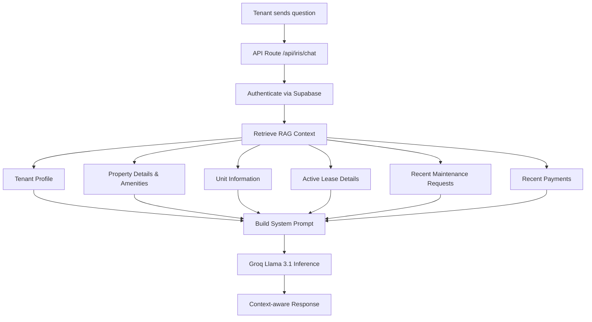
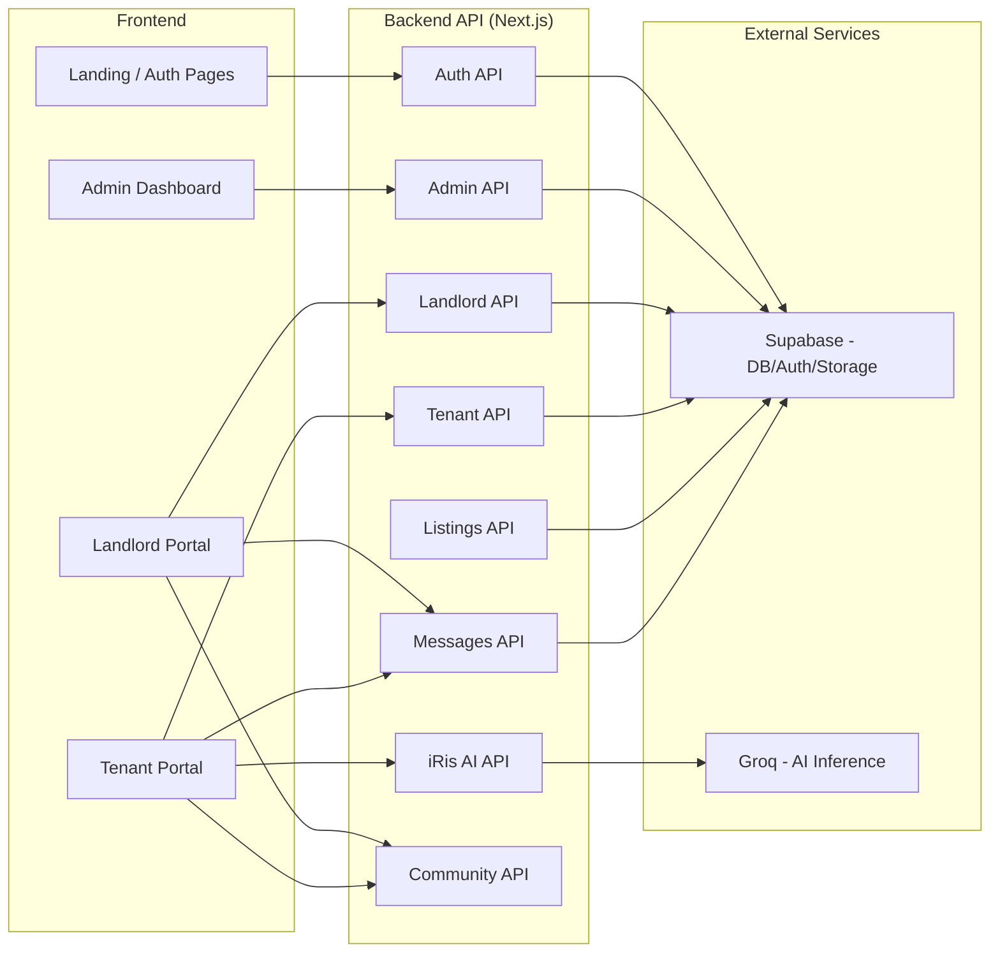
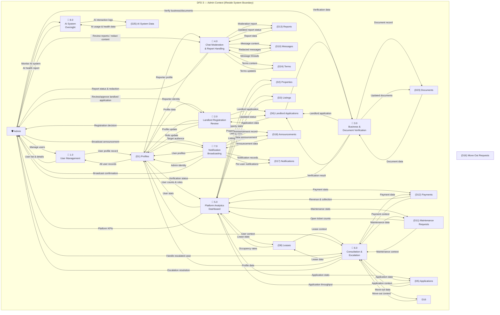

# iReside — Major Functions & Features Overview

## 🎯 System Philosophy & Core Refactor

> [!IMPORTANT]
> **Adviser-Mandated Refactor**: Following the last consultation, the system has been fundamentally refactored. It is no longer a public-facing marketplace (e.g., Airbnb for apartments).
>
> iReside is now an **exclusive deployment system for landlords**:
> - **Deployment-Based Model**: The development team deploys and hands over independent property instances to landlords.
> - **Landlord as Owner & Admin**: Each landlord independently manages their own property deployment (no centralized operator).
> - **Limited Maintenance Scope**: Development team handles only initial deployment, critical security patches, and optional paid updates.
> - **Self-Sufficient Operations**: Landlords operate their properties autonomously after deployment.
> - **No Public Discovery**: There is **no unit listing, searching, or public discovery** of listings/properties/units.

---

## O. Deployment Ownership & Maintenance Boundaries

> [!IMPORTANT]
> **Addressing the Turnover Problem**: Unlike traditional capstone projects with a dedicated institutional client (school, company, barangay), iReside serves generalized landlords—individual property owners who cannot collectively receive a centralized system handover. To resolve this, the project adopts a **Deployment-Based Delivery Model** that establishes clear ownership boundaries while ensuring system viability.

### Deployment Model Overview

The study **does not establish a centralized institutional operator** such as a barangay office, homeowners association, or government agency. Instead, the platform follows a deployment-based delivery model:

| Aspect | Traditional SaaS | iReside Deployment Model |
|--------|------------------|--------------------------|
| **Operator** | Centralized company | Each landlord (individual) |
| **Updates** | Continuous, mandatory | On-request, paid optional |
| **Support** | Dedicated team | Limited scope (see below) |
| **Scaling** | Enterprise-level | Single-property deployment |

### Landlord as Independent Administrator

Upon deployment, **participating landlords become the independent administrators** of their own operational environments:

- **Self-Sufficiency**: Landlords manage their own properties, tenants, and day-to-day operations
- **No Dependency on Development Team**: Once deployed, the system operates independently
- **Local Ownership**: Each property deployment is isolated and autonomously managed

### Development Team Responsibilities (Limited Scope)

The development team's obligations are **strictly bounded** to:

| Responsibility | Scope | Description |
|----------------|-------|-------------|
| **Initial Deployment** | ✅ Included | Provisioning and setting up the system for the landlord |
| **Critical Security Updates** | ✅ Included | Patching vulnerabilities that could compromise tenant data |
| **Optional Paid Updates** | ⚠️ Paid Add-on | Feature enhancements or customizations requested by the landlord |
| **Bug Fixes (Deployment Defects)** | ✅ Included | Errors introduced during initial deployment |

### What's Outside Scope

The study explicitly **does not evaluate or provide**:

- ❌ Continuous feature development after deployment
- ❌ Large-scale operational staffing or enterprise support teams
- ❌ Long-term commercial SaaS operations model
- ❌ Enterprise-level customer support infrastructure
- ❌ Nationwide deployment scalability testing
- ❌ Centralized platform maintenance beyond security patches

### Paid Update Model (Sustainability)

Landlords may request **optional paid services** subject to separate arrangements:

- Custom feature development
- Additional property deployments
- Advanced analytics or integrations
- Priority support tickets

This model ensures:
1. **No ongoing free support burden** on the development team
2. **Sustainable maintenance pathway** for landlords needing custom work
3. **Clear boundaries** between deployment obligations and extended services

### Panel Defense Summary

> [!TIP]
> **For Panelists**: If questioned about turnover, ownership, or maintenance:
>
> 1. **The "Generalized Client" Problem**: Unlike a school or company, landlords are not a single entity—they cannot collectively receive a centralized system
> 2. **Solution**: Each landlord receives their own independently operated deployment
> 3. **Development Team Role**: One-time deployment + security maintenance only
> 4. **Sustainability**: Optional paid updates provide a path for extended services without perpetual obligation
> 5. **No "Abandoned System" Risk**: Critical security patches remain the development team's responsibility

---

## 🏗️ Architecture & Tech Stack

| Layer | Technology |
|---|---|
| **Framework** | Next.js 16 (App Router) + TypeScript |
| **Frontend** | React 19, Tailwind CSS 4, Radix UI, Framer Motion |
| **Backend / DB** | Supabase (PostgreSQL, Auth, Real-time, Storage) |
| **AI Intelligence** | Groq Llama 3.1 8B via OpenAI SDK (RAG-powered) |
| **Drag & Drop** | @dnd-kit/core + @dnd-kit/utilities |
| **Security** | Supabase Auth + Row-Level Security (RLS) |

---

## 👤 User Roles & Their Functions

The system serves **3 distinct user roles** (plus the development team as temporary Super Admin during deployment):

> [!NOTE]
> **Super Administrator Role**: During the initial deployment phase, the development team acts as Super Administrator to provision the landlord's environment. Post-deployment, this role may be transferred to a designated landlord administrator or retained by the development team for security oversight.

### 1. 🛡️ Super Administrator (Development Team)

| Function | Description |
|---|---|
| **Live Metrics Dashboard** | View real-time KPIs: Total Users, Properties, Leases, Pending Reviews |
| **Registration Pipeline** | Monitor application flow (Pending → Reviewing → Approved) |
| **User Management** | Role-specific filter pills (All, Tenant, Landlord, Admin), combined search + filter |
| **Registration Review** | Status filter tabs, detailed review modals, document/photo inspection |
| **Application Processing** | Add internal admin notes, update status with icon-coded badges |
| **Secure Sign-out** | Destructive sign-out from administrator sidebar |

### 2. 🏠 Landlord

#### Dashboard & Analytics
| Function | Description |
|---|---|
| **AI-Driven KPI Insights** | AI-generated performance summaries |
| **Simplified / Detailed Mode** | Toggle between overview and detailed analytics |
| **Primary KPIs** | Earnings, Active Tenants, Occupancy Rate, Pending Issues |
| **Extended KPIs** | Maintenance Cost, Lease Renewals, Portfolio Value |
| **Featured Property Analytics** | Total Sales, Views, MOM Growth, Occupancy Rate |
| **Date Range Filtering** | Presets (7D, 30D, 90D, 1Y) + custom start/end dates |
| **PDF Report Generation** | iReside-branded reports for portfolio performance |
| **CSV Export** | Downloadable data for auditing |
| **Export History** | Chronological log of all generated reports |

#### Modular Floor Planner (Visual Builder)
| Function | Description |
|---|---|
| **Drag-and-Drop Builder** | Structural engine for designing property layouts |
| **Grid Snapping** | Precise 20px grid alignment system |
| **Interactive Manipulation** | Position corridors, units, and room spaces |
| **Real-Time Save** | Persistent state saved to Supabase backend |

#### Property & Tenant Management
| Function | Description |
|---|---|
| **Maintenance Dashboard** | Track all repair tickets with priority status |
| **Maintenance Gallery** | Multi-image galleries and descriptions per ticket |
| **Lease Tracking** | Monitor active lease progress with live charts |
| **Document Vault** | Store master agreements, reports, amendments |
| **Renewal Eligibility** | Dynamic calculation of renewal windows |
| **Tenant Communication** | Direct messaging + one-click calling |
| **Financial Ledger** | Monitor overdue/pending invoices |
| **Payment Breakdowns** | View Base Rent, Water, Electricity components |
| **Invoice Management** | Create and track invoices |
| **Community Board** | Manage building community posts |

### 3. 🏢 Tenant

#### Residency Management
| Function | Description |
|---|---|
| **Digital Lease Signing** | Signature-ready digital leases |
| **Document Vault** | Access signed reports and amendments |
| **Lease Overview** | View lease details, terms, and status |
| **Unit Map (Read-Only)** | Visual representation of building layout |
| **Unit Transfer Requests** | Request transfer to vacant units from the unit map |
| **Move-Out Requests** | Submit move-out requests digitally |

#### Maintenance & Payments
| Function | Description |
|---|---|
| **Maintenance Requests** | Submit tickets with image uploads |
| **Repair Ticket Tracking** | Real-time status updates |
| **Financial Ledger** | View monthly dues and balances |
| **Payment History** | Chronological transaction logs |

#### Communication
| Function | Description |
|---|---|
| **Messaging Portal** | Real-time chat with landlord (typing indicators, read receipts) |
| **File/Media Sharing** | Send and receive files in conversation threads |
| **iRis AI Assistant** | Context-aware AI chatbot for building support |
| **Natural Language Queries** | Ask about amenities, rules, lease details via RAG |

#### Onboarding & Tours
| Function | Description |
|---|---|
| **Product Tours** | Interactive guided tours for Dashboard, Messages, Lease, Community |
| **Onboarding Flow** | Step-by-step introduction for new tenants |

---

## 🏘️ Community Hub (Shared Module)

The Community Hub is a centralized space for building-wide engagement, shared by both Landlords and Tenants with role-based capabilities.

#### Post Types & Creation
| Function | Description |
|---|---|
| **Discussion Posts** | Text-based community threads |
| **Photo Albums** | Image galleries (up to 4 photos) for visual updates |
| **Resident Polls** | Create and participate in interactive community polls |
| **Management Notices** | Pinned announcements for building-wide updates |
| **Utility Alerts** | Auto-styled notifications for water/power/maintenance outages |

#### Engagement & Interaction
| Function | Description |
|---|---|
| **Multi-Reactions** | Like, Heart, Thumbs Up, Clap, and Celebration reactions |
| **Threaded Comments** | Real-time discussion threads on any community post |
| **Post Saving** | Bookmark important discussions for quick access |
| **Content Reporting** | User-driven moderation for spam or harassment |

#### Management & Moderation (Landlords/Admins Only)
| Function | Description |
|---|---|
| **Approval Queue** | Review and approve/reject resident posts before they go live |
| **Property Filtering** | View and manage community content for specific buildings |
| **Moderation Dashboard** | Centralized tab for handling pending resident content |

---

## 🤖 iRis AI Assistant (Key Feature)

The **iRis** AI assistant is a standout feature powered by **Groq Llama 3.1 8B** with RAG capabilities:

- **Full-page chat interface** + **Floating chat widget**
- **Conversation history** support
- **Zero-cost inference** via Groq's free tier
- **Content moderation** with toxic content filtering

---

## 📨 Messaging System

- Real-time landlord ↔ tenant messaging
- Typing indicators and status tracking
- File and media sharing within threads
- AI-powered message moderation
- Contacts sidebar with conversation management

---

## 🔐 Cross-Cutting Concerns (All Users)

| Concern | Implementation |
|---|---|
| **Authentication** | Supabase Auth (secure login/logout) |
| **Data Isolation** | Database-level Row-Level Security (RLS) |
| **AI Moderation** | Real-time toxic content filtering |
| **UI Transitions** | Framer Motion animations |
| **Loading States** | Skeleton loaders for data-heavy views |
| **Typography** | Geist + Rethink Sans fonts |
| **Responsive Design** | Mobile-responsive across all modules |

---

## 📂 System Module Map

---

## 📊 Summary by the Numbers

| Metric | Count |
|---|---|
| **User Roles** | 3 (Super Admin, Landlord, Tenant) |
| **Frontend Modules** | 4 (Auth, Admin, Landlord, Tenant) |
| **API Domains** | 12+ (auth, admin, landlord, tenant, listings, messages, iris, community, etc.) |
| **Landlord Features** | 24 specific capabilities |
| **Tenant Features** | 12 specific capabilities |
| **Community Features** | 12 core engagement capabilities |
| **Admin Features** | 13 specific capabilities |
| **AI Capabilities** | RAG, chat, content moderation |

---

## 📋 Deployment Model Summary

| Deployment Aspect | Value |
|---|---|
| **Delivery Model** | Deployment-Based (not centralized SaaS) |
| **Post-Deployment Operator** | Individual Landlord (independent) |
| **Development Team Role** | Limited: Deployment + Security + Paid Updates |
| **Ongoing Feature Updates** | Optional paid add-ons only |
| **Client Generalization Solution** | Per-landlord deployment handover |

---

## 🎓 For the Panel: Key Points to Remember

1. **The Problem**: Landlords are generalized clients—they cannot collectively receive a centralized system handover (unlike a school or company that would be the sole client)

2. **The Solution**: Deployment-Based Delivery—each landlord receives their own independently operated instance

3. **Development Team Boundaries**:
   - ✅ Deploy the system
   - ✅ Security patches (critical)
   - ✅ Optional paid customizations

4. **Sustainability**: Paid update model ensures extended services are available without perpetual obligation

5. **No Abandoned System Risk**: Security maintenance remains the development team's responsibility

---

## 📐 DFD Level 1 — Data Flow Diagrams (Gane & Sarson Model)

> [!NOTE]
> **Notation**: The following DFDs follow the Gane & Sarson model:
> - **Rectangles** = External Entities (Tenant, Landlord, Admin)
> - **Circles/Rounded shapes** = Processes (1.0, 2.0, 3.0…)
> - **Open rectangles (parallel lines)** = Data Stores (D1, D2, D3…)
> - **Arrows with labels** = Data Flows
>
> **External Entities**: Only three exist — **Tenant**, **Landlord**, and **Admin**. There are no other external entities (e.g., iRis AI is an internal process, not an external entity).
>
> **DFD numbering**: Each DFD diagram starts its process numbering at **1.0**. Data stores use global D1–D25 IDs.

---

### DFD 1 — Tenant Context

```mermaid
graph TD
    subgraph "DFD 1 — Tenant Context (iReside System Boundary)"
        %% External Entities
        TE["👤 Tenant"]

        %% Data Stores
        D1["(D1) Profiles"]
        D2["(D2) Properties"]
        D3["(D3) Listings"]
        D4["(D4) Units"]
        D5["(D5) Applications"]
        D7["(D7) Invoices"]
        D8["(D8) Leases"]
        D9["(D9) Geo Locations"]
        D10["(D10) Messages"]
        D11["(D11) Maintenance Requests"]
        D12["(D12) Payments"]
        D13["(D13) Reports"]
        D14["(D14) Saved Properties"]
        D15["(D15) Lease Renewals"]
        D16["(D16) Move Out Requests"]
        D17["(D17) Notifications"]
        D18["(D18) Announcements"]
        D19["(D19) Amenity Bookings"]

        %% Process 1.0 — Property Search & Discovery
        P1["🔵 1.0\nProperty Search\n& Discovery"]
        P1 -->|"Property listings & details"| D3
        P1 -->|"Property data"| D2
        P1 -->|"Unit information"| D4
        P1 -->|"Saved listing record"| D14
        P1 -->|"Geo-location data"| D9
        D3 -->|"Display listings"| P1
        D2 -->|"Display property details"| P1
        D4 -->|"Display unit data"| P1
        D14 -->|"Retrieve saved listings"| P1
        D9 -->|"Map data"| P1
        P1 -->|"Browse requests"| TE
        TE -->|"Search & browse"| P1

        %% Process 2.0 — Rental Application
        P2["🔵 2.0\nRental Application"]
        P2 -->|"Tenant profile data"| D1
        P2 -->|"Application record"| D5
        P2 -->|"Unit reference"| D4
        P2 -->|"Create/update application"| D5
        D1 -->|"Tenant identity"| P2
        D4 -->|"Applied unit"| P2
        TE -->|"Submit application"| P2
        P2 -->|"Application submitted"| TE

        %% Process 3.0 — Lease Signing
        P3["🔵 3.0\nLease Signing"]
        P3 -->|"Retrieve lease data"| D8
        P3 -->|"Unit reference"| D4
        P3 -->|"Update lease status"| D8
        P3 -->|"Renewal record"| D15
        P3 -->|"Retrieve renewal data"| D15
        D8 -->|"Lease details & status"| P3
        D4 -->|"Associated unit"| P3
        P3 -->|"Lease document"| TE
        TE -->|"Sign lease"| P3
        P3 -->|"Signature recorded"| D8
        P3 -->|"Renewal offer/response"| D15

        %% Process 4.0 — Payment Management
        P4["🔵 4.0\nPayment Management"]
        P4 -->|"Invoice data"| D7
        P4 -->|"Lease link"| D8
        P4 -->|"Payment record"| D12
        P4 -->|"Update payment status"| D12
        D7 -->|"Outstanding invoices"| P4
        D8 -->|"Lease reference"| P4
        D12 -->|"Payment history"| P4
        P4 -->|"Invoice & payment status"| TE
        TE -->|"Make payment"| P4

        %% Process 5.0 — Maintenance Requests
        P5["🔵 5.0\nMaintenance Requests"]
        P5 -->|"Tenant profile"| D1
        P5 -->|"Unit reference"| D4
        P5 -->|"Maintenance record"| D11
        P5 -->|"Update request status"| D11
        D1 -->|"Requester identity"| P5
        D4 -->|"Affected unit"| P5
        P5 -->|"Request submitted"| TE
        TE -->|"Submit maintenance ticket"| P5

        %% Process 6.0 — Move-Out Management
        P6["🔵 6.0\nMove-Out\nManagement"]
        P6 -->|"Move-out record"| D16
        P6 -->|"Lease reference"| D8
        P6 -->|"Unit reference"| D4
        P6 -->|"Update move-out status"| D16
        D16 -->|"Move-out request data"| P6
        D8 -->|"Active lease"| P6
        D4 -->|"Associated unit"| P6
        P6 -->|"Move-out status"| TE
        TE -->|"Initiate move-out"| P6

        %% Process 7.0 — Messaging & Communication
        P7["🔵 7.0\nMessaging &\nCommunication"]
        P7 -->|"Message threads"| D10
        P7 -->|"Reporter identity"| D1
        P7 -->|"Moderation report"| D13
        P7 -->|"Notifications"| D17
        P7 -->|"Retrieve notifications"| D17
        D10 -->|"Conversation history"| P7
        D1 -->|"Sender/receiver identity"| P7
        P7 -->|"Messages & notifications"| TE
        TE -->|"Send message / file report"| P7

        %% Process 8.0 — Dashboard & Profile
        P8["🔵 8.0\nDashboard &\nProfile"]
        P8 -->|"Lease summary"| D8
        P8 -->|"Invoice summary"| D7
        P8 -->|"Maintenance summary"| D11
        P8 -->|"Announcements"| D18
        P8 -->|"Amenity bookings"| D19
        P8 -->|"Profile update"| D1
        P8 -->|"Profile data"| D1
        D8 -->|"Lease status"| P8
        D7 -->|"Payment due"| P8
        D11 -->|"Open requests"| P8
        D18 -->|"Announcements"| P8
        D19 -->|"Booking confirmations"| P8
        P8 -->|"Dashboard overview"| TE
        TE -->|"Update profile / book amenity"| P8
    end
```

#### DFD 1 — Tenant: Process Descriptions

**Process 1.0 — Property Search & Discovery.** The Tenant browses or searches for available properties and units. The system retrieves data from D3 (Listings) to display published listings with pricing and status, D2 (Properties) to show property details, descriptions, amenities, photos, and geolocation, and D4 (Units) to display individual unit information. The Tenant may save properties of interest, creating an entry in D14 (Saved Properties). Property geolocation data is sourced from D9 (Geo Locations) to support map-based discovery.

**Process 2.0 — Rental Application.** The Tenant submits a rental application for a specific unit. This process creates a new record in D5 (Applications), capturing the Tenant's profile information from D1 (Profiles), the applied unit from D4 (Units), and intended lease terms. The application lifecycle (pending → reviewing → approved / rejected / withdrawn) is tracked within D5 (Applications).

**Process 3.0 — Lease Signing.** Once an application is approved, the Tenant views and signs the lease agreement. The system retrieves lease details from D8 (Leases), which stores terms, start and end dates, rent amount, and signature status. The Tenant's signature is recorded, updating the lease status to `pending_landlord_signature` until the landlord countersigns. If a renewal is offered, the Tenant can initiate or accept a renewal, creating a record in D15 (Lease Renewals).

**Process 4.0 — Payment Management.** The Tenant views invoices and makes rent payments. The system retrieves invoice records from D7 (Invoices), which is linked to the Tenant's active lease in D8 (Leases). Payments initiated by the Tenant create records in D12 (Payments), capturing the amount, payment method, and status (pending → processing → completed / failed / refunded). The Tenant can submit payment proof and request refunds, both updating records in D12 (Payments).

**Process 5.0 — Maintenance Requests.** The Tenant submits maintenance or repair requests for their unit. This process creates a record in D11 (Maintenance Requests), capturing the issue description, priority level (low, medium, high, urgent), and status (open → in_progress → resolved → closed). The Tenant can upload supporting media and track the status of open requests. The process associates the request with the correct unit by accessing D4 (Units) and identifies the requester via D1 (Profiles).

**Process 6.0 — Move-Out Management.** The Tenant initiates a move-out request when departing the property. This creates a record in D16 (Move Out Requests). The Tenant completes a move-out checklist — inventoried items, cleaning status, and utility readings — all stored in D16 (Move Out Requests). The process links to D8 (Leases) to identify the active lease being terminated and to D4 (Units) to associate the correct unit.

**Process 7.0 — Messaging & Communication.** The Tenant sends and receives messages with their landlord through the platform. Messages are stored in D10 (Messages), with conversations linked between the Tenant and landlord via D1 (Profiles). The Tenant can report inappropriate messages, creating a record in D13 (Reports) for admin moderation. Notifications received by the Tenant are stored in D17 (Notifications) and retrieved by this process.

**Process 8.0 — Dashboard & Profile.** The Tenant views a personal dashboard summarizing lease status, outstanding payments, active maintenance requests, and community announcements. This process aggregates data from D8 (Leases), D7 (Invoices), D11 (Maintenance Requests), and D18 (Announcements). The Tenant can also manage their own profile, updating records in D1 (Profiles). This process also supports booking of shared amenities, creating records in D19 (Amenity Bookings) linked to the Tenant's unit in D4 (Units).

---

### DFD 2 — Landlord Context

```mermaid
graph TD
    subgraph "DFD 2 — Landlord Context (iReside System Boundary)"
        %% External Entities
        LD["🏠 Landlord"]

        %% Data Stores
        D1["(D1) Profiles"]
        D2["(D2) Properties"]
        D3["(D3) Listings"]
        D4["(D4) Units"]
        D5["(D5) Applications"]
        D7["(D7) Invoices"]
        D8["(D8) Leases"]
        D9["(D9) Geo Locations"]
        D11["(D11) Maintenance Requests"]
        D12["(D12) Payments"]
        D15["(D15) Lease Renewals"]
        D16["(D16) Move Out Requests"]
        D17["(D17) Notifications"]
        D20["(D20) Expenses"]
        D21["(D21) Landlord Reviews"]
        D22["(D22) Inquiries"]

        %% Process 1.0 — Property & Unit Management
        P1["🔵 1.0\nProperty &\nUnit Management"]
        P1 -->|"Property record"| D2
        P1 -->|"Unit record"| D4
        P1 -->|"Geo-location data"| D9
        D2 -->|"Property details"| P1
        D4 -->|"Unit status"| P1
        P1 -->|"Property/Unit data"| LD
        LD -->|"Manage properties/units"| P1

        %% Process 2.0 — Listing Management
        P2["🔵 2.0\nListing Management"]
        P2 -->|"Listing record"| D3
        P2 -->|"Property reference"| D2
        D3 -->|"Listing status & metrics"| P2
        D2 -->|"Property for listing"| P2
        P2 -->|"Listing visibility"| LD
        LD -->|"Publish/pause listing"| P2

        %% Process 3.0 — Tenant Application Processing
        P3["🔵 3.0\nTenant Application\nProcessing"]
        P3 -->|"Application data"| D5
        P3 -->|"Applicant profile"| D1
        P3 -->|"Applied unit"| D4
        P3 -->|"Payment data"| D12
        D5 -->|"Application records"| P3
        D1 -->|"Applicant info"| P3
        D4 -->|"Applied unit"| P3
        P3 -->|"Application status"| LD
        LD -->|"Review/approve/reject application"| P3

        %% Process 4.0 — Lease Creation & Signing
        P4["🔵 4.0\nLease Creation\n& Signing"]
        P4 -->|"Lease record"| D8
        P4 -->|"Renewal record"| D15
        P4 -->|"Application reference"| D5
        P4 -->|"Unit reference"| D4
        P4 -->|"Tenant profile"| D1
        D8 -->|"Lease details & status"| P4
        D15 -->|"Renewal data"| P4
        P4 -->|"Lease document"| LD
        LD -->|"Create/sign lease"| P4
        P4 -->|"Signed lease"| D8

        %% Process 5.0 — Tenant Management
        P5["🔵 5.0\nTenant Management"]
        P5 -->|"Tenant profile"| D1
        P5 -->|"Lease data"| D8
        P5 -->|"Unit data"| D4
        D1 -->|"Tenant profiles"| P5
        D8 -->|"Active leases"| P5
        P5 -->|"Tenant management actions"| LD
        LD -->|"Manage tenants"| P5

        %% Process 6.0 — Payment & Invoice Management
        P6["🔵 6.0\nPayment &\nInvoice Management"]
        P6 -->|"Invoice record"| D7
        P6 -->|"Payment data"| D12
        P6 -->|"Expense record"| D20
        P6 -->|"Lease reference"| D8
        D7 -->|"Invoice data"| P6
        D12 -->|"Payment records"| P6
        D8 -->|"Lease reference"| P6
        P6 -->|"Invoice & payment status"| LD
        LD -->|"Manage invoices/expenses"| P6

        %% Process 7.0 — Maintenance Request Handling
        P7["🔵 7.0\nMaintenance\nRequest Handling"]
        P7 -->|"Maintenance record"| D11
        P7 -->|"Unit reference"| D4
        P7 -->|"Property reference"| D2
        D11 -->|"Request data"| P7
        D4 -->|"Affected unit"| P7
        P7 -->|"Maintenance status"| LD
        LD -->|"Handle maintenance request"| P7

        %% Process 8.0 — Move-Out Processing
        P8["🔵 8.0\nMove-Out\nProcessing"]
        P8 -->|"Move-out record"| D16
        P8 -->|"Lease reference"| D8
        P8 -->|"Unit update"| D4
        P8 -->|"Landlord review"| D21
        D16 -->|"Move-out request"| P8
        D8 -->|"Active lease"| P8
        D4 -->|"Unit status"| P8
        P8 -->|"Move-out decision"| LD
        LD -->|"Review/approve move-out"| P8
        P8 -->|"Updated unit status"| D4

        %% Process 9.0 — Analytics & Inquiries
        P9["🔵 9.0\nAnalytics &\nInquiries"]
        P9 -->|"Listing metrics"| D3
        P9 -->|"Payment data"| D12
        P9 -->|"Lease data"| D8
        P9 -->|"Maintenance data"| D11
        P9 -->|"Inquiry data"| D22
        D3 -->|"Views & leads"| P9
        D12 -->|"Collection rates"| P9
        D8 -->|"Occupancy data"| P9
        D11 -->|"Request metrics"| P9
        P9 -->|"Analytics & inquiry responses"| LD
        LD -->|"View analytics / respond to inquiries"| P9
    end
```

#### DFD 2 — Landlord: Process Descriptions

**Process 1.0 — Property & Unit Management.** The Landlord creates and manages properties and their individual units. When adding a new property, the Landlord submits details — name, address, city, district, property type, description, amenities, photos, and geolocation — which are stored in D2 (Properties). The Landlord then creates units within a property, stored in D4 (Units), each with a status of vacant, occupied, or maintenance. The Landlord can update property information, manage unit statuses, and associate geolocation data through D9 (Geo Locations). This process reads from and writes to D2 (Properties), D4 (Units), and D9 (Geo Locations).

**Process 2.0 — Listing Management.** The Landlord publishes, pauses, or updates property listings to make them visible to searching tenants. Listing records in D3 (Listings) capture the title, description, price, status (draft, published, paused), view counts, and lead counts. The Landlord can track listing performance metrics stored within D3 (Listings). This process reads from D2 (Properties) to associate the listing with the correct property and writes to D3 (Listings).

**Process 3.0 — Tenant Application Processing.** The Landlord receives, reviews, and acts on rental applications submitted by prospective tenants. The system retrieves application records from D5 (Applications), which include the applicant's profile from D1 (Profiles), the applied unit from D4 (Units), and intended lease terms. The Landlord can approve, reject, or request changes to an application. Walk-in applications are also processed here, creating new records in D5 (Applications). Upon approval, the process triggers Process 4.0 (Lease Creation & Signing). This process reads from D5 (Applications), D1 (Profiles), D4 (Units), and D12 (Payments), and writes to D5 (Applications).

**Process 4.0 — Lease Creation & Signing.** The Landlord creates lease agreements for approved applications. Lease details are stored in D8 (Leases). The Landlord signs first (updating the signature status to `pending_tenant_signature`), then sends a signing link to the Tenant. Once both parties sign, the lease transitions to `active`. The Landlord can manage lease renewals (creating records in D15 (Lease Renewals)). This process reads from D5 (Applications), D4 (Units), and D1 (Profiles), and writes to D8 (Leases) and D15 (Lease Renewals).

**Process 5.0 — Tenant Management.** The Landlord views and manages their active tenants on an ongoing basis. The system retrieves tenant information from D1 (Profiles), linked through D8 (Leases) which associates each tenant with their unit and property. The Landlord can view a tenant's activity history, payment history, and full profile details. The Landlord may also manually onboard a tenant by creating a profile record in D1 (Profiles) with role set to tenant. This process reads from D1 (Profiles), D8 (Leases), and D4 (Units), and writes to D1 (Profiles).

**Process 6.0 — Payment & Invoice Management.** The Landlord monitors rent collection and manages invoices and expenses. The system retrieves payment records from D12 (Payments), linked to tenant leases in D8 (Leases) and invoices in D7 (Invoices). The Landlord can create invoices, review payment submissions, mark payments as refunded, and send reminders. A monthly billing cycle automatically generates invoices stored in D7 (Invoices). The Landlord records property expenses in D20 (Expenses). This process reads from D12 (Payments), D7 (Invoices), and D8 (Leases), and writes to D7 (Invoices) and D20 (Expenses).

**Process 7.0 — Maintenance Request Handling.** The Landlord receives and responds to maintenance requests filed by tenants. The system retrieves requests from D11 (Maintenance Requests), linked to the relevant unit in D4 (Units) and property in D2 (Properties). The Landlord can update request status (mark as in_progress or resolved), add internal notes, and review any media submitted by the Tenant. Priority levels help the Landlord triage and schedule responses. This process reads from D11 (Maintenance Requests), D4 (Units), and D2 (Properties), and writes to D11 (Maintenance Requests).

**Process 8.0 — Move-Out Processing.** The Landlord reviews and acts on tenant move-out requests. The system retrieves move-out requests from D16 (Move Out Requests), linked to the lease in D8 (Leases) and the unit in D4 (Units). The Landlord can approve, deny, or mark a move-out as completed. Upon completion, the unit's status in D4 (Units) is updated to `vacant`, making it available for new tenants. The Landlord may also leave a review of the departing Tenant, stored in D21 (Landlord Reviews). This process reads from D16 (Move Out Requests), D8 (Leases), and D4 (Units), and writes to D16 (Move Out Requests), D4 (Units), and D21 (Landlord Reviews).

**Process 9.0 — Analytics & Inquiries.** The Landlord accesses analytics dashboards showing property and portfolio performance. The system aggregates data from D3 (Listings) — views and leads — D12 (Payments) — collection rates — D8 (Leases) — occupancy rates — and D11 (Maintenance Requests) — response times. The Landlord also receives property-specific inquiries from prospective tenants, stored in D22 (Inquiries), which the Landlord can review and respond to. This process reads from D3 (Listings), D12 (Payments), D8 (Leases), D11 (Maintenance Requests), and D22 (Inquiries), and writes to D22 (Inquiries).

---

### DFD 3 — Admin Context

#### DFD 3 — Admin: Process Descriptions

**Process 1.0 — User Management.** The Admin manages all user accounts on the platform across all roles. The system retrieves user records from D1 (Profiles), which stores each user's email, full name, phone number, role (tenant, landlord, admin), and avatar URL. The Admin can view all users, filter by role, update account details, or suspend accounts. This process reads from D1 (Profiles) and writes to D1 (Profiles).

**Process 2.0 — Landlord Registration Review.** Prospective landlords must be approved by the Admin before gaining full platform access. The Admin reviews records in D6 (Landlord Applications), which store the applicant's business name, business type, registered address, and supporting business documents. The Admin can approve or reject the application, updating the status in D6 (Landlord Applications). Upon approval, the applicant's role in D1 (Profiles) is updated to `landlord`, granting them access to landlord features. The Admin can also revert a registration or sync permit card data. This process reads from D6 (Landlord Applications) and D1 (Profiles), and writes to D6 (Landlord Applications) and D1 (Profiles).

**Process 3.0 — Business & Document Verification.** The Admin verifies landlord business registrations and platform documents. Business verification data is linked to D6 (Landlord Applications), while document records are stored in D23 (Documents). The Admin can run verification checks against external registries, mark registrations as verified or rejected, and track verification status over time. This process reads from D6 (Landlord Applications) and D23 (Documents), and writes to D6 (Landlord Applications) and D23 (Documents).

**Process 4.0 — Chat Moderation & Report Handling.** The Admin moderates user-to-user communications to enforce platform safety policies. Reported messages and user-submitted reports are retrieved from D13 (Reports), which tracks the reported content, the reporter's identity from D1 (Profiles), and status (pending, reviewed, dismissed, escalated). The Admin reviews reported conversations stored in D10 (Messages), dismisses false reports, or escalates serious violations. The Admin can also redact inappropriate content from message threads. Terms of service content is managed through D24 (Terms). This process reads from D13 (Reports), D10 (Messages), and D1 (Profiles), writes to D13 (Reports) and D10 (Messages), and reads/writes D24 (Terms).

**Process 5.0 — Platform Analytics Dashboard.** The Admin views a system-wide dashboard showing platform health and key performance indicators. The system aggregates data across all major data stores — D1 (Profiles) for user counts and role distribution, D2 (Properties) and D3 (Listings) for property and listing volumes, D8 (Leases) for occupancy rates, D12 (Payments) for revenue and collection rates, D11 (Maintenance Requests) for open ticket counts, and D5 (Applications) for application throughput. This process reads from D1, D2, D3, D5, D8, D12, and D11.

**Process 6.0 — Consultation & Escalation.** The Admin has access to a consultation tool for managing complex or escalated edge cases involving both landlords and tenants. This process provides a holistic view by reading from multiple data stores — D8 (Leases), D12 (Payments), D16 (Move Out Requests), D11 (Maintenance Requests), D1 (Profiles), and D5 (Applications) — to give the Admin full context on a dispute or exceptional situation. This process reads from D8, D12, D16, D11, D1, and D5, and writes updates to whichever data store is affected by the Admin's resolution action.

**Process 7.0 — Notification Broadcasting.** The Admin broadcasts system-wide announcements or targeted communications to user groups. Announcements are stored in D18 (Announcements), which links each announcement to the Admin who created it via D1 (Profiles). The system creates individual notification records in D17 (Notifications) for each affected user. The Admin can broadcast to all tenants, all landlords, or the entire platform. This process reads from D1 (Profiles) to identify target audiences and writes to D18 (Announcements) and D17 (Notifications).

**Process 8.0 — AI System Oversight.** The Admin monitors the health, usage patterns, and policy compliance of the AI assistant (iRis). AI interaction logs and usage metrics are stored in D25 (AI System Data). The Admin can review interaction history and ensure the AI is functioning within defined policy guardrails. This process reads from D25 (AI System Data).

---

### Global Data Store Register (D1–D25)

All 25 data stores are shared across the three DFD contexts. No data store is exclusive to a single DFD.

| ID | Data Store | Description | DFD 1 (Tenant) | DFD 2 (Landlord) | DFD 3 (Admin) |
|----|-----------|-------------|:---:|:---:|:---:|
| D1 | Profiles | User accounts — all three roles | ✅ | ✅ | ✅ |
| D2 | Properties | Property details and metadata | Read | Read/Write | Read |
| D3 | Listings | Published rental listings | Read | Read/Write | Read |
| D4 | Units | Individual units within properties | Read | Read/Write | Read |
| D5 | Applications | Rental applications | Create | Read/Write | Read |
| D6 | Landlord Applications | Landlord registration applications | — | — | Read/Write |
| D7 | Invoices | Billing and invoice records | Read | Read/Write | Read |
| D8 | Leases | Rental agreements and terms | Read | Read/Write | Read |
| D9 | Geo Locations | Property geolocation and map data | Read | Read/Write | — |
| D10 | Messages | User-to-user messaging | Read/Write | Read/Write | Read/Write (mod) |
| D11 | Maintenance Requests | Repair and maintenance tickets | Create | Read/Write | Read |
| D12 | Payments | Payment transactions | Create/View | Read/Write | Read |
| D13 | Reports | Moderation reports | Create | Read | Read/Write |
| D14 | Saved Properties | Tenant-saved listings | Read/Write | — | Read |
| D15 | Lease Renewals | Renewal offers and requests | View/Accept | Read/Write | Read |
| D16 | Move Out Requests | Tenant move-out requests | Create | Read/Write | Read |
| D17 | Notifications | System notifications per user | Read | Read | Read/Write |
| D18 | Announcements | Broadcast announcements | Read | — | Create |
| D19 | Amenity Bookings | Amenity reservations | Read/Write | Read | — |
| D20 | Expenses | Landlord-recorded property expenses | — | Read/Write | Read |
| D21 | Landlord Reviews | Landlord reviews of departing tenants | Read | Create | Read |
| D22 | Inquiries | Prospective tenant questions to landlords | — | Read/Write | — |
| D23 | Documents | Property and landlord documents | — | Read/Write | Read/Write |
| D24 | Terms | Terms of service and policy content | — | — | Read/Write |
| D25 | AI System Data | AI interaction logs and usage metrics | — | — | Read |

---

### Gane & Sarson DFD Rules — Compliance Check

| Rule | DFD 1 | DFD 2 | DFD 3 |
|------|:-----:|:-----:|:-----:|
| No entity-to-entity data flow | ✅ | ✅ | ✅ |
| No entity-to-data-store data flow | ✅ | ✅ | ✅ |
| No data store-to-data-store data flow | ✅ | ✅ | ✅ |
| Every process has at least one input and one output flow | ✅ (8 processes) | ✅ (9 processes) | ✅ (8 processes) |
| Every data store has at least one input and one output flow | ✅ (17 stores) | ✅ (16 stores) | ✅ (18 stores) |
| All external entities are only Tenant, Landlord, or Admin | ✅ | ✅ | ✅ |
| Process numbering starts at 1.0 per diagram | ✅ | ✅ | ✅ |
| Data stores labeled D1, D2, D3… | ✅ | ✅ | ✅ |

> [!TIP]
> For **panel defense**: When defending the DFDs, emphasize that the three-diagram approach (one per actor) ensures the system boundary is clearly scoped per role, no external entity appears out of scope, and every data flow can be traced to a real database table or API route in the implementation.