```mermaid
flowchart TD
    subgraph Phase1 ["1. Property Identity & Custom Branding"]
        A["Business Personalization Wizard (/setup)"]
        B["Master Settings, Palettes & GCash Info (/landlord/settings)"]
    end

    subgraph Phase2 ["2. Property Floorplan & Unit Setup"]
        C["Visual Floor Planner (/landlord/properties)"]
        D["Rent Pricing, Deposits & House Rules"]
    end

    subgraph Phase3 ["3. Tenant Intake & Marketing"]
        E["Lobby Promotional Flyer Studio (/landlord/flyer)"]
        F["Private Unit Invite QR & Code (/signup/tenant)"]
        G["Resident Guided Tour (/tenant/tour)"]
    end

    subgraph Phase4 ["4. Digital Leases & Signatures"]
        H["Landlord Issues Contract"]
        I["Tenant Draws Digital Signature"]
        J["Landlord Countersigns & Sealing"]
    end

    subgraph Phase5 ["5. Monthly Utility Readings & Invoices"]
        K["Corridor Sub-Meter Walkthrough (/landlord/utility)"]
        L["Automatic Bill Generation"]
    end

    subgraph Phase6 ["6. Rent Payments & GCash Receipts"]
        M["Tenant Uploads GCash Screenshot"]
        N["Landlord Verification Drawer & Digital Official Receipt"]
    end

    subgraph Phase7 ["7. Maintenance & Repairs"]
        O["Tenant Files Ticket / Emergency Direct Dialer"]
        P["Landlord Assigns Contractor & Logs Repair Expense"]
    end

    subgraph Phase8 ["8. Community Notice Board & Polls"]
        Q["Official Pinned Announcements"]
        R["Interactive Resident Polls & Photo Sharing"]
    end

    subgraph Phase9 ["9. Renewal & Move-Out Settlement"]
        S["90-Day Lease Renewal Addendum"]
        T["Move-Out Inspection & Deposit Refund Calculation"]
    end

    subgraph Phase10 ["10. Handover Guide & Disaster Recovery"]
        U["5-Module Handover Manual (/landlord/docs)"]
        V["Zero-IT Offline Data Recovery"]
    end

    Phase1 --> Phase2 --> Phase3 --> Phase4 --> Phase5 --> Phase6 --> Phase7 --> Phase8 --> Phase9 --> Phase10
```

# 🛡️ iReside: Master Operations & Bug-Hunting Manual
**The Complete Step-by-Step Testing & Demonstration Guide for Every Feature, Screen, and User Interaction**

---

> [!IMPORTANT]
> **Turnkey Architecture Note:**
> Technical installation and server provisioning are completed beforehand by the turnkey setup team.
> The `/setup/technical` screen is **[DEPRECATED / ARCHIVED]** and is **NOT** part of the landlord or tenant experience. 
> All property owners begin directly at the **Business Personalization Wizard (`/setup`)** or the **Login Page (`/login`)**.

---

## 👥 How to Test Multi-User Interactions (Landlord ↔ Tenant)

To test the system as it works in real life, open two browser windows side by side:
* **Window 1 (Regular Browser):** Log in as the **Property Owner / Landlord** (`http://localhost:3000/landlord/dashboard`).
* **Window 2 (Incognito / Private Window):** Register or log in as the **Tenant / Resident** (`http://localhost:3000/tenant/dashboard`).
* **Testing Offline Dead Zones (No Wi-Fi):** In your browser's Developer Tools (F12), click the **Network** tab and switch from **"No throttling"** to **"Offline"**. Observe how iReside stays fully usable, and then switch back to **"Online"** to watch it sync automatically!

---

---

## 🎨 PHASE 1: Property Identity, Theme & Custom Branding Setup

### 🔹 Step 1.1: Business Personalization Wizard (`/setup`)
* **Who does this:** Property Owner / Landlord on Day 1.
* **Where to go:** `http://localhost:3000/setup`.
* **Step-by-Step Actions:**
  1. **Step 1: Property Identity & Monogram Emblem:**
     - Type your **Property Name** (e.g., *"Valenzuela Grand Residences"*).
     - Type your **Property Tagline** (e.g., *"Premier Student & Executive Living"*).
     - Choose your **Property Type**: Click on *Apartment Complex*, *Student Dormitory*, or *Boarding House*.
     - 👉 *What to check:* Look at the live preview card on the right side. It immediately displays your custom name and automatically generates a custom **"VG"** 2-letter monogram badge.
     - Click **"Next: Theme & Palette"**.
  2. **Step 2: Color Studio & Contrast Check:**
     - Click across the ready-made color palettes (*Emerald Oasis, Electric Indigo, Ruby Crimson, Amber Sunset*).
     - Move the **Color Slider** to pick any custom brand color.
     - 👉 *What to check:* Look at the contrast badge (it will show *High Contrast Pass*). Notice how the sample buttons in the preview change colors instantly.
     - Toggle between **Dark Mode** and **Light Mode** to see how the system looks in both styles.
     - Click **"Next: Master Admin"**.
  3. **Step 3: Account Credentials:**
     - Type the Landlord's Full Name, Email, Password, and Phone Number (`0917-123-4567`).
     - Click **"Next: Review & Launch"**.
  4. **Step 4: Launching the Portal:**
     - Review the summary of your choices.
     - Click **"Save & Launch Property Portal"**.
     - 👉 *What to check:* The button shows a brief saving animation and confirms success. Click **"Open Dashboard"** to enter your personalized landlord workspace.

---

### 🔹 Step 1.2: Landlord Master Settings & Customization Hub (`/landlord/settings`)
* **Who does this:** Landlord anytime they want to update property info, colors, or payment details.
* **Where to go:** Click **Settings** in the top navigation or sidebar (`/landlord/settings`).
* **Detailed Tabs & Actions:**
  1. **Tab 1: Business Profile & Government Permits:**
     - Enter or update Business Name, Landlord Contact Phone, and Office Hours (*Daily 8:00 AM – 7:00 PM*).
     - Upload a photo or PDF of the **City Business Permit** (preview appears immediately).
  2. **Tab 2: Themes & Personalization:**
     - **Universal High-Contrast Mode:** Turn this toggle ON. Notice all cards gain clear bold outlines and ultra-sharp text for easy outdoor reading. Turn it OFF to return to normal mode.
     - **Brand Accent Color:** Click the color picker circle to test picking a new color. The top bar and buttons update immediately.
     - **Dashboard Banner Image:** Choose from preset building photos or paste a custom photo link.
  3. **Tab 3: Finance & GCash Receiving Account:**
     - Type the **GCash Account Name** (e.g., *"Juan Valenzuela"*).
     - Type the **GCash Account Number** (e.g., *"0917-888-9999"*).
     - Upload your **GCash Receiving QR Code** image so tenants can scan and pay rent without typing errors.
  4. **🛡️ Unsaved Changes Safety Guard:**
     - Change any text in a box, then try clicking "Dashboard" in the sidebar without saving.
     - 👉 *What to check:* A warning popup appears asking if you want to **Discard Changes** or **Save & Exit**. Click **"Save & Exit"** to save everything safely.

---

## 🏢 PHASE 2: Visual Floor Planner, Unit Inventory & Lease Rules

### 🔹 Step 2.1: Visual Floor Planner & Unit Grid Builder (`/landlord/properties`)
* **Who does this:** Landlord setting up building floors and rooms.
* **Where to go:** Click **Properties** in the navigation bar (`/landlord/properties` or `/landlord/visual-planner`).
* **Step-by-Step Actions:**
  1. **Add Floors:**
     - Click **"Add Floor"** twice to create **Floor 1** and **Floor 2**.
  2. **Add Units to Floors:**
     - On Floor 1, click **"Add Unit"** twice to create **Unit 101** and **Unit 102**.
     - On Floor 2, click **"Add Unit"** twice to create **Unit 201** and **Unit 202**.
  3. **Configure Unit Details:**
     - Click on **Unit 101** to open the unit editor drawer:
       - Set Monthly Base Rent: `₱7,500.00`.
       - Set Bedrooms: `1`, Bathrooms: `1`, Max Occupants: `2`.
       - Check Amenities: `Air Conditioning`, `Private Bathroom`, `Free Wi-Fi`, `Sub-Metered`.
     - 👉 *What to check:* Unit 101 now displays a bright green **"Vacant / Ready for Move-In"** status badge.

---

### 🔹 Step 2.2: Sub-Meter Tariffs, Security Deposits & House Rules
* **Who does this:** Landlord setting payment rules.
* **Where to go:** Under Property Settings / Lease Policies tab.
* **Step-by-Step Actions:**
  1. **Sub-Meter Utility Tariffs:**
     - Set Electricity Sub-Meter Rate: `₱15.00 per kWh`.
     - Set Water Sub-Meter Rate: `₱45.00 per m³`.
  2. **Lease Terms:**
     - Advance Rent Requirement: `1 Month`.
     - Security Deposit Requirement: `2 Months`.
     - Lease Renewal Notice Window: `90 Days Before Expiration`.
  3. **Building House Rules:**
     - Type house rules (e.g., *"Quiet hours start at 10:00 PM"*, *"No smoking inside units"*, *"Dispose of trash in designated bins"*).
     - Click **"Save Property Policies"**.

---

## 📢 PHASE 3: Physical Lobby Marketing, Resident Acquisition & Private Intake

### 🔹 Step 3.1: Lobby Promotional Flyer Studio (`/landlord/flyer`)
* **Who does this:** Landlord creating physical flyers to post in the building lobby, reception desk, or elevator.
* **Where to go:** Click **"Lobby Flyer Studio"** button on the dashboard.
* **Step-by-Step Actions:**
  1. **Brand Auto-Inheritance:**
     - 👉 *What to check:* Notice the poster design automatically pulls your property name (*"Valenzuela Grand Residences"*), brand color, and monogram logo.
  2. **On-Canvas Click-and-Type Editing (WYSIWYG):**
     - Click directly on the flyer title, Wi-Fi network name (*"VGR_Resident_WiFi"*), or office phone number and edit the text.
     - 👉 *What to check:* A subtle focus border appears, and your changes save automatically in the background (*"Saving..." ➔ "Saved"*).
  3. **Upload Real Building Background Photo:**
     - In the floating tools window, click **"Background" ➔ "Upload Building Photo"**.
     - Pick a photo from your computer. Use the sliders to adjust Brightness (`95%`) and Opacity (`80%`).
  4. **Download Ultra High-Res Poster (300 DPI Print-Ready):**
     - Click **"Export Print-Ready Poster (300 DPI PNG)"**.
     - 👉 *What to check:* The system generates an ultra-crisp image file (`Valenzuela_Grand_Residences_Lobby_Poster.png`) ready for commercial printing.
  5. **Download Standalone QR Code Art:**
     - Click **"Download QR Art (1000x1000)"** to get a high-resolution QR image suitable for reception desk acrylic standees.

---

### 🔹 Step 3.2: Private Unit Invite Token Generation (`/landlord/properties`)
* **Who does this:** Landlord accepting a new resident for a specific room.
* **Where to go:** Go to `/landlord/properties` ➔ Click on **Unit 101** ➔ Click **"Generate Resident Invite"**.
* **Step-by-Step Actions:**
  1. Click **"Create Private Invite Code"**.
  2. The system generates a unit-locked invite:
     - **Unit:** Unit 101
     - **Invite Code:** e.g. `VGR-101-9872`
     - **Direct Link:** `http://localhost:3000/signup/tenant?invite=VGR-101-9872`
  3. Click **"Copy Invite Link"** (or let the resident scan the unit QR code with their phone).

---

### 🔹 Step 3.3: Resident Private Account Registration (`/signup/tenant`)
* **Who does this:** New Tenant *(Use Window 2 / Incognito)*.
* **Where to go:** Open the copied invite link or go to `http://localhost:3000/signup/tenant`.
* **Step-by-Step Actions:**
  1. **Automatic Unit Verification:**
     - 👉 *What to check:* The invite code box automatically shows `VGR-101-9872` with a green lock badge: *"Unit 101 • Valenzuela Grand Residences"*. Open registration without an invite code is prevented to keep unauthorized strangers out.
  2. **Fill in Resident Details:**
     - Full Name: *"Juan Dela Cruz"*.
     - Email Address: *"juan.delacruz@gmail.com"*.
     - Mobile Number: *"0918-123-4567"*.
     - Password: Create a secure password.
     - Emergency Contact: *"Maria Dela Cruz (0918-999-8888)"*.
  3. **Complete Signup:**
     - Click **"Complete Resident Registration"**.
     - 👉 *What to check:* The resident is logged in immediately and lands on the Tenant Dashboard, automatically linked to Unit 101.

---

### 🔹 Step 3.4: First-Launch Resident Interactive Product Tour (`/tenant/tour`)
* **Who does this:** Tenant logging in for the very first time.
* **Step-by-Step Actions:**
  1. **Tour Initiation:**
     - A guided product tour overlay appears automatically to teach the resident how to use the portal.
  2. **Guided Highlights:**
     - **Step 1:** Rent & Utility Dues Card (Shows where to view outstanding balances and the GCash payment button).
     - **Step 2:** Digital Lease Agreement (Shows where the official contract and digital signature live).
     - **Step 3:** Maintenance Request Hub (Shows how to report broken lights or plumbing 24/7).
     - **Step 4:** Community Notice Board (Shows where building announcements and polls are posted).
  3. **Finish Tour:**
     - Click **"Finish Tour"**. The tour saves your completed state so it will not pop up again on future logins.

---

## ✍️ PHASE 4: Digital Contracts & Biometric Signatures (Landlord ↔ Tenant)

### 🔹 Step 4.1: Landlord Drafts & Sends Digital Lease Contract
* **Who does this:** Landlord *(Window 1)*.
* **Where to go:** `/landlord/applications` or `/landlord/properties` ➔ Unit 101.
* **Step-by-Step Actions:**
  1. Click **"Create Digital Lease"**.
  2. Select Tenant: *"Juan Dela Cruz (Unit 101)"*.
  3. Lease Duration: `12 Months` (Start: Today, End: 1 Year from Today).
  4. Monthly Rent: `₱7,500.00`.
  5. Security Deposit: `₱15,000.00` (2 Months).
  6. Advance Rent: `₱7,500.00` (1 Month).
  7. Utility Terms: Water & Electricity Sub-Metered.
  8. Click **"Generate & Dispatch Lease to Tenant"**.
  9. 👉 *What to check:* Lease status shows `Waiting for Tenant Signature`. A real-time notification is sent to the tenant.

---

### 🔹 Step 4.2: Tenant Reviews & Signs Contract with Touchpad/Mouse
* **Who does this:** Tenant *(Window 2)*.
* **Where to go:** Click notification or go to `/tenant/lease` or `/tenant/contracts`.
* **Step-by-Step Actions:**
  1. **Contract Review:**
     - Read through the complete digital contract, formatted with the property's name, rules, rent amount, and deposit policies.
  2. **Biometric Digital Signature:**
     - Scroll to the bottom signature block. Click **"Sign Contract"**.
     - Draw your signature smoothly on the touch/mouse signature pad. (Click *Clear* if you want to redraw).
     - Click **"Accept Terms & Submit Signature"**.
  3. 👉 *What to check:* The tenant's drawn signature appears stamped on the contract in ink blue with an exact timestamp. The status updates to `Waiting for Landlord Countersignature`.

---

### 🔹 Step 4.3: Landlord Countersigns & Officially Seals the Lease
* **Who does this:** Landlord *(Window 1)*.
* **Where to go:** Go to `/landlord/applications` ➔ Click on *"Juan Dela Cruz — Unit 101"*.
* **Step-by-Step Actions:**
  1. Inspect the tenant's signature and timestamp.
  2. Click **"Countersign Lease"**.
  3. Draw the Landlord's signature on the signature pad.
  4. Click **"Finalize & Seal Agreement"**.
  5. 👉 *What to check:*
     - The contract receives a permanent digital cryptographic seal.
     - Lease status changes to **Active**.
     - Unit 101 changes from `Vacant` to **Occupied**.
     - Initial billing invoices for Advance Rent (`₱7,500`) and Security Deposit (`₱15,000`) are created automatically in the financial ledger.
     - Both Landlord and Tenant can click **"Download Executed Lease (PDF)"** to save a copy.

---

### 🔹 Step 4.4: Offline Move-In Test (Signing in Basements with Zero Wi-Fi)
* **Who does this:** Landlord and Tenant in a dead zone with no internet.
* **Step-by-Step Actions:**
  1. Turn off your Wi-Fi or set DevTools Network to **Offline**.
  2. 👉 *What to check:* A floating **Amber Pill** appears at the top: *"Offline Mode • Viewing Cached Data"*.
  3. Open a pending contract and draw the signature. Submit it.
  4. 👉 *What to check:* The contract saves securely on your device with a badge: *"Queued for Cloud Finalization (Offline)"*.
  5. Turn Wi-Fi back ON or set DevTools Network to **Online**.
  6. 👉 *What to check:* The top banner turns green (*"Connection Restored • Synchronized"*). The signature uploads and finalizes automatically without asking anyone to re-sign!

---

## ⚡ PHASE 5: Monthly Corridor Sub-Meter Utility Walkthrough

### 🔹 Step 5.1: Corridor Meter Reading & Live Calculation (`/landlord/utility`)
* **Who does this:** Landlord walking through building hallways reading sub-meters.
* **Where to go:** Click **Utilities** in the sidebar (`/landlord/utility`).
* **Step-by-Step Actions:**
  1. **Select Billing Month:** Current Month (e.g., September 2026).
  2. **Type Readings for Unit 101:**
     - **Electricity (kWh):** Previous: `1,240.0` ➔ Present: `1,385.5` *(Consumption: 145.5 kWh @ ₱15.00/kWh = ₱2,182.50)*.
     - **Water (m³):** Previous: `410.0` ➔ Present: `422.0` *(Consumption: 12.0 m³ @ ₱45.00/m³ = ₱540.00)*.
  3. 👉 *What to check:* The total utility cost computes in real time: `₱2,722.50`.
  4. **Batch Invoice Dispatch:**
     - Click **"Generate & Dispatch Utility Invoices"**.
     - 👉 *What to check:* The system creates itemized utility bills and instantly sends bill notifications to all tenants.

---

## 💳 PHASE 6: Monthly Rent & Utility GCash Payments (Tenant ↔ Landlord)

### 🔹 Step 6.1: Tenant Reviews Bill & Submits GCash Payment Proof
* **Who does this:** Tenant *(Window 2)*.
* **Where to go:** Click **Payments** in the top bar (`/tenant/payments`).
* **Step-by-Step Actions:**
  1. **View Itemized Statement:**
     - The tenant sees their active bill:
       - Base Rent (Unit 101): `₱7,500.00`
       - Electricity Sub-Meter (145.5 kWh): `₱2,182.50`
       - Water Sub-Meter (12.0 m³): `₱540.00`
       - **Total Amount Due:** `₱10,222.50`.
  2. **Pay via GCash:**
     - Click **"Pay via GCash"**.
     - The modal shows the Landlord's GCash QR code and mobile number (`0917-888-9999`).
  3. **Submit Payment Details:**
     - Enter GCash Reference Number: e.g. `9023 8812 4410`.
     - Enter Amount Paid: `₱10,222.50`.
     - Upload receipt screenshot image from phone.
     - Click **"Submit Payment for Verification"**.
     - 👉 *What to check:* Invoice status changes to `Under Review`. The tenant receives a confirmation notice.

---

### 🔹 Step 6.2: Landlord Verifies GCash & Issues Official Digital Receipt
* **Who does this:** Landlord *(Window 1)*.
* **Where to go:** Click **Financials** in the sidebar (`/landlord/financials`).
* **Step-by-Step Actions:**
  1. **Open Verification Queue:**
     - Click on the pending payment from *"Juan Dela Cruz — ₱10,222.50"*.
     - 👉 *What to check:* A side-by-side inspection drawer opens showing the tenant's uploaded GCash screenshot and reference number.
  2. **Approve Payment:**
     - Click **"Approve & Issue Receipt"**.
  3. 👉 *What to check:*
     - Invoice status turns green: **Paid**.
     - An official digital receipt (`OR-2026-XXXX`) is created.
     - Tenant's outstanding balance drops to `₱0.00`.
     - Landlord Dashboard revenue updates by `+₱10,222.50`.

---

## 🔧 PHASE 7: Maintenance Requests & Contractor Expense Tracking

### 🔹 Step 7.1: Tenant Reports a Maintenance Issue (`/tenant/maintenance/new`)
* **Who does this:** Tenant *(Window 2)*.
* **Where to go:** Click **Maintenance** ➔ **"New Request"** (`/tenant/maintenance/new`).
* **Step-by-Step Actions:**
  1. Category: Select `Plumbing`.
  2. Urgency: Select `High (Leaking pipe under kitchen sink)`.
  3. Issue Title: *"Kitchen Sink Drain Pipe Leak"*.
  4. Description: *"Water drips under the sink when running the faucet."*
  5. Upload Photo: Attach a photo of the leaking pipe.
  6. Click **"Submit Maintenance Request"**.
  7. 👉 *What to check:* Ticket `MNT-XXXX` is created. Landlord receives an immediate alert.

---

### 🔹 Step 7.2: Emergency Phone & SMS Fallback (Dead Zone Feature)
* **Who does this:** Tenant dealing with a pipe burst during a network outage.
* **Step-by-Step Actions:**
  1. Set DevTools Network to **Offline**.
  2. Open `/tenant/maintenance/new`.
  3. 👉 *What to check:* The red **Emergency Maintenance Action Bar** appears with two 1-tap buttons:
     - **Direct Phone Call (`tel:`):** Opens phone dialer directly calling the property manager.
     - **Pre-filled Emergency SMS:** Opens phone SMS app with a pre-written emergency text.
     - The ticket and photo are stored on the device and sent automatically when internet returns.

---

### 🔹 Step 7.3: Landlord Assigns Contractor & Logs Repair Expense (`/landlord/maintenance`)
* **Who does this:** Landlord *(Window 1)*.
* **Where to go:** Click **Maintenance** in the sidebar (`/landlord/maintenance`).
* **Step-by-Step Actions:**
  1. Open ticket `MNT-XXXX` (*Kitchen Sink Leak*).
  2. **Assign Third-Party Contractor:**
     - Change status from `Open` to `In Progress`.
     - Assignment Type: Select **"Third-Party Contractor"**.
     - Contractor Name: *"Valenzuela Quick Plumbing Services"*.
     - Contractor Contact: *"0922-555-0199"*.
     - Estimated Cost: `₱1,800.00`.
     - Click **"Update Ticket & Notify Tenant"**.
  3. **Mark Resolved & Auto-Log Expense:**
     - After repairs are done, click **"Mark Work Order Resolved"**.
     - Enter Actual Invoiced Amount: `₱1,800.00`.
     - Check the box: **"Record directly into Property Expense Ledger"**.
     - Click **"Confirm Resolution"**.
  4. 👉 *What to check:*
     - Ticket status changes to **Resolved**.
     - An expense entry (`₱1,800.00`, Category: `Maintenance`, Unit: `101`) appears automatically in the property financial ledger without manual typing!

---

## 📢 PHASE 8: Community Bulletin, Interactive Polls & Photo Albums

### 🔹 Step 8.1: Landlord Broadcasts Pinned Announcement
* **Who does this:** Landlord *(Window 1)*.
* **Where to go:** Click **Community** in the sidebar (`/landlord/community`).
* **Step-by-Step Actions:**
  1. Click **"Create Announcement"**.
  2. Title: *"Scheduled Water Interruption Notice"*.
  3. Content: *"Maynilad pipe maintenance this Friday, 1:00 PM – 5:00 PM. Please store water in advance."*
  4. Toggle **"Pin to Top of Feed"** ON.
  5. Click **"Publish Announcement"**.
  6. 👉 *What to check:* The announcement appears pinned with an orange badge on both Landlord and Tenant notice boards.

---

### 🔹 Step 8.2: Community Poll & Tenant Voting
* **Who does this:** Landlord creates poll, Tenant votes.
* **Step-by-Step Actions:**
  1. **Landlord Creates Poll *(Window 1)*:**
     - Question: *"Preferred Lobby Quiet Hours on Weekends?"*
     - Choices: `10:00 PM`, `11:00 PM`, `Midnight`.
     - Click **"Create Poll"**.
  2. **Tenant Votes *(Window 2)*:**
     - Go to `/tenant/community`.
     - Click `10:00 PM`.
     - 👉 *What to check:* The vote is recorded instantly. Vote percentages recalculate live. The tenant cannot vote twice.

---

## 🔄 PHASE 9: Lease Expiration, Renewal Addendum & Move-Out Settlement

### 🔹 Step 9.1: Automated 90-Day Expiration Alert & Renewal Addendum
* **Who does this:** System, Tenant, and Landlord.
* **Step-by-Step Actions:**
  1. When 90 days remain before lease expiration, an amber banner appears: *"Lease Expiring Soon — Ready for Renewal"*.
  2. Tenant clicks **"Request Lease Renewal"** (`/tenant/lease/renew`) and chooses a `12-Month` extension.
  3. Landlord opens `/landlord/renewals` and clicks **"Approve Renewal"**.
  4. 👉 *What to check:* A 1-page **Lease Extension Addendum** is generated and signed, updating the lease end date for another year.

---

### 🔹 Step 9.2: 30-Day Move-Out Notice & Unit Departure
* **Who does this:** Tenant *(Window 2)*.
* **Where to go:** Click **"Move-Out Request"** (`/tenant/move-out`).
* **Step-by-Step Actions:**
  1. Set Move-Out Date: 30 days ahead.
  2. Enter GCash Account for Security Deposit refund: `0918-123-4567`.
  3. Reason for Departure: *"Relocating for work"*.
  4. Click **"Submit 30-Day Move-Out Notice"**.
  5. 👉 *What to check:* Notice is filed and schedule is sent to the Landlord.

---

### 🔹 Step 9.3: Landlord Inspection & Security Deposit Refund Settlement
* **Who does this:** Landlord *(Window 1)*.
* **Where to go:** Go to `/landlord/move-outs`.
* **Step-by-Step Actions:**
  1. **Inspection Checklist:**
     - Keys returned: `Yes`.
     - Room condition: `Good`.
     - Final unbilled utility arrears: `₱650.00`.
     - Minor wall touchup / cleaning: `₱500.00`.
  2. **Deposit Math Calculation:**
     - Original Security Deposit: `₱15,000.00`
     - Less Final Utilities: `-₱650.00`
     - Less Cleaning / Touchup: `-₱500.00`
     - **Net Refund to Resident:** `₱13,850.00`.
  3. **Send Refund & Release Unit:**
     - Type GCash reference number for the `₱13,850.00` refund remittance.
     - Click **"Finalize Move-Out & Release Unit"**.
  4. 👉 *What to check:*
     - Lease status changes to **Terminated**.
     - Unit 101 returns to **Vacant / Ready for Move-In**.
     - The resident account is archived with complete historic records preserved.

---

## 📚 PHASE 10: Zero-IT Handover Manual & Emergency Recovery Hub

### 🔹 Step 10.1: Built-In Operations & Handover Manual (`/landlord/docs`)
* **Who does this:** Landlord or staff learning daily operations without hiring IT.
* **Where to go:** Click **Documentation** in the sidebar (`/landlord/docs`).
* **Step-by-Step Actions:**
  1. Browse the 5 Interactive Handover Modules:
     - **Module 1: Getting Started** — How your turnkey system works out of the box.
     - **Module 2: Day-to-Day Operations** — Printing flyers, unit invite codes, and room management.
     - **Module 3: Billing & GCash Ledger** — Recording sub-meters, approving GCash screenshots, and issuing receipts.
     - **Module 4: Maintenance & Community** — Dispatching plumbers/electricians and posting building notices.
     - **Module 5: Troubleshooting & Recovery** — Handling dead zones, power outages, and offline data sync.
  2. 👉 *What to check:* All guides, screenshots, and troubleshooting FAQs are written in clear, simple language so any property staff can operate the system independently.

---

## 🎯 Quick Verification Checklist for Panel Defense

| Category | Screen / Feature | What to Verify | Status |
| :--- | :--- | :--- | :---: |
| **Personalization** | Business Setup Wizard (`/setup`) | Property name, tagline, HSL palette, contrast check, monogram emblem | ✅ Verified |
| **Settings** | Master Settings (`/landlord/settings`) | High-contrast mode, GCash QR upload, unsaved changes modal | ✅ Verified |
| **Floorplan** | Visual Planner (`/landlord/properties`) | Floors, rooms, rates, amenities, and vacant status badges | ✅ Verified |
| **Flyer Studio** | Lobby Flyer (`/landlord/flyer`) | WYSIWYG click-and-type editing, photo upload, 300 DPI print export | ✅ Verified |
| **Intake** | Private Unit QR (`/signup/tenant`) | Auto-binds resident to assigned room; blocks open public signups | ✅ Verified |
| **Tour** | Guided Resident Tour (`/tenant/tour`) | 4-step interactive walkthrough with one-time memory | ✅ Verified |
| **Lease** | Digital Contracts (`/tenant/lease`) | Touch/mouse signature pad, SHA-256 seal, PDF download, offline signing | ✅ Verified |
| **Utilities** | Sub-Meter Hallway Input (`/landlord/utility`) | Instant kWh & m³ cost calculation in dead zones and batch billing | ✅ Verified |
| **Financials** | GCash Ledger & Receipts (`/landlord/financials`) | Side-by-side screenshot review, digital OR issuance, balance clearing | ✅ Verified |
| **Repairs** | Maintenance & Auto-Expense | Emergency phone/SMS dialer in dead zones, contractor quote auto-logged | ✅ Verified |
| **Community** | Notice Board & Polls (`/tenant/community`) | Pinned bulletins, live single-vote poll tallies, photo albums | ✅ Verified |
| **Lifecycle** | Renewal & Deposit Refund | 1-page renewal addendum, move-out deductions, room reset to Vacant | ✅ Verified |
| **Handover** | Zero-IT Handover Hub (`/landlord/docs`) | 5 simple operational modules for complete independent property operation | ✅ Verified |
