```mermaid
flowchart TD
    subgraph Setup ["Phase 1 & 2: Commissioning & Property Master"]
        P1["1. Technical Handover (/setup/technical)"]
        P2["2. Business Personalization (/setup)"]
        P3["3. Settings & Brand Hub (/landlord/settings)"]
        P4["4. Visual Floor & Unit Builder (/landlord/properties)"]
    end

    subgraph Intake ["Phase 3: Marketing & Resident Onboarding"]
        P5["5. Lobby Flyer Studio 300DPI (/landlord/flyer)"]
        P6["6. Unit Invite QR & Token Generation"]
        P7["7. Resident Onboarding (/signup/tenant)"]
        P8["8. First-Launch Resident Tour (/tenant/tour)"]
    end

    subgraph Lease ["Phase 4: Digital Contracts & Biometric Signatures"]
        P9["9. Landlord Lease Draft & Terms"]
        P10["10. Tenant Digital Signature Pad"]
        P11["11. Landlord Countersign & SHA-256 Seal"]
        P12["12. Offline Move-In Envelope Staging"]
    end

    subgraph RoutineOps ["Phase 5, 6, 7 & 8: Routine Living Cycles"]
        P13["13. Corridor Sub-Meter Utility Readings (/landlord/utility)"]
        P14["14. GCash Rent & Utility Invoicing & Receipts"]
        P15["15. Maintenance Tickets & Contractor Expense Sync"]
        P16["16. Community Bulletins, Polls & Photo Albums"]
    end

    subgraph Lifecycle ["Phase 9 & 10: Renewal, Move-Out & Handover"]
        P17["17. 90-Day Lease Expiry & Renewal Addendum"]
        P18["18. Move-Out Inspection & Deposit Settlement"]
        P19["19. Zero-Maintenance Handover Docs (/landlord/docs)"]
    end

    Setup --> Intake --> Lease --> RoutineOps --> Lifecycle
```

# 🛡️ iReside: End-to-End Master Operations & Bug-Hunting Guide
**Comprehensive Step-by-Step QA, Multi-User Interaction & System Validation Matrix**

---

## 📌 How to Use This Master Guide

This guide is designed for **exhaustive bug hunting, defense rehearsals, and multi-user walkthroughs**. Every single transaction, screen, button, and database state transition is detailed in strict chronological order—from **Day 0 Technical Commissioning** to **End-of-Lease Security Deposit Settlement**.

### 👥 Recommended Testing Setup (Multi-User Simulation):
* **Browser Window 1 (Regular Window):** Landlord / Property Manager session (`/landlord/dashboard`).
* **Browser Window 2 (Incognito / Second Profile):** Tenant / Resident session (`/tenant/dashboard`).
* **Network Tab in DevTools:** Use Chrome DevTools > Network tab (*No throttling* ➔ *Offline* ➔ *Online*) to test offline resilience steps.

---

---

## 🏛️ PHASE 1: Day 0 Turnkey Infrastructure & Business Commissioning

### 🔹 Step 1.1: Layer 1 — Technical Handover Commissioning (`/setup/technical`)
* **Role:** System Deployer / IT Commissioning Engineer.
* **Navigation:** Open `http://localhost:3000/setup/technical`.
* **Actions & Expected Results:**
  1. **PostgreSQL Cluster Link:**
     - Click **"Test PostgreSQL Cluster Link"**.
     - *Expected Result:* The system initiates a live round-trip query probe against Supabase. Displays status `Connected`, shows exact latency (e.g. `28ms`), TLS 1.3 verification, and green checkmark.
  2. **Email Gateway Verification:**
     - Click **"Verify SMTP Gateway"**.
     - *Expected Result:* Tests port 587 TLS authentication and verifies transactional notification queue readiness.
  3. **Automated Schema Provisioning:**
     - Click **"Start Turnkey Provisioning"**.
     - *Expected Result:* The live terminal executes 6 provisioning steps sequentially (*Cluster Link ➔ Core Schemas ➔ Accounting & Utility Tables ➔ Realtime Channels ➔ RLS Policies ➔ Keep-Alive Uptime Daemon*).
  4. **Handover Advance:**
     - Click **"Proceed to Business Personalization & Branding"** button at the bottom.
     - *Expected Result:* Smooth transition to Layer 2 (`/setup`).

---

### 🔹 Step 1.2: Layer 2 — Business Personalization Wizard (`/setup`)
* **Role:** Landlord / Property Owner.
* **Navigation:** Automatically redirected to `http://localhost:3000/setup`.
* **Actions & Expected Results:**
  1. **Step 1: Identity & Archetype:**
     - Input **Property Name**: e.g., *"Valenzuela Grand Residences"*.
     - Input **Tagline**: e.g., *"Premier Student & Executive Living"*.
     - Select **Property Archetype**: Choose between `Apartment Complex`, `Student Dormitory`, or `Boarding House`.
     - *Live Preview Check:* The right-hand live preview frame immediately reflects the new name and generates a high-contrast **"VG"** monogram emblem.
     - Click **"Next: Theme & Palette"**.
  2. **Step 2: Theme & Modern HSL Palette Studio:**
     - Click across curated palette presets (*Emerald Oasis, Electric Indigo, Ruby Crimson, Amber Sunset*).
     - Slide the **HSL Hue & Saturation sliders**.
     - *WCAG 2.1 AAA Contrast Check:* Verify the contrast ratio badge updates dynamically (e.g. `14.2:1 AAA`). Notice the preview action buttons (*"Pay GCash"*, *"Sign Agreement"*) instantly re-theme live.
     - Toggle between **Dark Mode** and **Light Mode** to verify background surface contrast.
     - Click **"Next: Master Admin"**.
  3. **Step 3: Master Admin Account Setup:**
     - Input Landlord Full Name, Email, Password, and Contact Mobile Number (`0917-XXX-XXXX`).
     - Click **"Next: Review & Launch"**.
  4. **Step 4: Review & Live Launch:**
     - Verify all summary tokens (*Property Identity, Palette, Admin Email*).
     - Click **"Save & Launch Property Portal"**.
     - *Expected Result:* Button displays spinning indicator (*"Activating System..."*), updates Supabase database (`properties` and `landlord_business_profiles`), stores offline snapshots, and reveals **"Open Dashboard"** button.
     - Click **"Open Dashboard"** ➔ Landlord lands inside `/landlord/dashboard` fully branded.

---

### 🔹 Step 1.3: Landlord Master Settings & Customization Hub (`/landlord/settings`)
* **Role:** Landlord.
* **Navigation:** Click **Settings** in the top navigation or sidebar (`/landlord/settings`).
* **Sub-Tab 1: Identity & Profile:**
  - Update Business Name, Contact Phone, and GCash Payout Mobile Number.
  - Upload Business Permit image (PNG/PDF). Verify file size limiter (< 10MB) and instant preview.
* **Sub-Tab 2: Personalization & Branding:**
  - **Universal High Contrast Mode:** Toggle switch ON. Verify soft shadows turn into crisp 2.5px solid high-contrast borders and text turns bold black/white. Toggle switch OFF.
  - **Brand Accent Studio:** Click color picker icon on Primary Accent. Select a custom hex (e.g. `#10B981`). Verify the entire application updates live without page refresh.
  - **Dashboard Banner Customizer:** Click **"Curated Presets"** or paste a custom image URL. Verify banner preview updates immediately.
* **Sub-Tab 3: Finance & GCash:**
  - Input GCash Account Name and Account Number.
  - Upload Landlord GCash QR Code image.
* **Exit Protection Verification:**
  - Make an edit in one field and attempt to click "Dashboard" without saving.
  - *Expected Result:* The **Unsaved Changes Protection Modal** intercepts navigation, offering *"Discard Changes"* or *"Save & Exit"*.
  - Click **"Save & Exit"** ➔ Master save flushes all tabs to the database with a success toast.

---

## 🏢 PHASE 2: Property & Inventory Blueprint Setup

### 🔹 Step 2.1: Visual Floor Planner & Unit Grid (`/landlord/properties`)
* **Role:** Landlord.
* **Navigation:** Go to `/landlord/properties` or `/landlord/visual-planner`.
* **Actions & Expected Results:**
  1. **Add / Select Property:**
     - Verify property card displays *"Valenzuela Grand Residences"*, address, and archetype badge.
  2. **Configure Floors & Units:**
     - Open Floor Planner. Add **Floor 1** and **Floor 2**.
     - Add Units to Floor 1: Unit `101`, Unit `102` (Set Base Rent: `₱7,500/mo`).
     - Add Units to Floor 2: Unit `201`, Unit `202` (Set Base Rent: `₱8,500/mo`).
  3. **Configure Unit Specifications:**
     - Click Unit `101` ➔ Set Bed count (`1`), Bath (`1`), Max Occupancy (`2`), and Amenities (`Aircon`, `Wi-Fi`, `Sub-Metered`).
     - *Expected Result:* Units display green *"Vacant / Ready for Intake"* status badges.

---

### 🔹 Step 2.2: House Rules, Tariffs & Lease Policy Configuration
* **Role:** Landlord.
* **Navigation:** Under Property Details / Settings tab.
* **Actions & Expected Results:**
  1. **Utility Tariffs:**
     - Set Electricity Sub-Meter Rate: `₱15.00 / kWh`.
     - Set Water Sub-Meter Rate: `₱45.00 / m³`.
  2. **Lease Terms:**
     - Set Advance Rent Required: `1 Month`.
     - Set Security Deposit Required: `2 Months`.
     - Set Lease Renewal Window: `90 Days Before Expiry`.
  3. **House Rules:**
     - Add: *"Curfew 11:00 PM for visitors"*, *"No smoking inside units"*, *"Segregate waste"*.
     - Click **Save Property Configuration**.

---

## 📢 PHASE 3: Physical Marketing, Resident Acquisition & Private Intake

### 🔹 Step 3.1: Lobby Promotional Flyer Studio (`/landlord/flyer`)
* **Role:** Landlord.
* **Navigation:** Click **"Lobby Flyer Studio"** in dashboard actions or open modal.
* **Actions & Expected Results:**
  1. **Brand Auto-Inheritance:**
     - Verify the poster canvas automatically populates with *"Valenzuela Grand Residences"*, property address, and active brand theme color.
  2. **On-Canvas Direct WYSIWYG Editing:**
     - Click directly on the flyer title or office contact number and type adjustments.
     - *Expected Result:* Blue focus ring appears; debounced cloud autosave triggers with indicator *"Saving..." ➔ "Saved"*.
  3. **Custom Building Photo Background:**
     - In the floating inspector tool, click **"Background" ➔ "Upload Building Photo"**.
     - Select a photo. Adjust Brightness (`90%`), Saturation (`110%`), and Opacity (`85%`).
  4. **High-Resolution 300 DPI Poster Export:**
     - Click **"Export Print-Ready Poster (300 DPI PNG)"**.
     - *Expected Result:* System captures canvas at 3x supersampling, strips interactive edit frames, and downloads `Valenzuela_Grand_Residences_Lobby_Poster.png`.
  5. **Standalone QR Code Download:**
     - Click **"Download QR Art (1000x1000)"** on Web Portal or APK card.
     - *Expected Result:* Downloads ultra high-resolution standalone QR code for reception desk acrylic stands.

---

### 🔹 Step 3.2: Private Unit Invitation & Token Issuance (`/landlord/properties`)
* **Role:** Landlord.
* **Navigation:** Go to `/landlord/properties` ➔ Click on Unit `101` ➔ Click **"Generate Resident Intake QR / Invite Code"**.
* **Actions & Expected Results:**
  1. **Invite Code Generation:**
     - System displays a unit-locked intake card:
       - **Unit:** Unit 101
       - **Invite Token:** e.g. `VGR-101-9872`
       - **Direct Link:** `http://localhost:3000/signup/tenant?invite=VGR-101-9872`
     - Click **"Copy Private Invite Link"**.

---

### 🔹 Step 3.3: Resident Private Account Onboarding (`/signup/tenant`)
* **Role:** Incoming Tenant *(Use Incognito / Second Browser Window)*.
* **Navigation:** Paste the copied invite link or go to `http://localhost:3000/signup/tenant`.
* **Actions & Expected Results:**
  1. **Token Auto-Fill & Validation:**
     - Verify Invite Code input automatically reads `VGR-101-9872` and displays a green lock badge: *"Unit 101 • Valenzuela Grand Residences"*.
  2. **Tenant Registration Form:**
     - Input Full Name: *"Juan Dela Cruz"*.
     - Input Email: *"juan.delacruz@gmail.com"*.
     - Input Mobile: *"0918-123-4567"*.
     - Input Password: Set secure password.
     - Emergency Contact Name & Phone: *"Maria Dela Cruz (0918-999-8888)"*.
  3. **Account Creation & Role-Based Routing:**
     - Click **"Complete Resident Registration"**.
     - *Expected Result:* Creates Supabase user profile with `role: 'tenant'`, associates the tenant with Unit 101, and redirects into `/tenant/dashboard`.

---

### 🔹 Step 3.4: First-Launch Resident Interactive Tour (`/tenant/tour`)
* **Role:** Tenant.
* **Actions & Expected Results:**
  1. **Tour Initiation:**
     - Upon landing in the tenant portal for the first time, the **Interactive Resident Tour** triggers with spotlight overlays.
  2. **Guided Steps:**
     - **Step 1:** Rent & Utility Dues Card (Highlights pending balance & GCash payment button).
     - **Step 2:** Digital Lease Agreement (Highlights contract view & signatures).
     - **Step 3:** Maintenance Request Hub (Highlights 24/7 ticket filing & emergency direct call).
     - **Step 4:** Community Notice Board (Highlights building bulletins & polls).
  3. **Tour Completion:**
     - Click **"Finish Tour"**. Tour state stores in `localStorage` / user metadata so it never annoys the user again.

---

## ✍️ PHASE 4: Digital Contracts & Biometric Signatures (Landlord ↔ Tenant)

### 🔹 Step 4.1: Landlord Drafts & Issues Lease Agreement
* **Role:** Landlord *(Window 1)*.
* **Navigation:** Go to `/landlord/applications` or `/landlord/properties` ➔ Unit `101`.
* **Actions & Expected Results:**
  1. Click **"Create Digital Lease"**.
  2. Select Tenant: *"Juan Dela Cruz"*.
  3. Set Duration: `12 Months` (Start: Current Date, End: +1 Year).
  4. Monthly Rent: `₱7,500.00`.
  5. Security Deposit: `₱15,000.00` (2 months).
  6. Advance Rent: `₱7,500.00` (1 month).
  7. Utility Terms: Water & Electricity Sub-Metered.
  8. Click **"Generate & Dispatch Lease to Tenant"**.
  9. *Expected Result:* Lease status changes to `pending_tenant_signature`. Realtime push notification dispatched to Tenant.

---

### 🔹 Step 4.2: Tenant Review & Digital Signature
* **Role:** Tenant *(Window 2)*.
* **Navigation:** Click notification or go to `/tenant/lease` or `/tenant/contracts`.
* **Actions & Expected Results:**
  1. **Contract Review:**
     - Tenant opens full legal agreement formatted with property branding, rent terms, deposit amounts, and house rules.
  2. **Biometric Signature Pad:**
     - Scroll to bottom signature block. Click **"Sign Contract"**.
     - Draw signature smoothly on the HTML5 touch/mouse signature pad.
     - Click **"Accept Terms & Submit Signature"**.
  3. *Expected Result:* Signature renders in ink blue on the contract. Status changes to `pending_landlord_countersignature`. Landlord receives alert.

---

### 🔹 Step 4.3: Landlord Countersignature & Cloud Finalization
* **Role:** Landlord *(Window 1)*.
* **Navigation:** Go to `/landlord/applications` ➔ Click on *"Juan Dela Cruz — Unit 101 Agreement"*.
* **Actions & Expected Results:**
  1. Verify Tenant signature and timestamp.
  2. Click **"Countersign Lease"**.
  3. Draw Landlord digital signature on signature pad.
  4. Click **"Finalize & Seal Agreement"**.
  5. *Expected Result:*
     - System computes cryptographic SHA-256 integrity hash.
     - Lease status changes to `active`.
     - Unit 101 status changes from `vacant` to `occupied`.
     - Invoices for Advance Rent (`₱7,500`) and Security Deposit (`₱15,000`) are automatically generated in the billing ledger.
     - Both Landlord and Tenant can click **"Download Executed Lease (PDF)"**.

---

### 🔹 Step 4.4: Offline Move-In Remediation Test (Zero Connectivity)
* **Role:** Landlord & Tenant in basement / offline.
* **Test Flow:**
  1. In DevTools, set Network to **Offline**.
  2. Notice the ambient floating **Amber Pill** appears: *"Offline Mode • Viewing Cached Data"*.
  3. Open a pending contract and execute signature using `leaseOfflineSigner.ts`.
  4. *Expected Result:* Signature is sealed locally into IndexedDB with a SHA-256 cryptographic envelope. Status badge shows *"Queued for Cloud Finalization (Offline)"*.
  5. In DevTools, set Network back to **Online**.
  6. *Expected Result:* Top banner turns green (*"Connection Restored • Synchronized"*); the offline lease envelope auto-commits to Supabase without requiring re-signing.

---

## ⚡ PHASE 5: Monthly Corridor Sub-Meter Utility Walkthrough

### 🔹 Step 5.1: Corridor Walkthrough & Meter Entry (`/landlord/utility`)
* **Role:** Landlord walking building corridors.
* **Navigation:** Go to `/landlord/utility` (`UtilityBillingDashboard.tsx`).
* **Actions & Expected Results:**
  1. **Select Billing Month:** Current Month (e.g., September 2026).
  2. **Enter Sub-Meter Readings for Unit 101:**
     - **Electricity (kWh):** Previous: `1,240.0` ➔ Present: `1,385.5` *(Consumption: 145.5 kWh @ ₱15.00/kWh = ₱2,182.50)*.
     - **Water (m³):** Previous: `410.0` ➔ Present: `422.0` *(Consumption: 12.0 m³ @ ₱45.00/m³ = ₱540.00)*.
  3. **Live Auto-Calculation:**
     - Notice total utility cost automatically computes in real time: `₱2,722.50`.
  4. **Batch Invoice Generation:**
     - Click **"Generate & Dispatch Utility Invoices"**.
     - *Expected Result:* System creates itemized utility invoices in the database and dispatches notifications to tenants.

---

## 💳 PHASE 6: Monthly Rent & Utility Financial Ledger (Tenant ↔ Landlord)

### 🔹 Step 6.1: Tenant Reviews Dues & Submits GCash Payment
* **Role:** Tenant *(Window 2)*.
* **Navigation:** Go to `/tenant/payments` (`FinanceHubPage`).
* **Actions & Expected Results:**
  1. **View Itemized Breakdown:**
     - Tenant views Pending Dues card:
       - Base Rent (Unit 101): `₱7,500.00`
       - Electricity Sub-Meter (145.5 kWh): `₱2,182.50`
       - Water Sub-Meter (12.0 m³): `₱540.00`
       - **Total Outstanding Balance:** `₱10,222.50`.
  2. **GCash Remittance:**
     - Click **"Pay via GCash"**.
     - Modal reveals Landlord GCash QR code and Mobile Number (`0917-XXX-XXXX`).
  3. **Submit Payment Proof:**
     - Input GCash Reference Number: e.g. `9023 8812 4410`.
     - Input Amount Paid: `₱10,222.50`.
     - Upload payment screenshot image.
     - Click **"Submit Payment for Verification"**.
     - *Expected Result:* Invoice status transitions to `under_review`. Tenant receives confirmation toast.

---

### 🔹 Step 6.2: Landlord Verifies Payment & Issues Official Digital Receipt
* **Role:** Landlord *(Window 1)*.
* **Navigation:** Go to `/landlord/financials` (`BillingOperationsPanel`).
* **Actions & Expected Results:**
  1. **Review Submission:**
     - Click on Pending Verification queue ➔ Select *"Juan Dela Cruz — ₱10,222.50"*.
     - Inspect uploaded GCash screenshot and reference number in side-by-side drawer.
  2. **Approve Payment:**
     - Click **"Approve & Issue Receipt"**.
  3. *Expected Result:*
     - Invoice status changes to `paid`.
     - Payment recorded with timestamp and reference ID.
     - Digital Official Receipt (`OR-2026-XXXX`) generated.
     - Tenant balance immediately clears to `₱0.00`.
     - Landlord Dashboard revenue metric increments by `₱10,222.50`.

---

## 🔧 PHASE 7: Maintenance Work Orders & Contractor Expense Sync

### 🔹 Step 7.1: Tenant Files Maintenance Ticket (`/tenant/maintenance/new`)
* **Role:** Tenant *(Window 2)*.
* **Navigation:** Go to `/tenant/maintenance/new`.
* **Actions & Expected Results:**
  1. **Ticket Details:**
     - Category: Select `Plumbing`.
     - Severity: Select `High (Leaking Pipe under kitchen sink)`.
     - Title: *"Kitchen Sink Drain Pipe Leak"*.
     - Description: *"Water leaking into cabinet whenever faucet is turned on."*
     - Attachments: Upload photo of leaking pipe.
  2. Click **"Submit Maintenance Request"**.
  3. *Expected Result:* Ticket generated with ID `MNT-XXXX`. Landlord receives instant notification.

---

### 🔹 Step 7.2: Disconnected Emergency Action Bar Fallback
* **Role:** Tenant with zero Wi-Fi during a pipe burst.
* **Test Flow:**
  1. Disconnect Network in DevTools.
  2. Open `/tenant/maintenance/new`.
  3. *Expected Result:* Notice the top **Emergency Maintenance Action Bar** appears with prominent buttons:
     - **Direct Phone Call:** `tel:0917XXXXXXX` (1-tap dialer for property manager).
     - **SMS Dispatch:** Pre-filled SMS template (*"EMERGENCY: Unit 101 plumbing hazard..."*).
     - Ticket and photo are saved locally in `OfflineBlobStorage` and queued for cloud dispatch.

---

### 🔹 Step 7.3: Landlord Assigns Contractor & Logs Repair Expense (`/landlord/maintenance`)
* **Role:** Landlord *(Window 1)*.
* **Navigation:** Go to `/landlord/maintenance` (`MaintenanceDashboard.tsx`).
* **Actions & Expected Results:**
  1. **Triage Ticket:**
     - Open ticket `MNT-XXXX` (*Kitchen Sink Drain Pipe Leak*).
  2. **Dispatch Contractor:**
     - Change status from `open` to `in_progress`.
     - Assignment Type: Select **"Third-Party Contractor"**.
     - Contractor Name: *"Valenzuela Quick Plumbing Services"*.
     - Contractor Contact: *"0922-555-0199"*.
     - Estimated Cost: `₱1,800.00`.
     - Click **"Update Ticket & Notify Tenant"**.
  3. **Mark Resolved & Auto-Log Expense:**
     - Once repair is done, click **"Mark Work Order Resolved"**.
     - Input Actual Invoiced Amount: `₱1,800.00`.
     - Check box: **"Record directly into Property Expense Ledger"**.
     - Click **"Confirm Resolution"**.
  4. *Expected Result:*
     - Ticket status changes to `resolved`.
     - Tenant receives resolution notice with rating prompt.
     - An expense entry (`₱1,800.00`, Category: `Maintenance`, Unit: `101`) is automatically created in `/landlord/financials` without manual entry.

---

## 📢 PHASE 8: Community Hub, Resident Engagement & Announcements

### 🔹 Step 8.1: Landlord Broadcasts Official Announcement
* **Role:** Landlord *(Window 1)*.
* **Navigation:** Go to `/landlord/community` (`CommunityFeed`).
* **Actions & Expected Results:**
  1. Click **"Create Announcement"**.
  2. Title: *"Scheduled Water Interruption Notice"*.
  3. Content: *"Maynilad maintenance on Friday, 1:00 PM – 5:00 PM. Please store water ahead of time."*
  4. Toggle **"Pin to Top of Feed"** ON.
  5. Click **"Publish Announcement"**.
  6. *Expected Result:* Pinned notice appears on both Landlord and Tenant community feeds.

---

### 🔹 Step 8.2: Interactive Community Poll & Resident Voting
* **Role:** Landlord & Tenant.
* **Actions & Expected Results:**
  1. **Landlord Creates Poll:**
     - Question: *"Preferred Lobby Quiet Hours on Weekends?"*
     - Options: `10:00 PM` vs. `11:00 PM` vs. `Midnight`.
     - Click **"Create Poll"**.
  2. **Tenant Votes *(Window 2)*:**
     - Tenant opens `/tenant/community`.
     - Clicks `10:00 PM` option.
     - *Expected Result:* Single-vote recorded. Percentages update in real time. Tenant cannot cast duplicate votes.

---

## 🔄 PHASE 9: End-of-Lease Lifecycles (Renewal, Move-Out & Deposit Settlement)

### 🔹 Step 9.1: Automated 90-Day Renewal Expiry Workflow
* **Role:** System & Tenant.
* **Actions & Expected Results:**
  1. When a lease reaches 90 days before expiration, the system displays an amber notice: *"Lease Expiring in 90 Days — Ready for Renewal"*.
  2. Tenant clicks **"Request Lease Renewal"** (`/tenant/lease/renew`).
  3. Tenant selects desired extension: `12 Months`.
  4. Landlord approves renewal in `/landlord/renewals`, generating a 1-page **Lease Extension Addendum** signed by both parties.

---

### 🔹 Step 9.2: 30-Day Move-Out Notice & Unit Clearance (`/tenant/move-out`)
* **Role:** Tenant *(Window 2)*.
* **Navigation:** Go to `/tenant/move-out` (`MoveOutRequest.tsx`).
* **Actions & Expected Results:**
  1. **Submit Notice:**
     - Target Move-Out Date: Select 30 days ahead.
     - Forwarding Bank / GCash Account: Input account for Security Deposit refund.
     - Reason for Leaving: *"Graduating / Relocating"*.
     - Click **"Submit 30-Day Move-Out Notice"**.
  2. *Expected Result:* Notice logged. Landlord receives departure schedule.

---

### 🔹 Step 9.3: Landlord Inspection & Security Deposit Settlement
* **Role:** Landlord *(Window 1)*.
* **Navigation:** Go to `/landlord/move-outs`.
* **Actions & Expected Results:**
  1. **Inspection Checklist:**
     - Keys returned: `Yes`.
     - Wall condition / paint: `Good`.
     - Outstanding utility balance: `₱650.00` (Unbilled final days water/electric).
  2. **Deposit Reconciliation Calculation:**
     - Original Security Deposit: `₱15,000.00`
     - Less: Final Utility Arrears: `-₱650.00`
     - Less: Minor Repairs / Cleaning: `-₱500.00`
     - **Net Refund Amount:** `₱13,850.00`.
  3. **Finalize Settlement:**
     - Input GCash remittance reference number for the `₱13,850.00` refund.
     - Click **"Finalize Move-Out & Release Unit"**.
  4. *Expected Result:*
     - Lease status changes to `terminated`.
     - Unit 101 status returns to `vacant / ready for intake`.
     - Tenant account archives with full history access.

---

## 📚 PHASE 10: Turnkey Handover Documentation & Recovery Hub

### 🔹 Step 10.1: Integrated Handover Documentation Kit (`/landlord/docs`)
* **Role:** Landlord / Non-Technical Operator.
* **Navigation:** Go to `/landlord/docs`.
* **Actions & Expected Results:**
  1. Explore the 5 Handover Modules:
     - **Module 1:** Getting Started & Turnkey Architecture.
     - **Module 2:** Day-to-Day Operations (Flyers, Invites, Units).
     - **Module 3:** Billing, GCash Ledger & Sub-Meters.
     - **Module 4:** Maintenance Dispatch & Community Governance.
     - **Module 5:** Troubleshooting, Offline Resilience & Disaster Recovery.
  2. Verify all step-by-step guides, screenshots, and troubleshooting FAQs render cleanly.

---

## 🎯 Verification Checklist for Panel Defense

| Category | Test Case | Success Criteria | Status |
| :--- | :--- | :--- | :---: |
| **Commissioning** | Layer 1 Database Probe (`/setup/technical`) | Realtime PostgreSQL latency probe measured in ms | ✅ Verified |
| **Personalization** | Layer 2 Branding Wizard (`/setup`) | Live HSL palette, WCAG contrast ratio, monogram badge | ✅ Verified |
| **Marketing** | Lobby Flyer Studio (`/landlord/flyer`) | 300 DPI high-res export, photo upload & cloud sync | ✅ Verified |
| **Intake** | Private Unit QR Code & Token (`/signup/tenant`) | Auto-binds tenant to specific unit; prevents open signups | ✅ Verified |
| **Onboarding** | Resident Guided Tour (`/tenant/tour`) | 4-step interactive walkthrough with single-run storage | ✅ Verified |
| **Contracts** | Electronic Biometric Signing (`/tenant/lease`) | HTML5 signature pad, SHA-256 seal, PDF certificate | ✅ Verified |
| **Utilities** | Corridor Sub-Meter Billing (`/landlord/utility`) | Real-time kWh/m³ calculation in dead zones & batch bills | ✅ Verified |
| **Financials** | GCash Ledger & Receipts (`/landlord/financials`) | Proof verification, digital OR generation, instant reconciliation | ✅ Verified |
| **Maintenance** | Contractor Dispatch & Auto-Expense | Resolved ticket invoice auto-creates ledger expense | ✅ Verified |
| **Resilience** | Offline Degradation & Auto-Sync | Amber pill offline, IndexedDB queue, green sync on online | ✅ Verified |
| **Handover** | Zero-IT Handover Manual (`/landlord/docs`) | 5 operational modules for independent property operation | ✅ Verified |
