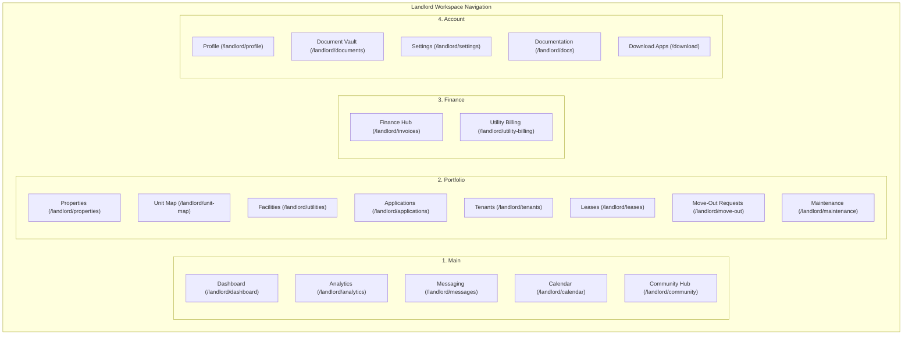
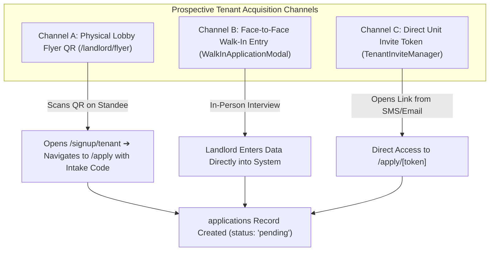
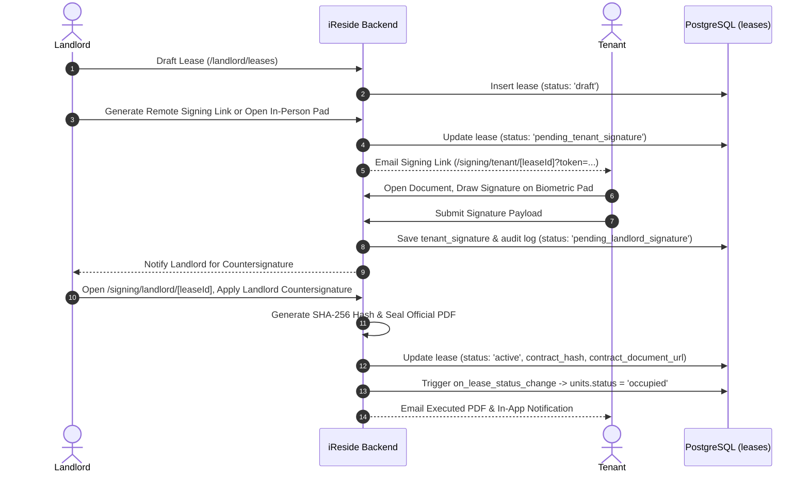
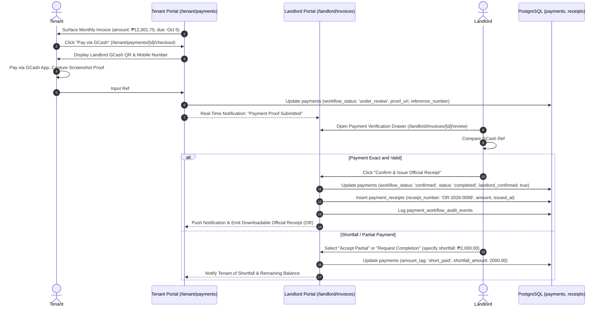
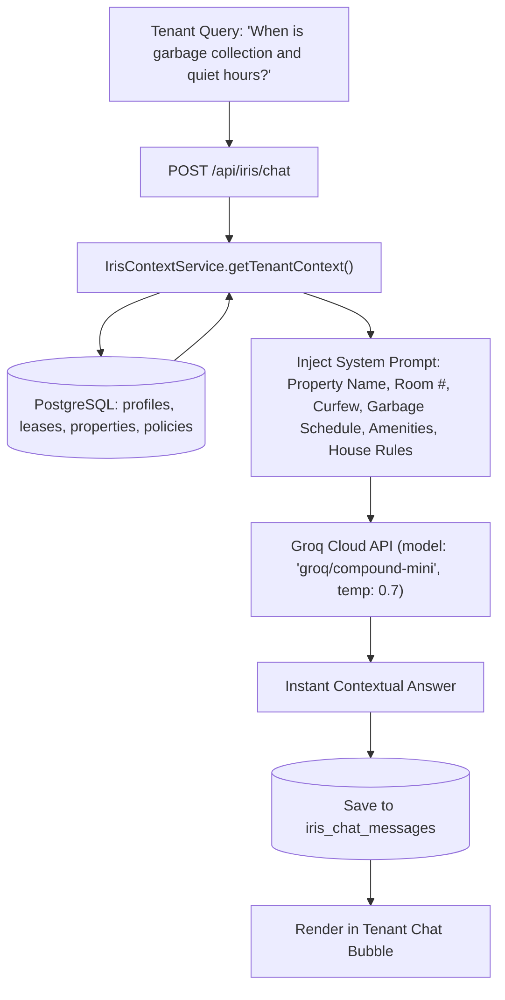

# iReside: Living System Source of Truth & Operational Lookup Reference
**The Definitive Architecture, Database, Route, and Functional Workflow Guide for iReside**
*Document Version: 2.0 (Post-Refactor Living Audit)*  
*Target Audience: AI Agents, Software Engineers, System Architects, QA Testers, and Capstone Evaluators*

---

> [!IMPORTANT]
> **Purpose of this Document:**  
> This document is the **single source of truth (SSOT)** for iReside's living production system. It reflects the **actual code, database schema (`source-of-truth-db.sql`), active routes, component interactions, and state machines**.
> 
> When performing future tasks—including rewriting `docs/END_TO_END_OPERATIONS_AND_BUG_HUNTING_GUIDE.md`, generating Data Flow Diagrams (DFDs), designing test cases, or implementing features—**consult this lookup guide first**.
> 
> Any code, route, or feature labeled **[DECOMMISSIONED / DEPRECATED]** in this guide must **NEVER** be referenced as an active system feature or introduced into production flows.

---

## Table of Contents
1. [Architectural Philosophy & Deployment Model](#1-architectural-philosophy--deployment-model)
2. [Decommissioned & Deprecated Features Registry (The Blacklist)](#2-decommissioned--deprecated-features-registry-the-blacklist)
3. [Canonical Database Schema Reference (`source-of-truth-db.sql`)](#3-canonical-database-schema-reference-source-of-truth-dbsql)
   - 3.1 [Custom ENUM Types (24 Types)](#31-custom-enum-types-24-types)
   - 3.2 [Core Domain Tables (54 Tables Grouped by Domain)](#32-core-domain-tables-54-tables-grouped-by-domain)
   - 3.3 [Automated Database Triggers & Functions (12 Key Triggers)](#33-automated-database-triggers--functions-12-key-triggers)
   - 3.4 [Foreign Key Architecture & Data Integrity](#34-foreign-key-architecture--data-integrity)
4. [Living System Routes & Navigation Architecture](#4-living-system-routes--navigation-architecture)
   - 4.1 [Public & Shared Entry Routes](#41-public--shared-entry-routes)
   - 4.2 [Landlord Workspace Navigation & Routes (18 Core + Subroutes)](#42-landlord-workspace-navigation--routes-18-core--subroutes)
   - 4.3 [Tenant Workspace Navigation & Routes (8 Core + Subroutes)](#43-tenant-workspace-navigation--routes-8-core--subroutes)
   - 4.4 [Dedicated Remote Signing Portals](#44-dedicated-remote-signing-portals)
5. [End-to-End Core Workflow Specifications & Data Flows](#5-end-to-end-core-workflow-specifications--data-flows)
   - Flow 1: Workspace Bootstrap & Master Branding Setup (`/setup`, `/landlord/settings`)
   - Flow 2: Spatial Floor Planning & Unit Inventory Architecture (`VisualBuilder`)
   - Flow 3: Prospective Tenant Acquisition & Intake (Channels A, B, and C)
   - Flow 4: Application Review, Document Verification & Payment Requests
   - Flow 5: Digital Contracting & Dual-Mode E-Signing Workflow
   - Flow 6: Submeter Utility Readings, Tariff Allocation & Batch Invoicing
   - Flow 7: Tenant Rent Payments, Proof Upload & Landlord Official Receipting
   - Flow 8: Maintenance Ticket Lifecycle & Heuristic/AI Sentiment Triage
   - Flow 9: Direct 1-on-1 Messaging, Bill Attachments & Unit Filtering
   - Flow 10: Community Hub (Bulletins, Polls, Albums & Amenity Bookings)
   - Flow 11: Mid-Lease & Termination Lifecycle (Renewals, Transfers, Move-Out)
   - Flow 12: iRis AI Assistant Engine (`groq/compound-mini`)
   - Flow 13: Offline Operations, Task Queuing & Network Reconnect Sync
6. [Data Flow Diagram (DFD) Alignment Guide](#6-data-flow-diagram-dfd-alignment-guide)
   - 6.1 [Context Level (Level 0) External Entities](#61-context-level-level-0-external-entities)
   - 6.2 [Level 1 System Processes (P1 to P10) & Data Stores (D1 to D9)](#62-level-1-system-processes-p1-to-p10--data-stores-d1-to-d9)
   - 6.3 [Level 2 Decomposition Maps](#63-level-2-decomposition-maps)
7. [Gap Analysis & Reconciliation Matrix (Existing Guide vs Reality)](#7-gap-analysis--reconciliation-matrix-existing-guide-vs-reality)

---

## 1. Architectural Philosophy & Deployment Model

### 1.1 The Turnkey / Private Residential Ecosystem
iReside operates as a **Turnkey Private Residential Management System**, designed specifically for dormitory, apartment, and boarding house owners in the Philippines.

* **Historical Model (Deprecated):** Multi-tenant public marketplace with open visitor browsing, self-serve landlord onboarding, and central super-admin approval queues.
* **Living Model (Current):** Turnkey private deployment. Each property or property portfolio operates within its own branded, sovereign instance.
  - **No Public Marketplace:** Random web visitors cannot browse resident rosters, vacant unit listings, or private floor plans.
  - **Closed Ecosystem:** Access is strictly controlled via pre-provisioned landlord accounts, landlord-issued prospective tenant intake tokens, or direct walk-in provisioning.
  - **Turnkey Root Entry:** The root URL (`/`) automatically detects session state:
    - If unauthenticated ➔ Redirects to `/login`.
    - If authenticated Tenant ➔ Redirects to `/tenant/dashboard`.
    - If authenticated Landlord / Master Admin ➔ Redirects to `/landlord/dashboard`.

### 1.2 User Roles & Operational Responsibilities
The system enforces strict Role-Based Access Control (RBAC) via Supabase Auth and database Row-Level Security (RLS):

| Role Identifier | Human Title | Operational Scope |
| :--- | :--- | :--- |
| `landlord` | **Property Owner / Property Manager** | Full operational control over properties, spatial layouts, tenant leases, financial ledgers, submeter tariffs, maintenance dispatch, community moderation, and branding settings. |
| `tenant` | **Active Resident** | Access to their assigned unit, active lease agreement, monthly invoices, GCash payment submission, repair ticket filing, 1-on-1 landlord chat, building notices, and the iRis AI assistant. |
| *Prospective Applicant* | **Prospective Tenant** *(Pre-auth)* | Access to tokenized application forms (`/apply/[token]`), tokenized remote lease signing (`/signing/tenant/[leaseId]`), and tokenized upfront payment settlement (`/apply/payments/[token]`). Account credentials are automatically provisioned upon landlord review or approval. |
| `admin` | **System Administrator** *(Technical Commissioning)* | Retained for database maintenance, RLS administration, and initial environment provisioning. **The public `/admin/*` portal UI has been retired/consolidated into the Landlord Workspace.** |

### 1.3 Living Core Technology Stack
* **Framework:** Next.js 16 (App Router, Server Components & Client Components)
* **Frontend Library:** React 19, TypeScript 5+
* **Styling & Design System:** Tailwind CSS 4, Custom Neumorphic & High-Contrast Tokens, Lucide React (strictly semantic icons, zero AI-slop elements)
* **UI Primitives & Motion:** Radix UI Primitives, Framer Motion
* **Interactive Floor Planner:** `@dnd-kit/core` + `@dnd-kit/utilities`
* **Backend & Database:** Supabase Cloud (PostgreSQL 15+, Row Level Security, Supabase Auth, Supabase Storage, Realtime Subscriptions)
* **Artificial Intelligence:** Groq Cloud API running `groq/compound-mini` (temperature 0.7, specialized residential context injection)
* **Document Engine:** Client-side HTML5 Canvas + `jspdf` for SHA-256 sealed digital lease contracts and Official Receipts (OR)
* **Client Packages:** Progressive Web App (PWA) + Dedicated Native Windows Installer (`iReside Desktop.exe`) + Android APK download hub

---

## 2. Decommissioned & Deprecated Features Registry (The Blacklist)

> [!CAUTION]
> **STRICT AUDIT RULE:**  
> The items listed in the table below still have residual files or code structures in the repository, but they have been **intentionally decommissioned, archived, or redirected**. 
> Future agent prompts, operational guides, test cases, and DFDs **MUST NOT** present these as active living features.

| Decommissioned Item | File / Route Location | Living Replacement / Current Reality | Rationale for Decommissioning |
| :--- | :--- | :--- | :--- |
| **Super Admin Web Portal (`/admin/*`)** | `src/app/admin/layout.tsx`, `src/app/admin/dashboard/`, `src/app/admin/users/`, `src/app/admin/registrations/`, `src/app/admin/chat-moderation/`, `src/app/admin/consultation-tool/`, `src/components/admin/AdminSidebar.tsx` | All `/admin/*` routes intercept requests and automatically redirect to `/landlord/dashboard` (or `/login`). | Consolidating multi-tenant platform admin into the Turnkey Landlord operations model (Commit `c0e0e2a`). |
| **Public Marketing Landing Page** | `src/components/deprecated/LandingPage.deprecated.tsx` | `src/app/page.tsx` runs `RootTurnkeyEntryPage`, instantly routing authenticated users to their respective dashboard or unauthenticated visitors to `/login`. | iReside is a private residential management portal, not a public advertising marketplace. |
| **Public Self-Serve Landlord Registration** | `src/app/signup/page.tsx`, `src/components/deprecated/LandlordSignup.deprecated.tsx` | Landlord workspaces are pre-provisioned. `src/app/signup/page.tsx` redirects to `/login`. | Avoids unvetted public account creation. Landlord setup occurs via the Business Personalization Wizard (`/setup`). |
| **Direct Open Tenant Registration** | `src/app/signup/tenant/page.tsx` | The `/signup/tenant` page is an informational educational gate explaining the "Invite-Only Community" model, pointing to `/login`. | Tenants can only enter via landlord walk-in entry or tokenized private intake invites (`/apply/[token]`). |
| **Automated Payment Gateways (Stripe/PayMongo/Webhooks)** | `src/app/tenant/payments/checkout/page.tsx` | Redirects to `/tenant/payments`. Payments strictly use manual GCash QR / bank transfer proof upload and landlord verification. | Scope delimitation for Philippine dormitories: Landlords require direct peer-to-peer GCash/cash collections without third-party merchant transaction fee deductions. |
| **Technical Commissioning Setup Route** | `src/app/setup/technical/page.tsx` | All live property onboarding begins at `/setup` (Business Personalization Wizard) and `/landlord/settings`. | Technical database migration runs via CLI / Supabase dashboard during turnkey provisioning; end-users never execute raw SQL migrations. |
| **Consultation Document Tool** | `src/app/admin/consultation-tool/`, `src/app/sign/[id]/page.tsx` | Digital contracting is handled directly in the Lease Lifecycle via `/signing/tenant/[leaseId]` and `/signing/landlord/[leaseId]`. | Consultation documents were a legacy prototype for admin-guided business permit onboarding. |
| **Legacy Module Route Stubs** | `src/app/modules/dashboard/`, `src/app/modules/financials/`, `src/app/modules/unit-map/` | Empty `<main className="min-h-screen" />` stubs. | Prototype placeholders replaced by standard `/landlord/*` and `/tenant/*` portal routes. |
| **Legacy Prototype Dashboard** | `src/app/dashboard/page.tsx` | Landlord operations live exclusively at `/landlord/dashboard`. | Early stage hardcoded prototype before RBAC was completed. |
| **Legacy AI Model Reference (Llama 3.1 8B)** | Historical documentation | Active code in `src/lib/services/iris/iris.service.ts` uses `groq/compound-mini` via Groq Cloud API. | Upgraded in commit `67e579c` for superior speed, lower latency, and higher Philippine context reasoning quality. |

---

## 3. Canonical Database Schema Reference (`source-of-truth-db.sql`)

The PostgreSQL database in `source-of-truth-db.sql` is the verified source of truth. It contains **54 public tables**, **24 custom ENUM types**, **115 foreign key constraints**, and **12 automated trigger functions**.

### 3.1 Custom ENUM Types (24 Types)

```sql
-- 1. User Roles
CREATE TYPE "public"."user_role" AS ENUM ('tenant', 'landlord', 'admin');

-- 2. Property & Unit Specifications
CREATE TYPE "public"."property_type" AS ENUM ('apartment', 'condo', 'house', 'townhouse', 'studio', 'dormitory', 'boarding_house');
CREATE TYPE "public"."unit_status" AS ENUM ('vacant', 'occupied', 'maintenance');

-- 3. Applications & Tenant Intake
CREATE TYPE "public"."application_status" AS ENUM ('pending', 'reviewing', 'approved', 'rejected', 'withdrawn', 'payment_pending');

-- 4. Leases & Contracting
CREATE TYPE "public"."lease_status" AS ENUM ('draft', 'pending_signature', 'active', 'expired', 'terminated', 'pending_tenant_signature', 'pending_landlord_signature');
CREATE TYPE "public"."renewal_status" AS ENUM ('pending', 'approved', 'rejected', 'signed');
CREATE TYPE "public"."unit_transfer_status" AS ENUM ('pending', 'approved', 'denied', 'cancelled');
CREATE TYPE "public"."move_out_status" AS ENUM ('pending', 'approved', 'denied', 'completed');

-- 5. Financials, Invoicing & Utilities
CREATE TYPE "public"."payment_status" AS ENUM ('pending', 'processing', 'completed', 'failed', 'refunded');
CREATE TYPE "public"."payment_workflow_status" AS ENUM ('pending', 'reminder_sent', 'intent_submitted', 'under_review', 'awaiting_in_person', 'confirmed', 'rejected', 'receipted');
CREATE TYPE "public"."payment_method" AS ENUM ('credit_card', 'debit_card', 'gcash', 'maya', 'bank_transfer', 'cash');
CREATE TYPE "public"."payment_intent_method" AS ENUM ('gcash', 'in_person');
CREATE TYPE "public"."payment_amount_tag" AS ENUM ('exact', 'partial', 'overpaid', 'short_paid');
CREATE TYPE "public"."payment_review_action" AS ENUM ('accept_partial', 'request_completion', 'reject', 'confirm_received');
CREATE TYPE "public"."utility_type" AS ENUM ('water', 'electricity');
CREATE TYPE "public"."utility_billing_mode" AS ENUM ('included_in_rent', 'tenant_paid');

-- 6. Maintenance & Repairs
CREATE TYPE "public"."maintenance_status" AS ENUM ('open', 'assigned', 'in_progress', 'resolved', 'closed');
CREATE TYPE "public"."maintenance_priority" AS ENUM ('low', 'medium', 'high', 'urgent');

-- 7. Messaging & Community
CREATE TYPE "public"."message_type" AS ENUM ('text', 'system', 'image', 'file');
CREATE TYPE "public"."post_type_enum" AS ENUM ('announcement', 'poll', 'photo_album', 'discussion');
CREATE TYPE "public"."post_status_enum" AS ENUM ('draft', 'published', 'archived');
CREATE TYPE "public"."reaction_type_enum" AS ENUM ('like', 'heart', 'thumbs_up', 'clap', 'celebration');
CREATE TYPE "public"."report_status_enum" AS ENUM ('pending', 'reviewed', 'dismissed', 'escalated');
CREATE TYPE "public"."notification_type" AS ENUM (
    'payment', 'lease', 'maintenance', 'announcement', 'message', 
    'application', 'lease_renewal_available', 'lease_renewal_request', 
    'lease_renewal_approved', 'lease_renewal_rejected'
);
```

---

### 3.2 Core Domain Tables (54 Tables Grouped by Domain)

#### Domain A: Identity, Profiles & Authentication Security
* **`profiles`** (26 columns): The master account profile table linked 1:1 with `auth.users.id`.
  - *Key columns:* `id` (UUID PK), `email`, `full_name`, `role` (`user_role`), `phone`, `avatar_url`, `avatar_bg_color`, `two_factor_enabled`, `two_factor_secret`, `has_changed_password`, `created_at`, `updated_at`.
* **`user_sessions`** (SQL View): Consolidated live session monitor for tracking active sessions across devices.

#### Domain B: Property, Spatial Blueprint & Environment Policies
* **`properties`** (22 columns): Core building / property record.
  - *Key columns:* `id` (UUID PK), `landlord_id` (FK `profiles.id`), `name`, `address`, `city`, `type` (`property_type`), `amenities` (text[]), `contract_template` (JSONB), `branding` (JSONB: primary color, secondary color, monogram, logo URL, tagline), `created_at`, `updated_at`.
* **`property_floor_configs`** (8 columns): Configures physical building levels for the spatial visual builder.
  - *Key columns:* `id` (UUID PK), `property_id` (FK `properties.id`), `floor_number`, `floor_key` (e.g., `floor_1`), `display_name`, `sort_order`.
* **`units`** (11 columns): Physical rentable rooms / dorm units.
  - *Key columns:* `id` (UUID PK), `property_id` (FK `properties.id`), `name` (e.g., "101"), `floor` (integer), `status` (`unit_status`: `vacant`, `occupied`, `maintenance`), `rent_amount` (numeric), `sqft`, `beds`, `baths`.
* **`unit_map_positions`** (7 columns): Spatial coordinates for the 2D floor builder.
  - *Key columns:* `unit_id` (FK `units.id` PK), `floor_key`, `x`, `y`, `w`, `h`, `updated_at`.
* **`property_environment_policies`** (17 columns): House rules, curfews, and environmental controls.
  - *Key columns:* `property_id` (FK `properties.id` PK), `environment_mode`, `max_occupants_per_unit`, `curfew_enabled`, `curfew_time`, `visitor_cutoff_enabled`, `visitor_cutoff_time`, `quiet_hours_start`, `quiet_hours_end`, `noise_policy`, `visitor_policy`, `submeter_billing_policy`.
* **`unit_environment_overrides`** (12 columns): Per-unit exceptions to general property house rules.

#### Domain C: Tenant Acquisition, Private Invites & Applications
* **`tenant_intake_invites`** (16 columns): Manages landlord-generated tokenized invites for prospective residents.
  - *Key columns:* `id` (UUID PK), `landlord_id` (FK `profiles.id`), `property_id` (FK `properties.id`), `unit_id` (FK `units.id`, nullable for open-property invites), `mode` (`property` or `unit`), `application_type` (`online` or `face_to_face`), `public_token` (string), `token_hash` (string), `status` (`active`, `revoked`, `expired`, `consumed`), `max_uses`, `use_count`, `required_requirements` (text[]), `expires_at`.
* **`tenant_intake_invite_events`** (5 columns): Audit trail for invite token interactions (`opened`, `submitted`, `consumed`, `expired`).
* **`applications`** (31 columns): Official rental applications submitted by applicants or logged by landlords.
  - *Key columns:* `id` (UUID PK), `unit_id` (FK `units.id`), `landlord_id` (FK `profiles.id`), `applicant_id` (FK `profiles.id`, nullable prior to account creation), `invite_id` (FK `tenant_intake_invites.id`), `lease_id` (FK `leases.id`), `status` (`application_status`), `applicant_name`, `applicant_email`, `applicant_phone`, `monthly_income`, `employment_status`, `employment_info` (JSONB), `requirements_checklist` (JSONB: `valid_id`, `income_verified`, `application_form`, `move_in_payment`, etc.), `documents` (text[]), `emergency_contact_name`, `emergency_contact_phone`, `application_source` (`walk_in_application` | `invite_link`), `created_at`.
* **`application_payment_requests`** (21 columns): Upfront advance rent or security deposit payment requests issued prior to lease sealing.
  - *Key columns:* `id` (UUID PK), `application_id` (FK `applications.id`), `landlord_id` (FK `profiles.id`), `requirement_type` (`advance_rent` | `security_deposit`), `amount`, `status`, `linked_payment_id` (FK `payments.id`), `proof_url`, `reference_number`.
* **`application_payment_audit_events`** (8 columns): Audit trail for upfront payment requests.
* **`landlord_inquiry_actions`** (8 columns): Tracks landlord read/archived/deleted states for incoming inquiries.

#### Domain D: Leases, Contracting, Renewals & Move-Out Lifecycle
* **`leases`** (22 columns): Master legal lease agreement between landlord and tenant.
  - *Key columns:* `id` (UUID PK), `unit_id` (FK `units.id`), `tenant_id` (FK `profiles.id`), `landlord_id` (FK `profiles.id`), `status` (`lease_status`), `start_date` (date), `end_date` (date), `monthly_rent` (numeric), `deposit_amount` (numeric), `advance_amount` (numeric), `signing_mode` (`in_person` | `remote`), `tenant_signature` (data URL), `landlord_signature` (data URL), `tenant_signed_at`, `landlord_signed_at`, `contract_document_url` (PDF URL), `contract_hash` (SHA-256 string), `signature_lock_version` (integer for optimistic concurrency control), `created_at`, `updated_at`.
* **`lease_signing_audit`** (8 columns): Forensic audit trail recording IP address, user agent, timestamps, and hash states during e-signing events.
* **`renewal_requests`** (14 columns): Automated 90-day lease renewal proposals and addendums.
  - *Key columns:* `id` (UUID PK), `current_lease_id` (FK `leases.id`), `new_lease_id` (FK `leases.id`), `tenant_id` (FK `profiles.id`), `landlord_id` (FK `profiles.id`), `status` (`renewal_status`), `proposed_start_date`, `proposed_end_date`, `proposed_monthly_rent`, `proposed_security_deposit`, `tenant_notes`, `landlord_notes`.
* **`unit_transfer_requests`** (12 columns): Tenant requests to move from their current unit to a vacant unit in the same property.
  - *Key columns:* `id` (UUID PK), `lease_id` (FK `leases.id`), `tenant_id` (FK `profiles.id`), `landlord_id` (FK `profiles.id`), `property_id` (FK `properties.id`), `current_unit_id` (FK `units.id`), `requested_unit_id` (FK `units.id`), `reason`, `status` (`unit_transfer_status`), `created_at`.
* **`move_out_requests`** (21 columns): Tenant 30-day move-out notice, room checkout inspection, and deposit settlement.
  - *Key columns:* `id` (UUID PK), `lease_id` (FK `leases.id`), `tenant_id` (FK `profiles.id`), `landlord_id` (FK `profiles.id`), `reason`, `requested_date`, `status` (`move_out_status`), `inspection_notes`, `damages_cost` (numeric), `unpaid_utilities` (numeric), `deposit_refund_amount` (numeric), `settlement_completed_at`.
* **`landlord_reviews`** (8 columns): Tenant rating and feedback submitted upon lease conclusion.

#### Domain E: Financial Operations, Submeters, Invoices & Expenses
* **`payments`** (40 columns): The master financial invoice and billing transaction table.
  - *Key columns:* `id` (UUID PK), `lease_id` (FK `leases.id`), `tenant_id` (FK `profiles.id`), `landlord_id` (FK `profiles.id`), `amount` (numeric), `status` (`payment_status`), `workflow_status` (`payment_workflow_status`), `due_date` (date), `billing_cycle` (string, e.g., "2026-09"), `method` (`payment_method`), `description`, `proof_url`, `reference_number`, `landlord_confirmed` (boolean), `amount_tag` (`payment_amount_tag`), `accepted_amount`, `shortfall_amount`, `is_advance_payment` (boolean), `created_at`, `updated_at`.
* **`payment_items`** (11 columns): Granular invoice line items (Rent, Water Submeter, Electricity Submeter, Penalty, Amenities).
  - *Key columns:* `id` (UUID PK), `payment_id` (FK `payments.id`), `label`, `amount`, `category`, `reading_id` (FK `utility_readings.id`, optional), `utility_type`.
* **`payment_receipts`** (13 columns): Immutable official receipts (OR) issued upon landlord confirmation of payment.
  - *Key columns:* `id` (UUID PK), `payment_id` (FK `payments.id` UNIQUE), `landlord_id` (FK `profiles.id`), `tenant_id` (FK `profiles.id`), `receipt_number` (string e.g., "OR-2026-0089"), `amount`, `issued_at`, `issued_by`, `receipt_pdf_url`.
* **`payment_workflow_audit_events`** (10 columns): Event ledger tracking invoice state changes, actions, before/after states, and idempotency keys.
* **`landlord_payment_destinations`** (10 columns): Landlord GCash receiving account and QR image settings.
  - *Key columns:* `id` (UUID PK), `landlord_id` (FK `profiles.id`), `provider` (e.g. "gcash"), `account_name`, `account_number`, `qr_image_url`, `is_enabled`.
* **`utility_configs`** (14 columns): Configures per-property or per-unit submeter tariffs.
  - *Key columns:* `id` (UUID PK), `landlord_id` (FK `profiles.id`), `property_id` (FK `properties.id`), `unit_id` (FK `units.id`, nullable for property default), `utility_type` (`water` | `electricity`), `billing_mode` (`tenant_paid` | `included_in_rent`), `rate_per_unit` (e.g., ₱18.50 per kWh, ₱55.00 per m³), `unit_label`.
* **`utility_readings`** (21 columns): Monthly meter reading entries for electricity and water submeters.
  - *Key columns:* `id` (UUID PK), `landlord_id` (FK `profiles.id`), `lease_id` (FK `leases.id`), `property_id` (FK `properties.id`), `unit_id` (FK `units.id`), `utility_type`, `previous_reading`, `current_reading`, `consumption`, `rate_per_unit`, `total_amount`, `payment_id` (FK `payments.id`), `billing_period_start`, `billing_period_end`.
* **`expenses`** (10 columns): Landlord property operational expense tracking (repairs, building tax, maintenance materials).
  - *Key columns:* `id` (UUID PK), `landlord_id` (FK `profiles.id`), `property_id` (FK `properties.id`), `unit_id` (FK `units.id`, optional), `category`, `amount`, `date_incurred`, `description`, `receipt_url`.
* **`landlord_statistics_exports`** (9 columns): Audit tracking for generated CSV and PDF analytics reports.

#### Domain F: Maintenance Ticketing & Repairs
* **`maintenance_requests`** (27 columns): Comprehensive repair ticket lifecycle.
  - *Key columns:* `id` (UUID PK), `unit_id` (FK `units.id`), `tenant_id` (FK `profiles.id`), `landlord_id` (FK `profiles.id`), `title`, `description`, `status` (`maintenance_status`: `open`, `assigned`, `in_progress`, `resolved`, `closed`), `priority` (`maintenance_priority`: `low`, `medium`, `high`, `urgent`), `images` (text[]), `assignee_name`, `scheduled_for`, `repair_method` (`landlord` | `third_party` | `self_repair`), `third_party_name`, `self_repair_requested`, `self_repair_decision`, `sentiment` (Distressed, Negative, Neutral, Positive), `triage_reason`, `triage_confidence`, `created_at`, `updated_at`.

#### Domain G: Communication, Messaging & Safety Moderation
* **`conversations`** (3 columns): Direct 1-on-1 chat channels.
  - *Key columns:* `id` (UUID PK), `created_at`, `updated_at`.
* **`conversation_participants`** (4 columns): Participants linked to a conversation (`conversation_id`, `user_id`).
* **`messages`** (8 columns): Real-time chat messages.
  - *Key columns:* `id` (UUID PK), `conversation_id` (FK `conversations.id`), `sender_id` (FK `profiles.id`), `type` (`message_type`: `text`, `system`, `image`, `file`), `content`, `metadata` (JSONB: bill attachment, room filter tags), `read_at`, `created_at`.
* **`message_user_actions`** (7 columns): Tracks user muting, archiving, and blocking per conversation.
* **`message_user_reports`** (10 columns): Safety and harassment reporting between chat participants.
* **`message_moderation_banned_terms`** (10 columns): Keyword dictionary for filtering prohibited words, scams, and profanity.
* **`notifications`** (8 columns): System alerts delivered via real-time banners and in-app bell menu.
  - *Key columns:* `id` (UUID PK), `user_id` (FK `profiles.id`), `type` (`notification_type`), `title`, `message`, `data` (JSONB), `read` (boolean), `created_at`.

#### Domain H: Community Hub & Amenities
* **`community_posts`** (15 columns): Building-wide social bulletin board posts.
  - *Key columns:* `id` (UUID PK), `property_id` (FK `properties.id`), `author_id` (FK `profiles.id`), `author_role`, `type` (`post_type_enum`), `title`, `content`, `status` (`post_status_enum`), `pinned` (boolean), `metadata` (JSONB: poll questions, album cover), `created_at`.
* **`community_comments`** (7 columns): Threaded discussion comments on community posts.
* **`community_reactions`** (5 columns): Emoji reactions on posts (`like`, `heart`, `thumbs_up`, etc.).
* **`community_albums`** (7 columns) & **`community_photos`** (7 columns): Photo galleries for property events.
* **`community_poll_votes`** (5 columns): Resident voting records on interactive community polls.
* **`saved_posts`** (4 columns): Personal resident bookmarking for community announcements.
* **`post_views`** (6 columns): View counters for building advisories and announcements.
* **`content_reports`** (9 columns): Moderation flags on user-generated community posts.
* **`amenities`** (16 columns): Bookable building amenities (Study Lounge, Rooftop Deck, Laundry Area, Gym).
* **`amenity_bookings`** (12 columns): Reservation schedule for shared facilities.

#### Domain I: AI Intelligence & Product Tours
* **`iris_chat_messages`** (6 columns): Chat history for the iRis AI resident conversational assistant.
  - *Key columns:* `id` (UUID PK), `user_id` (FK `profiles.id`), `role` (`user` | `assistant` | `system`), `content`, `metadata` (token count, topics), `created_at`.
* **`landlord_product_tour_states`** (14 columns) & **`landlord_product_tour_events`** (9 columns): State machine tracking guided onboarding tours for landlords.
* **`tenant_product_tour_states`** (14 columns) & **`tenant_product_tour_events`** (9 columns): State machine tracking guided onboarding tours for new residents.

---

### 3.3 Automated Database Triggers & Functions (12 Key Triggers)

1. **`on_lease_status_change`** (`AFTER UPDATE OF "status" ON leases`):
   - Automatically synchronizes physical unit inventory.
   - When a lease transitions to `active`, the linked unit status is automatically set to `occupied`.
   - When a lease transitions to `terminated` or `expired`, the unit status automatically resets to `vacant`.
2. **`on_new_message`** (`AFTER INSERT ON messages`):
   - Updates `conversations.updated_at` to trigger real-time conversation re-sorting.
   - Generates an in-app `notification` row for the recipient if not currently active in the chat window.
3. **`trg_payment_receipts_immutable`** (`BEFORE UPDATE ON payment_receipts`):
   - Enforces legal immutability of issued Official Receipts (ORs). Any attempt to modify a generated receipt throws a database exception.
4. **`trg_payments_sync_compat_status`** (`BEFORE INSERT OR UPDATE OF "workflow_status" ON payments`):
   - Keeps legacy `status` (`pending`, `completed`, `failed`) synchronized with granular `workflow_status` (`under_review`, `confirmed`, `receipted`).
5. **`validate_lease_status_transition()`**:
   - Guards against illegal lease state skips (e.g., jumping from `draft` straight to `active` without signature capture).
6. **`update_lease_signature_timestamps()`**:
   - Automatically timestamps `tenant_signed_at` or `landlord_signed_at` upon signature payload injection.
7. **`check_renewal_windows()`**:
   - Automated function evaluated by cron to flag active leases reaching the 90-day renewal threshold.
8. **`handle_new_user()`**:
   - Triggered on Supabase `auth.users` creation to initialize the corresponding `profiles` row with the provided user role.
9. **`increment_post_view()`**:
   - Atomically records unique resident view counts on community announcements.
10. **`trg_applications_updated_at`**, **`trg_leases_updated_at`**, **`trg_payments_updated_at`**:
    - Automatic timestamp updates on all core record mutations.

### 3.4 Foreign Key Architecture & Data Integrity

The 115 foreign key constraints enforce relational integrity across all modules:
* **Account Deletion Safeguards:** `leases`, `payments`, and `maintenance_requests` reference `profiles.id` with `RESTRICT` or `CASCADE` where appropriate, preventing orphaned billing records.
* **Property Ownership Hierarchy:** 
  - `properties` (Root) ➔ `units` ➔ `leases` ➔ `payments` & `utility_readings`.
  - Deleting a unit is physically blocked by foreign key constraints if an active or pending lease exists.
* **Spatial Alignment:** `unit_map_positions` maintains a strict 1:1 foreign key with `units.id`. Removing a unit cleanly purges its spatial coordinates from the 2D blueprint.
* **Payment Linkage:** `payment_receipts` maintains a `UNIQUE` foreign key to `payments.id`, guaranteeing that an invoice can only have exactly one official receipt issued.

---

## 4. Living System Routes & Navigation Architecture

### 4.1 Public & Shared Entry Routes

| URL Route | Living Page Component / Handler | Purpose & Access Rules |
| :--- | :--- | :--- |
| **`/`** | `RootTurnkeyEntryPage` (`src/app/page.tsx`) | Turnkey root router. Evaluates auth state and performs instant redirect to `/tenant/dashboard`, `/landlord/dashboard`, or `/login`. |
| **`/login`** | `LoginContent` (`src/app/login/page.tsx`) | Primary authentication gate. Supports Email + Password and Google OAuth. Handles role routing to Tenant or Landlord workspace upon authentication. |
| **`/signup`** | `SignUpPage` (`src/app/signup/page.tsx`) | **[DEPRECATED - Turnkey]** Redirects immediately to `/login`. Pre-provisioned landlord accounts are used. |
| **`/signup/tenant`** | `TenantInformationPage` (`src/app/signup/tenant/page.tsx`) | Informational portal explaining the private invite-only resident model, features, and directing users to `/login`. |
| **`/apply`** | `ApplyForm` (`src/app/apply/page.tsx`) | Prospective tenant application gate. Accepts a valid invite code or auto-resolves unit tokens (`?unitId=...`). |
| **`/apply/[token]`** | `InviteApplicationClient` (`src/app/apply/[token]/page.tsx`) | Tokenized prospective tenant application submission form with document uploads and compliance checklist. |
| **`/apply/payments/[token]`** | Upfront Payment Gate (`src/app/apply/payments/[token]/page.tsx`) | Tokenized payment view for applicants to view landlord GCash QR and upload proof for advance rent/security deposit. |
| **`/download`** | Desktop & Mobile Hub (`src/app/download/page.tsx`) | Public download hub for the native Windows `.exe` desktop application and dedicated Android `.apk` package. |
| **`/docs`** | Documentation Hub (`src/app/docs/page.tsx`) | Public-accessible system manual, user guides, and architecture documentation reader. |
| **`/offline`** | Offline Fallback (`src/app/offline/page.tsx`) | Service-worker fallback displayed when network connection drops. |
| **`/forgot-password`** | Password Recovery (`src/app/forgot-password/page.tsx`) | Standard email-based password reset dispatcher. |

---

### 4.2 Landlord Workspace Navigation & Routes (18 Core + Subroutes)

The Landlord Workspace is wrapped in `LandlordLayout` (`src/app/landlord/layout.tsx`), providing the persistent collapsible Neumorphic sidebar (`src/components/landlord/Sidebar.tsx`), mobile drawer menu, global property selector dropdown, real-time notification banners, and quick contacts drawer.

#### Living Sidebar Navigation Items (Grouped by Category)



#### Detailed Landlord Route Specifications

1. **`/landlord/dashboard`** (`src/app/landlord/dashboard/page.tsx`):
   - Executive operational command center. Displays 4-column KPI cards (Total Units, Occupancy Rate, Monthly Collections, Active Maintenance Tickets), Urgent Action Inbox, Cash Flow Chart, Recent Inquiries widget, and floating "+ Walk-In Application" modal launcher.
2. **`/landlord/analytics`** (`src/app/landlord/analytics/page.tsx`):
   - Revenue trends, collection efficiency, expense breakdown, occupancy velocity, and automated CSV/PDF financial export dispatcher. Includes AI-powered financial summary insights (`/api/landlord/analytics/iris-analysis`).
3. **`/landlord/messages`** (`src/app/landlord/messages/page.tsx`):
   - Real-time chat center with room-number filtering, unread counters, file/image upload attachments, and the ability to attach pending invoices directly into chat threads.
4. **`/landlord/calendar`** (`src/app/landlord/calendar/page.tsx`):
   - Interactive calendar surfacing scheduled unit viewings, lease start/end dates, move-out inspections, and maintenance service dispatches.
5. **`/landlord/community`** (`src/app/landlord/community/page.tsx`):
   - Management portal for building notices, polls, photo albums, comment moderation, and content report review.
6. **`/landlord/properties`** (`src/app/landlord/properties/page.tsx`):
   - Portfolio overview showing registered properties, total unit counts, occupancy chips, and property creation.
   - *Subroute:* `/landlord/properties/new` — Wizard for bootstrapping a new building.
   - *Subroute:* `/landlord/properties/[id]/environment` — House rules, curfew hours, visitor cutoff, and environment policy editor.
7. **`/landlord/unit-map`** (`src/app/landlord/unit-map/page.tsx`):
   - The interactive 2D spatial floor planner (`VisualBuilder.tsx`). Allows landlords to switch floor levels, drag and resize units, configure room specs, add corridors, and monitor real-time occupancy color states.
8. **`/landlord/utilities`** (`src/app/landlord/utilities/page.tsx`):
   - Facilities and amenities configuration portal. Tracks shared meters and listed building amenities.
9. **`/landlord/applications`** (`src/app/landlord/applications/page.tsx`):
   - Rental application screening queue (`RentApplications.tsx`). Hosts the **Tenant Invite Manager** (generates tokenized QR/links), **Walk-In Application Wizard**, applicant document inspection lightbox, upfront payment request triggers, and quick-approval actions.
10. **`/landlord/tenants`** (`src/app/landlord/tenants/page.tsx`):
    - Master resident roster. Displays active tenants, emergency contacts, room assignments, lease health, and manual resident provisioning.
11. **`/landlord/leases`** (`src/app/landlord/leases/page.tsx`):
    - Legal contract command center. Draft digital leases, inspect signature status (`pending_tenant_signature`, `pending_landlord_signature`, `active`), countersign contracts, trigger 90-day renewal proposals, and download official SHA-256 sealed lease agreement PDFs.
12. **`/landlord/move-out`** (`src/app/landlord/move-out/page.tsx`):
    - Move-out notice dashboard (`MoveOutRequestsList.tsx`). Conduct room checkout inspections (`MoveOutInspectionForm.tsx`), log itemized damage deductions, compute net deposit refund math, and close leases.
13. **`/landlord/maintenance`** (`src/app/landlord/maintenance/page.tsx`):
    - Repair ticket dispatch board (`MaintenanceDashboard.tsx`). Filter by priority (Urgent, High, Medium, Low), review AI sentiment analysis, assign internal staff or 3rd-party contractors, approve tenant self-repair requests, and transition tickets to `resolved` with auto-expense logging.
14. **`/landlord/invoices`** (`src/app/landlord/invoices/page.tsx`):
    - Master rental billing ledger. Review incoming tenant GCash payment screenshots and bank reference codes, approve payments, issue immutable Official Receipts (OR), or flag shortfalls and request completion.
15. **`/landlord/utility-billing`** (`src/app/landlord/utility-billing/page.tsx`):
    - Submeter billing console (`UtilityBillingDashboard.tsx`). Record previous and current meter readings for electricity (kWh) and water (m³), compute consumption, multiply by tariff rates, and batch-post charges to tenant monthly invoices.
16. **`/landlord/profile`** (`src/app/landlord/profile/page.tsx`):
    - Landlord contact details, management credentials, and public contact information.
17. **`/landlord/documents`** (`src/app/landlord/documents/page.tsx`):
    - Secure Document Vault for storing property deeds, building permits, compliance certificates, and master contracts.
18. **`/landlord/settings`** (`src/app/landlord/settings/page.tsx`):
    - Master account settings tab rail: Business Profile, Personalization (theme presets, universal high-contrast toggle), Finance (GCash receiving QR and mobile number configuration), Security (2FA Email Authenticator), and Activity & Audit Logs.
19. **`/landlord/flyer`** (`src/app/landlord/flyer/page.tsx`):
    - The **Lobby Flyer Studio** (`LobbyFlyerModal.tsx`). Generates print-ready 300 DPI lobby posters with property monogram, brand colors, QR codes linking to resident onboarding (`/signup/tenant`), and app download (`/download`).
20. **`/landlord/docs`** (`src/app/landlord/docs/page.tsx`):
    - Integrated interactive eBook reader (`DocumentationHub.tsx`) containing 43 comprehensive operational runbooks and IT guides.

---

### 4.3 Tenant Workspace Navigation & Routes (8 Core + Subroutes)

The Tenant Workspace is wrapped in `TenantLayout` (`src/app/tenant/layout.tsx`), configured with the dedicated tenant navigation sidebar (`src/components/tenant/TenantNavbar.tsx`), notification popover, role badges, and theme toggle.

#### Living Tenant Sidebar Navigation Items

1. **`/tenant/dashboard`** (`src/app/tenant/dashboard/page.tsx`):
   - Resident homepage. Displays current room number, active lease dates, upcoming rent due countdown, quick GCash payment trigger, quick maintenance report button, and emergency hotline contacts.
2. **`/tenant/community`** (`src/app/tenant/community/page.tsx`):
   - Resident social hub. View landlord announcements, participate in interactive community polls, browse shared photo albums, comment on posts, and view building amenities (`PropertyAmenities.tsx`).
3. **`/tenant/lease`** (`src/app/tenant/lease/page.tsx`):
   - Personal lease repository (`LeaseModal.tsx`). Review lease terms, download the countersigned official lease PDF, inspect security deposit records, request unit transfers (`UnitTransferRequest.tsx`), submit 30-day move-out notices (`MoveOutRequest.tsx`), and review 90-day renewal reminders (`LeaseRenewalReminder.tsx`).
4. **`/tenant/unit-map`** (`src/app/tenant/unit-map/page.tsx`):
   - Read-only spatial architectural layout showing building floors, room locations, emergency exits, and amenities.
5. **`/tenant/utilities`** (`src/app/tenant/utilities/page.tsx`):
   - Personal submeter consumption tracker. Displays monthly electricity (kWh) and water (m³) reading history, billing calculations, and usage trend charts.
6. **`/tenant/maintenance`** (`src/app/tenant/maintenance/page.tsx`):
   - Repair ticketing center. Submit new tickets with issue photos (`/tenant/maintenance/new`), track repair personnel arrival, toggle self-repair requests, and rate completed repair quality.
7. **`/tenant/payments`** (`src/app/tenant/payments/page.tsx`):
   - Resident Finance Hub. Displays active monthly invoices, itemized line items (Rent, Water, Electricity), landlord GCash QR code, proof screenshot upload form (`/tenant/payments/[id]/checkout`), payment history, and downloadable Official Receipts (OR).
8. **`/tenant/messages`** (`src/app/tenant/messages/page.tsx`):
   - Immersive full-screen communication portal. Switch between direct 1-on-1 landlord chat and the **iRis AI Resident Assistant** (`TenantIrisChat.tsx`).
9. **`/tenant/docs`** (`src/app/tenant/docs/page.tsx`):
   - Resident user manual, house rules, garbage schedules, and troubleshooting guides.
10. **`/tenant/settings`** (`src/app/tenant/settings/page.tsx`):
    - Profile preferences, avatar background colors, emergency contact details, notification preferences, and account password updates.
11. **`/tenant/tour`** (`src/app/tenant/tour/page.tsx`):
    - Replay controller for guided product tours (`TenantProductTourOverlay.tsx`).

---

### 4.4 Dedicated Remote Signing Portals

For remote digital lease contracting, the system provides isolated, distraction-free signing environments outside standard dashboard layouts:

* **`/signing/tenant/[leaseId]`** (`src/app/(signing)/signing/tenant/[leaseId]/page.tsx`):
  - Remote tenant e-signing room. Accessed via secure token link (`?token=...`). Renders the full legal `LeaseDocument`, provides the interactive `DigitalSigner` biometric touchpad, captures tenant signature data URL, validates compliance, and logs audit metadata (`lease_signing_audit`).
* **`/signing/landlord/[leaseId]`** (`src/app/(signing)/signing/landlord/[leaseId]/page.tsx`):
  - Remote landlord countersigning room. Renders the tenant-signed document, captures landlord signature, executes cryptographic sealing, and updates status to `active`.
* **`/tenant/sign-lease/[leaseId]`** (`src/app/tenant/sign-lease/[leaseId]/page.tsx`):
  - Intelligent redirector that transitions in-app tenant signing directly into `/signing/tenant/[leaseId]`.

---

## 5. End-to-End Core Workflow Specifications & Data Flows

```mermaid
flowchart LR
    subgraph Bootstrap ["Phase 1: Bootstrap"]
        W1["1. Personalization Wizard (/setup)"] --> W2["2. Settings & GCash QR (/landlord/settings)"]
        W2 --> W3["3. Floor Planner (VisualBuilder)"]
        W3 --> W4["4. Tariffs & House Rules"]
    end

    subgraph Intake ["Phase 2: Acquisition"]
        I1["Channel A: Lobby Flyer QR"] 
        I2["Channel B: Walk-In Modal"]
        I3["Channel C: Unit Invite Token"]
        I1 & I2 & I3 --> I4["Review & Document Verification"]
        I4 --> I5["Upfront Payment Request"]
    end

    subgraph Contracting ["Phase 3: Digital Lease"]
        I5 --> C1["Draft Lease Agreement"]
        C1 --> C2["Tenant Signature (Pad/Remote)"]
        C2 --> C3["Landlord Countersignature"]
        C3 --> C4["Active Lease & Unit Occupied"]
    end

    subgraph MonthlyOps ["Phase 4: Monthly Operations"]
        C4 --> M1["Submeter Utility Readings"]
        M1 --> M2["Batch Invoice Generation"]
        M2 --> M3["Tenant GCash Payment & Proof"]
        M3 --> M4["Landlord Verification & Official Receipt"]
        M4 --> M5["Maintenance Ticket & Dispatch"]
        M5 --> M6["Direct Chat & Community Hub"]
    end

    subgraph Lifecycle ["Phase 5: Termination & Renewals"]
        M6 --> L1["90-Day Renewal Addendum"]
        M6 --> L2["Unit Transfer Request"]
        M6 --> L3["30-Day Move-Out & Deposit Settlement"]
    end

    Bootstrap --> Intake --> Contracting --> MonthlyOps --> Lifecycle
```



---

### Flow 1: Workspace Bootstrap & Master Branding Setup
* **URLs:** `/setup` (Personalization Wizard) and `/landlord/settings` (Master Settings)
* **Actors:** Landlord (Property Owner)
* **Database Mutations:** `properties.branding`, `profiles`, `landlord_payment_destinations`, `property_environment_policies`

#### Detailed Execution Steps
1. **Property Identity & Monogram Generation (`/setup` - Step 1):**
   - Landlord enters **Property Name** (e.g., *"Valenzuela Grand Residences"*), **Tagline**, and selects **Archetype** (`Student Dormitory`, `Apartment Complex`, or `Boarding House`).
   - The system dynamically generates a 2-letter monogram emblem (e.g., `VG`) or uploads a custom logo image (`logoUrl`).
2. **Color Studio & WCAG AAA Contrast Check (`/setup` - Step 2):**
   - Landlord picks a curated color preset (`Emerald Oasis`, `Electric Indigo`, `Sunset Amber`, `Ruby Crimson`) or custom HSL color.
   - The UI evaluates relative luminance and WCAG 2.1 contrast formulas, displaying the contrast ratio badge (e.g., `High Contrast Pass: 7.4:1 - WCAG AAA`).
   - Landlord configures default light or dark theme preference.
3. **Master Admin Credentials (`/setup` - Step 3):**
   - Landlord reviews master profile info (`full_name`, `email`, `phone`).
4. **Portal Launch & Storage Sync (`/setup` - Step 4):**
   - Clicking **"Save & Launch Property Portal"** calls `useBrand().updateBranding()`.
   - Injects custom CSS variables (`--primary`, `--primary-rgb`, `--brand-header`) into `document.documentElement` and persists branding to `properties.branding`.
   - Routes landlord directly into `/landlord/dashboard`.
5. **GCash Receiving Destination Setup (`/landlord/settings` - Finance Tab):**
   - Landlord enters GCash Registered Name and Mobile Number (e.g., `0917-888-1234`).
   - Landlord uploads high-resolution GCash receiving QR code image.
   - Saves record to `landlord_payment_destinations` (`provider: 'gcash'`, `is_enabled: true`).

---

### Flow 2: Spatial Floor Planning & Unit Inventory Architecture
* **URLs:** `/landlord/properties` and `/landlord/unit-map`
* **Actors:** Landlord
* **Components:** `VisualBuilder.tsx`, `MapSetupWizard.tsx`, `UnitListingWizard.tsx`
* **Database Mutations:** `property_floor_configs`, `units`, `unit_map_positions`

#### Detailed Execution Steps
1. **Floor Level Configuration:**
   - Landlord accesses `/landlord/unit-map`.
   - Creates building levels (e.g., `Ground Floor`, `Second Floor`).
   - Inserts records into `property_floor_configs` (`floor_number: 1`, `floor_key: 'floor_1'`).
2. **Unit Creation & Spatial Drag-and-Drop:**
   - Landlord drags unit shapes onto the grid blueprint canvas (`@dnd-kit`).
   - Specifies Unit Name (e.g., `101`), Target Monthly Rent (e.g., `₱8,500.00`), Bedroom Count, Max Occupants, and Amenities.
   - Inserts row into `units` table (`status: 'vacant'`).
   - Inserts spatial coordinates into `unit_map_positions` (`unit_id`, `floor_key: 'floor_1'`, `x`, `y`, `w`, `h`).
3. **Real-Time Synchronization:**
   - Changes broadcast via Supabase Realtime channel (`property-unit-map`).
   - Units render dynamic occupancy color badges:
     - 🟢 **Vacant / Move-In Ready** (`status: 'vacant'`)
     - 🔵 **Occupied / Active Lease** (`status: 'occupied'`)
     - 🟠 **Under Maintenance** (`status: 'maintenance'`)

---

### Flow 3: Prospective Tenant Acquisition & Intake (All 3 Channels)
iReside supports **three distinct intake paths** to acquire prospective tenants without open public marketplaces:



#### Channel A: Physical Lobby Poster & QR Scan (`/landlord/flyer`)
1. Landlord opens `/landlord/flyer` to access `LobbyFlyerModal.tsx`.
2. System auto-populates property branding, title, and contact details.
3. System generates high-resolution QR codes linking to the tenant registration/application gate (`/signup/tenant` or `/apply`).
4. Landlord clicks **"Export Print-Ready Poster (300 DPI PNG)"** and places the physical poster in the dorm lobby.
5. Prospective resident scans the QR code with their mobile phone and enters the intake code.

#### Channel B: Face-to-Face Walk-In Intake (`WalkInApplicationModal.tsx`)
1. Walk-in applicant visits property office in person.
2. Landlord clicks **"+ Walk-In Application"** on `/landlord/dashboard` or `/landlord/applications`.
3. Landlord enters applicant details: Full Name, Email, Phone, Emergency Contact, and Occupation.
4. Selects target vacant unit from dropdown (occupied units are disabled).
5. Ticks physical document verification checklist: Government ID, Proof of Income, COE/Student Registration.
6. Optional: Records upfront cash reservation fee.
7. Submitting creates an `applications` record with `application_source: 'walk_in_application'`.

#### Channel C: Targeted Private Unit Invite (`TenantInviteManager.tsx`)
1. Landlord opens `/landlord/applications` ➔ clicks **"Tenant Invite Manager"**.
2. Configures invite parameters:
   - Target Scope: Locked to specific unit or open to property.
   - Application Type: `online` (requires applicant document uploads) or `face_to_face`.
   - Max Uses: Single-use (1) or multi-use.
   - Expiration Date: e.g., 7 days.
   - Mandatory Documents: Valid ID, Proof of Income, Student Certificate.
3. System generates token and URL: `http://localhost:3000/apply/[token]`.
4. Stored in `tenant_intake_invites` with SHA-256 `token_hash`.
5. Applicant opens link, completes form, attaches files, and submits. Application is logged with `application_source: 'invite_link'` and `applicant_id: null`.

---

### Flow 4: Application Review, Document Verification & Payment Requests
* **URL:** `/landlord/applications`
* **Actors:** Landlord ➔ Prospective Tenant
* **Database Mutations:** `applications`, `application_payment_requests`, `payments`, `profiles`

#### Detailed Execution Steps
1. **Inspection Queue:** Landlord opens Maria Santos's application drawer in `/landlord/applications`.
2. **Document Verification:** Landlord clicks document thumbnails to inspect uploaded government ID and student enrollment certificate in high-res lightbox.
3. **Upfront Payment Request:**
   - Landlord clicks **"Request Advance & Security Deposit"**.
   - Specifies Advance Rent (e.g., `₱8,500.00`) and Security Deposit (e.g., `₱17,000.00`).
   - Inserts row into `application_payment_requests` (`status: 'pending'`).
   - Applicant receives notification/email with link: `/apply/payments/[token]`.
4. **Applicant Payment Submission:**
   - Applicant views landlord's GCash QR code, transfers funds, inputs GCash reference code, and uploads screenshot proof.
5. **Landlord Verification & Approval:**
   - Landlord inspects payment proof.
   - Landlord clicks **"Confirm Payment & Approve"**.
   - `application_payment_requests.status` updates to `completed`.
   - System auto-provisions Supabase Auth tenant user (`adminClient.auth.admin.createUser`) with role `tenant`.
   - `applications.status` transitions to `approved`.
   - Unit is locked for lease generation.

---

### Flow 5: Digital Contracting & Dual-Mode E-Signing Workflow
* **URLs:** `/landlord/leases`, `/(signing)/signing/tenant/[leaseId]`, `/(signing)/signing/landlord/[leaseId]`
* **Actors:** Landlord & Tenant
* **Components:** `LeaseDocument.tsx`, `DigitalSigner.tsx`, `SignaturePad.tsx`, `generateLeasePdf()`
* **Database Mutations:** `leases`, `lease_signing_audit`, `units.status`



#### Dual Signing Modes
1. **Mode 1: In-Person Signing (`SignaturePad.tsx`):**
   - For walk-in applicants physically present in the office.
   - Landlord opens contract preview modal, applicant signs directly on the touch screen, and landlord immediately countersigns.
2. **Mode 2: Remote Secure Token Signing (`DigitalSigner.tsx`):**
   - System generates time-limited JWT signing token (`src/lib/jwt.ts`).
   - Tenant opens `/signing/tenant/[leaseId]?token=...`.
   - Tenant reviews legal terms, draws biometric signature, and submits.
   - Optimistic concurrency control via `signature_lock_version` prevents race conditions.
   - Landlord opens `/signing/landlord/[leaseId]` to apply countersignature.
   - Document generates SHA-256 cryptographic hash seal and exports canonical PDF (`exportLeaseDocumentElementToPdf`).
   - Trigger `on_lease_status_change` automatically updates `units.status` to `occupied`.

---

### Flow 6: Submeter Utility Readings, Tariff Allocation & Batch Invoicing
* **URLs:** `/landlord/utility-billing` and `/landlord/invoices`
* **Actors:** Landlord
* **Components:** `UtilityBillingDashboard.tsx`, `src/lib/billing/server.ts`
* **Database Mutations:** `utility_readings`, `payments`, `payment_items`

#### Detailed Execution Steps
1. **Meter Reading Intake (`UtilityBillingDashboard.tsx`):**
   - Landlord walks physical corridors at month-end.
   - Opens `/landlord/utility-billing` on mobile tablet or desktop.
   - Selects property and target billing month (e.g., `2026-09`).
   - For each active lease:
     - **Electricity:** Enters current submeter kWh (e.g., Previous: `1420.0`, Current: `1585.5` ➔ Usage: `165.5 kWh`).
     - **Water:** Enters current submeter m³ (e.g., Previous: `84.0`, Current: `92.0` ➔ Usage: `8.0 m³`).
2. **Tariff Calculation:**
   - System pulls active tariff from `utility_configs` (e.g., Electricity: `₱18.50/kWh`, Water: `₱55.00/m³`).
   - Computes:
     - Electricity Cost: $165.5 	imes 18.50 = 	ext{₱}3,061.75$
     - Water Cost: $8.0 	imes 55.00 = 	ext{₱}440.00$
   - Inserts rows into `utility_readings`.
3. **Monthly Batch Invoicing:**
   - Clicking **"Generate & Dispatch Monthly Invoices"** triggers `generateMonthlyInvoices()` in `src/lib/billing/server.ts` (or automated via `/api/cron/monthly-invoices`).
   - Compiles master `payments` invoice row for each tenant:
     - Line Item 1: Monthly Base Rent (`₱8,500.00`)
     - Line Item 2: Electricity Submeter Usage (`₱3,061.75`, linked via `reading_id`)
     - Line Item 3: Water Submeter Usage (`₱440.00`, linked via `reading_id`)
     - Total Due: `₱12,001.75`
   - Sets `workflow_status: 'pending'`, `due_date: '2026-10-05'`.
   - Sends in-app and email invoice alert to tenant.

---

### Flow 7: Tenant Rent Payments, Proof Upload & Landlord Official Receipting
* **URLs:** `/tenant/payments`, `/tenant/payments/[id]/checkout`, `/landlord/invoices`
* **Actors:** Tenant & Landlord
* **Components:** `src/app/tenant/payments/[id]/checkout/page.tsx`, `src/app/api/landlord/invoices/[id]/review/route.ts`
* **Database Mutations:** `payments`, `payment_receipts`, `payment_workflow_audit_events`



#### Detailed Execution Steps
1. **Invoice Presentation:** Tenant views active bill on `/tenant/payments` (`₱12,001.75`).
2. **Payment Checkout (`/tenant/payments/[id]/checkout`):**
   - Tenant opens checkout.
   - Screen displays landlord's GCash QR code, account name (*Juan Valenzuela*), and number (*0917-888-1234*).
   - Tenant transfers funds via their mobile GCash app.
   - Tenant types GCash Reference Number (`9044 1238 7761`) and attaches receipt screenshot (`receipt_oct2026.jpg`).
   - Clicks **"Submit Payment Proof"**.
   - `payments.workflow_status` transitions to `under_review`.
3. **Landlord Verification Drawer (`/landlord/invoices`):**
   - Landlord inspects proof image in high-resolution preview drawer.
   - Checks reference number and verifies funds in landlord GCash/bank account.
   - Landlord selects review action (`reviewSchema` in `/api/landlord/invoices/[id]/review`):
     - `confirm_received`: Exact match ➔ updates `payments.status = 'completed'`, `landlord_confirmed = true`.
     - `accept_partial`: Accepts partial installment and records remaining balance.
     - `reject`: Rejects invalid proof with explanatory note.
4. **Immutable Official Receipt (OR) Generation:**
   - On confirmation, the system inserts an immutable record into `payment_receipts`:
     - `receipt_number`: e.g., `OR-2026-0089`
     - `amount`: `12001.75`
     - `issued_by`: Landlord Profile UUID
     - `issued_at`: Current timestamp
   - Trigger `trg_payment_receipts_immutable` guarantees the receipt cannot be altered.
   - Tenant can instantly view and download the official signed receipt PDF from `/tenant/payments`.

---

### Flow 8: Maintenance Ticket Lifecycle & Heuristic/AI Sentiment Triage
* **URLs:** `/tenant/maintenance/new`, `/tenant/maintenance`, `/landlord/maintenance`
* **Actors:** Tenant & Landlord
* **Components:** `MaintenanceDashboard.tsx`, `MaintenanceRequestModal.tsx`, `src/lib/services/maintenance/`
* **Database Mutations:** `maintenance_requests`, `expenses`

#### Detailed Execution Steps
1. **Tenant Ticket Submission (`/tenant/maintenance/new`):**
   - Tenant reports a plumbing failure: Title: *"Bathroom Pipe Leaking Heavily"*, Category: `Plumbing`.
   - Attaches photo of pipe rupture (`leak_photo.jpg`).
   - Optional: Toggles *"Request Self-Repair Allowance"* (if tenant wishes to fix it themselves for rent deduction).
   - Submits ticket.
2. **Heuristic & AI Triage Processing:**
   - The backend runs triage analysis (`buildHeuristicMaintenanceTriage()` in `src/lib/triage/`):
     - Scans for distressed keywords (`"leaking heavily"`, `"emergency"`, `"flooding"`).
     - Assigns Sentiment: `Distressed`.
     - Auto-computes Priority: `Urgent`.
     - Confidence Score: `0.95`.
   - Inserts row into `maintenance_requests` with triage metadata.
3. **Landlord Triage & Dispatch (`/landlord/maintenance`):**
   - Ticket surfaces on Landlord Maintenance Board with an amber `Urgent` chip and `Distressed` sentiment badge.
   - Landlord opens ticket modal:
     - Selects Repair Method: `landlord` (in-house staff), `third_party` (e.g., *"Manila Plumbing Services"*), or `self_repair`.
     - Sets Schedule Date: e.g., `2026-09-12 10:00 AM`.
     - Assignee: `Mang Ramon (Plumber)`.
   - Status transitions to `assigned` ➔ `in_progress`.
4. **Resolution & Auto-Expense Integration:**
   - Plumber repairs the leak.
   - Landlord marks ticket as `resolved`.
   - Landlord enters actual repair cost (e.g., `₱1,250.00` for pipe replacement materials).
   - The system automatically creates a linked entry in `expenses`:
     - `category: 'repairs'`, `amount: 1250.00`, `property_id`, `unit_id: '101'`.
   - Tenant rates repair satisfaction (1 to 5 stars) from `/tenant/maintenance`.

---

### Flow 9: Direct 1-on-1 Messaging, Bill Attachments & Unit Filtering
* **URLs:** `/landlord/messages` and `/tenant/messages`
* **Actors:** Landlord & Tenant
* **Components:** `src/lib/services/messaging/`, `RoleSidebar.tsx`, Supabase Realtime
* **Database Mutations:** `conversations`, `conversation_participants`, `messages`, `notifications`

#### Detailed Execution Steps
1. **Thread Initialization:**
   - Initiated automatically on lease activation or manually via resident directory.
   - Linked via `conversation_participants` (`user_id: Landlord UUID`, `user_id: Tenant UUID`).
2. **Landlord Unit Filtering & Room Focus:**
   - Landlord uses the room filter bar in `/landlord/messages` to isolate messages by unit (e.g., filter to `Unit 101`).
3. **Bill Attachment in Chat:**
   - Landlord clicks the **"Attach Bill"** button inside the chat composer.
   - Selects pending invoice for Unit 101 (`₱12,001.75`).
   - Injects JSONB metadata into `messages.metadata`: `{ bill_id: '...', amount: 12001.75, due_date: '2026-10-05' }`.
   - Message renders an interactive payment action card in the tenant's chat stream.
4. **Realtime Transmission & Moderation:**
   - Message payload passes through banned terms filter (`message_moderation_banned_terms`).
   - Broadcasts via Supabase Realtime WebSocket channel (`messages:conversation_id`).
   - Trigger `on_new_message` updates conversation timestamp and increments unread badge counters.

---

### Flow 10: Community Hub (Bulletins, Polls, Albums & Amenity Bookings)
* **URLs:** `/landlord/community` and `/tenant/community`
* **Actors:** Landlord & Resident Community
* **Components:** `CommunityComposer.tsx`, `CommunityPostCard.tsx`, `PropertyAmenities.tsx`
* **Database Mutations:** `community_posts`, `community_comments`, `community_reactions`, `community_poll_votes`, `amenity_bookings`

#### Detailed Execution Steps
1. **Landlord Broadcasts Building Advisory:**
   - Landlord opens `/landlord/community` ➔ clicks **"New Announcement"**.
   - Title: *"Scheduled Meralco Power Maintenance - Saturday 8AM to 12PM"*.
   - Flags as **Pinned** (`pinned: true`).
   - Post is published to `community_posts` (`type: 'announcement'`).
2. **Interactive Community Polls:**
   - Landlord or resident posts poll: *"Preferred Weekend Study Lounge Extended Hours"*.
   - Residents vote on options; votes are tallied in `community_poll_votes`.
3. **Resident Interactions:**
   - Residents react (`community_reactions`: `like`, `heart`, `thumbs_up`) and leave comments (`community_comments`).
   - Residents bookmark important advisories using `saved_posts`.
4. **Amenity Bookings (`PropertyAmenities.tsx`):**
   - Tenant views listed facilities (e.g., *Rooftop Deck*, *Study Lounge*).
   - Selects date and time slot.
   - Inserts row into `amenity_bookings` (`status: 'confirmed'`).

---

### Flow 11: Mid-Lease & Termination Lifecycle (Renewals, Transfers, Move-Out)

#### Subflow 11.1: 90-Day Automated Lease Renewal
1. **Automated Window Evaluation:**
   - Background cron (`check_renewal_windows()` in `source-of-truth-db.sql`) identifies active leases where `end_date - current_date <= 90`.
   - Generates notifications for both landlord and tenant (`notification_type: 'lease_renewal_available'`).
2. **Renewal Addendum Proposal (`renewal_requests`):**
   - Tenant or Landlord submits renewal proposal from `/tenant/lease` or `/landlord/leases`.
   - Specifies Proposed Term (e.g., 12 months), Proposed Rent (e.g., `₱8,800.00`), and Start/End Dates.
   - Inserts row into `renewal_requests` (`status: 'pending'`).
3. **Execution & Contract Extension:**
   - Both parties review and accept terms.
   - System drafts successor lease (`new_lease_id`).
   - Parties execute signatures via `/signing/tenant/[newLeaseId]`.
   - On completion, `renewal_requests.status` updates to `signed`, and the predecessor lease transitions to `expired` upon reach of term.

#### Subflow 11.2: Unit Transfer Workflow (`unit_transfer_requests`)
1. **Tenant Unit Transfer Request (`UnitTransferRequest.tsx`):**
   - Tenant desires to transfer from Unit 101 to larger Unit 201.
   - Opens `/tenant/lease` ➔ clicks **"Request Unit Transfer"**.
   - System queries vacant units via `/api/tenant/unit-map`.
   - Tenant selects Unit 201, inputs reason (*"Needs extra desk space for board exam review"*), and submits.
   - Inserts row into `unit_transfer_requests` (`status: 'pending'`).
2. **Landlord Transfer Review:**
   - Landlord reviews transfer request in `/landlord/tenants`.
   - Upon approval:
     - Old unit (101) is scheduled for move-out checkout.
     - New unit (201) is reserved for the tenant.
     - Lease agreement is updated with adjusted rental rate.

#### Subflow 11.3: 30-Day Move-Out, Room Checkout Inspection & Deposit Math Settlement
1. **Move-Out Notice Submission (`MoveOutRequest.tsx`):**
   - Tenant submits 30-day notice from `/tenant/lease`.
   - Enters Requested Vacate Date and Forwarding Bank/GCash account for deposit refund.
   - Inserts row into `move_out_requests` (`status: 'pending'`).
2. **Landlord Checkout Inspection (`MoveOutInspectionForm.tsx`):**
   - On move-out day, landlord conducts physical room walkthrough.
   - Records itemized deductions:
     - Repainting Damaged Wall: `₱1,500.00`
     - Final Unpaid Submeter Electricity: `₱850.00`
     - Total Deductions: `₱2,350.00`
3. **Deposit Settlement Math:**
   - Total Security Deposit Held: `₱17,000.00`
   - Total Deductions: `₱2,350.00`
   - **Net Refund Due to Tenant:** $17,000.00 - 2,350.00 = 	ext{₱}14,650.00$
4. **Lease Termination & Unit Inventory Release:**
   - Landlord transfers refund to tenant's GCash, uploads settlement receipt, and clicks **"Complete Move-Out"**.
   - `move_out_requests.status` transitions to `completed`.
   - `leases.status` updates to `terminated`.
   - Trigger `on_lease_status_change` automatically resets `units.status` back to `vacant`, making the unit immediately available for new applicants.

---

### Flow 12: iRis AI Assistant Engine (`groq/compound-mini`)
* **URLs:** `/tenant/messages` (AI Tab) and `/api/iris/chat`
* **Actors:** Tenant & iRis AI
* **Components:** `TenantIrisChat.tsx`, `IrisService.ts`, `IrisContextService.ts`
* **AI Model:** `groq/compound-mini` via Groq Cloud API
* **Database Mutations:** `iris_chat_messages`



#### RAG & Context Injection Architecture
1. **Query Dispatch:** Tenant types query into `TenantIrisChat.tsx`.
2. **Context Assembly (`IrisContextService`):**
   - The backend retrieves the tenant's profile, active lease details, room number, landlord GCash payment policies, property house rules (`property_environment_policies`), quiet hours, and garbage schedules.
3. **System Prompt Formulation:**
   - Formats a comprehensive system prompt grounding iRis strictly to the physical property's rules.
   - Example prompt instruction: *"You are iRis, the resident AI assistant for Valenzuela Grand Residences. The tenant resides in Unit 101. Quiet hours are 10:00 PM to 7:00 AM. Garbage collection is Mon/Wed/Fri at 7:00 AM. Answer courteously in English or Taglish."*
4. **Inference Execution:**
   - Dispatches payload to Groq Cloud API using model `groq/compound-mini`.
   - Enforces 500 max tokens and 0.7 temperature.
5. **Persistence:**
   - Saves message history to `iris_chat_messages` for conversational continuity across sessions.

---

### Flow 13: Offline Operations, Task Queuing & Network Reconnect Sync
* **Components:** `OfflineStorage.ts`, `mutationQueue.ts`, `leaseOfflineSigner.ts`, `/offline`
* **Supported Offline Scenarios:** Basement corridor submeter logging, in-person lease signing in dead zones, offline receipt drafting.

#### Detailed Execution Steps
1. **Network Drop Detection:**
   - Browser fires `window.addEventListener('offline')`.
   - Persistent ambient banner indicates: *"Offline Mode • Viewing Cached Data"*.
2. **Local Mutation Queuing (`mutationQueue.ts`):**
   - When the landlord records submeter readings or executes a walk-in signature without internet connectivity:
   - The payload is serialized with an idempotency key and stored in browser IndexedDB / localStorage.
3. **Background Reconnect Synchronization:**
   - When network restores (`online` event), `mutationQueue.replay()` iterates over queued mutations.
   - Dispatches queued POST/PATCH requests to Supabase with idempotency headers.
   - Toasts confirm: *"3 offline tasks synchronized successfully"*.

---

## 6. Data Flow Diagram (DFD) Alignment Guide

This section defines the exact mapping between external entities, system processes, and data stores to ensure future DFD diagrams (Level 0, Level 1, Level 2) are 100% accurate.

### 6.1 Context Level (Level 0) External Entities

| External Entity | Inbound Data Flows to iReside | Outbound Data Flows from iReside |
| :--- | :--- | :--- |
| **Landlord / Property Manager** | Property setup parameters, floor blueprints, walk-in applications, lease drafts, countersignatures, submeter readings, payment verification actions, maintenance dispatch, community notices. | Operational KPI dashboards, tenant applications, payment proof screenshots, repair alerts, financial analytics reports, digital lease contracts. |
| **Active Resident / Tenant** | GCash payment proofs & ref numbers, repair tickets, biometric touchpad signatures, 1-on-1 messages, community comments/votes, move-out notices, transfer requests. | Monthly rent & utility invoices, Official Receipts (OR), maintenance status updates, landlord announcements, signed lease PDFs, iRis AI answers. |
| **Prospective Tenant / Applicant** | Online intake application forms, uploaded ID/income documents, upfront advance/deposit proofs, remote lease e-signatures. | Tokenized application access, upfront payment GCash QR instructions, remote signing token links, welcome credentials. |
| **Groq Cloud AI Service** | Contextual resident responses, sentiment triage classifications, financial summary insights. | Grounded system prompts, tenant query text, maintenance ticket descriptions, financial metrics payloads. |
| **Email / SMTP Service** | Delivery receipts, bounce statuses. | Registration OTP codes, remote signing JWT links, payment confirmations, lease executed PDFs. |

---

### 6.2 Level 1 System Processes (P1 to P10) & Data Stores (D1 to D9)

```mermaid
graph TD
    subgraph Processes ["Level 1 Processes"]
        P1["P1: Authenticate & Authorize User"]
        P2["P2: Configure Property & Blueprint"]
        P3["P3: Process Prospective Intake"]
        P4["P4: Manage Leases & Contracting"]
        P5["P5: Record Utilities & Batch Invoices"]
        P6["P6: Process Payments & Official Receipts"]
        P7["P7: Triage & Dispatch Maintenance"]
        P8["P8: Facilitate Realtime Chat & Moderation"]
        P9["P9: Manage Community Bulletin & Amenities"]
        P10["P10: Process iRis AI & Analytics"]
    end

    subgraph DataStores ["Data Stores"]
        D1[("D1: User Profiles & Auth<br>(profiles, user_sessions)")]
        D2[("D2: Property & Spatial Layout<br>(properties, units, floor_configs, map_positions, policies)")]
        D3[("D3: Intake & Applications<br>(tenant_intake_invites, applications, payment_requests)")]
        D4[("D4: Leases & Contracting<br>(leases, lease_signing_audit, renewals, transfers, move_out)")]
        D5[("D5: Utilities & Tariffs<br>(utility_configs, utility_readings)")]
        D6[("D6: Financial Ledger & Receipts<br>(payments, payment_items, payment_receipts, expenses)")]
        D7[("D7: Maintenance Tickets<br>(maintenance_requests)")]
        D8[("D8: Communications & Banned Terms<br>(conversations, messages, reports, notifications)")]
        D9[("D9: Community & Amenities<br>(community_posts, comments, reactions, amenities, bookings)")]
    end

    P1 <--> D1
    P2 <--> D2
    P3 <--> D3
    P3 --> D1
    P4 <--> D4
    P4 --> D2
    P5 <--> D5
    P5 --> D6
    P6 <--> D6
    P7 <--> D7
    P7 --> D6
    P8 <--> D8
    P9 <--> D9
    P10 --> D1 & D2 & D4
```



#### Process-to-Data-Store Matrix

| Process ID | Process Name | Read Data Stores | Written Data Stores | Database Tables Involved |
| :--- | :--- | :--- | :--- | :--- |
| **P1** | **Authenticate & Authorize User** | D1 | D1 | `profiles`, `user_sessions` |
| **P2** | **Configure Property & Blueprint** | D1, D2 | D2 | `properties`, `property_floor_configs`, `units`, `unit_map_positions`, `property_environment_policies` |
| **P3** | **Process Prospective Intake** | D1, D2, D3 | D3, D1 | `tenant_intake_invites`, `tenant_intake_invite_events`, `applications`, `application_payment_requests`, `profiles` |
| **P4** | **Manage Leases & Contracting** | D1, D2, D3, D4 | D4, D2 | `leases`, `lease_signing_audit`, `renewal_requests`, `unit_transfer_requests`, `move_out_requests`, `units` |
| **P5** | **Record Utilities & Batch Invoices** | D2, D4, D5 | D5, D6 | `utility_configs`, `utility_readings`, `payments`, `payment_items` |
| **P6** | **Process Payments & Receipts** | D4, D6 | D6, D3 | `payments`, `payment_items`, `payment_receipts`, `payment_workflow_audit_events`, `applications` |
| **P7** | **Triage & Dispatch Maintenance** | D1, D2, D4, D7 | D7, D6 | `maintenance_requests`, `expenses` |
| **P8** | **Facilitate Messaging & Moderation** | D1, D8 | D8 | `conversations`, `conversation_participants`, `messages`, `notifications`, `message_moderation_banned_terms` |
| **P9** | **Manage Community & Amenities** | D1, D2, D9 | D9 | `community_posts`, `community_comments`, `community_reactions`, `community_poll_votes`, `amenities`, `amenity_bookings` |
| **P10** | **Process iRis AI & Analytics** | D1, D2, D4, D6 | D1 | `iris_chat_messages`, `landlord_statistics_exports` |

---

## 7. Gap Analysis & Reconciliation Matrix (Existing Guide vs Reality)

This matrix directly compares the claims in the existing `docs/END_TO_END_OPERATIONS_AND_BUG_HUNTING_GUIDE.md` against the verified codebase reality to guide the upcoming document revision:

| Area / Feature | Existing Guide Claim | Codebase Reality (Verified SSOT) | Required Revision Action |
| :--- | :--- | :--- | :--- |
| **System Root URL (`/`)** | Claims operations start at Public Landing & Authentication Portal (`/login`, `/signup`). | Root (`/`) runs `RootTurnkeyEntryPage` which auto-redirects authenticated users to their dashboard or unauthenticated visitors to `/login`. `/signup` is deprecated. | Update intro to state that iReside is a sovereign turnkey workspace. Remove references to public visitor landing pages. |
| **Super Admin Portal (`/admin/*`)** | References testing admin oversight, consultation tools, and registration pipelines. | All `/admin/*` routes intercept requests and automatically redirect to `/landlord/dashboard`. Admin portal is decommissioned (Commit `c0e0e2a`). | Remove all Super Admin operational test scenarios. Focus exclusively on Landlord and Resident interactions. |
| **Tenant Intake Channel A (Flyer QR)** | Claims QR code leads directly to `/apply` with an open property promo code (`/apply/VGR-PROMO-2026`). | `LobbyFlyerModal.tsx` generates QR codes pointing to `/signup/tenant` (Resident Portal Information Gate) and `/download` (App Download Hub). Tokenized intake uses `/apply/[token]`. | Align flyer QR flows with the actual `LobbyFlyerModal.tsx` dual QR structure (`/signup/tenant` and `/download`). |
| **Tenant Self-Registration** | Flow 3.3 implies prospective tenants self-register via open signup form (`/signup/tenant?invite=...`). | `/signup/tenant` is an educational informational page, NOT a registration form. Tenant Supabase Auth accounts are strictly provisioned by the system upon landlord review/approval. | Clarify that applicants submit intake forms without passwords; accounts are auto-provisioned upon landlord approval. |
| **Automated Payment Processing** | References automated gateway checkouts and webhooks. | All payments use peer-to-peer manual GCash QR screenshot proofs or in-person cash. Automated gateways are decommissioned. | Ensure all billing testing steps focus on screenshot upload, review drawer actions, and official receipt (OR) issuance. |
| **AI Assistant Model** | Older docs cite Groq Llama 3.1 8B. | Active code in `src/lib/services/iris/iris.service.ts` uses `groq/compound-mini` via Groq Cloud API. | Update all technical and AI references to `groq/compound-mini`. |
| **Signing URLs** | References old `/sign/[id]` consultation route. | Active remote signing routes are `/(signing)/signing/tenant/[leaseId]` and `/(signing)/signing/landlord/[leaseId]`. `/tenant/sign-lease/[leaseId]` redirects to it. | Update all lease execution and signing test links to the `/signing/*` routes. |
| **UI Design Elements** | Mentions generic badges and pills. | Project adheres to strict UI constraints: No sparkle icons, no AI slop pills, curated HSL color schemes, and neumorphic/high-contrast tokens. | Audit all UI descriptions in the guide to remove AI slop buzzwords and match living design tokens. |

---
*End of Living System Source of Truth & Operational Lookup Reference.*  
*(Use this reference as the baseline for all subsequent tasks, revisions, and audits).*
