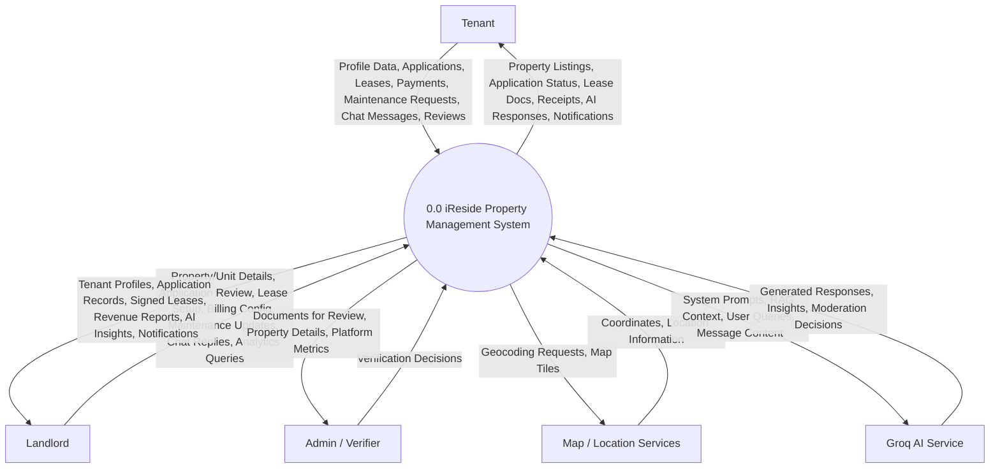

# iReside Data Flow Diagram — Level 0 (Context Diagram)

The Level 0 DFD (Context Diagram) represents the entire iReside system as a single process and illustrates its interactions with external entities.

## System Overview

The iReside Property Management System encompasses 12 major business processes:
- User registration & authentication
- Property & unit management
- Listing management
- Application processing
- Lease management
- Payment processing
- Maintenance management
- Messaging system
- Notification system
- IRIS AI chat
- Statistics & reporting
- Review management

All processes are encapsulated within the system boundary and interact with external entities as shown below.

## Description of Interactions

### 👤 Tenant
Tenants interact with the system to find housing and manage their residency.
- **Inputs**: They provide personal information, submit applications for units, sign digital leases, deposit payments, report maintenance issues, send messages, and submit reviews.
- **Outputs**: They receive tailored property results, real-time updates on their requests, legal documents, intelligent support via the iRis concierge, and property/landlord reviews.

### 🏢 Landlord
Landlords use the system as a business management tool.
- **Inputs**: They upload property data, review prospective tenants, configure automated billing, respond to maintenance/chat, and request analytics.
- **Outputs**: The system provides them with verified tenant leads, financial analytics, signed legal contracts, AI-driven portfolio insights, and platform metrics.

### 🛡️ Admin / Verifier
A specialized role focused on platform integrity.
- **Inputs**: Approves or denies property/landlord verification requests.
- **Outputs**: Receives specific documents and property data that require manual oversight; views system-wide metrics.

### 🗺️ Map / Location Services (External)
- **Inputs**: Latitude/Longitude or address strings from searched properties.
- **Outputs**: Visual map rendering and accurate geocoding for distance-based search.

### 🤖 Groq AI Service (External)
- **Inputs**: The system passes sanitized user messages combined with relevant "Retrieval-Augmented Generation" (RAG) context and moderation checks.
- **Outputs**: The AI returns formatted text responses for the iRis assistant, structured data for landlord analytics, and content moderation decisions.
