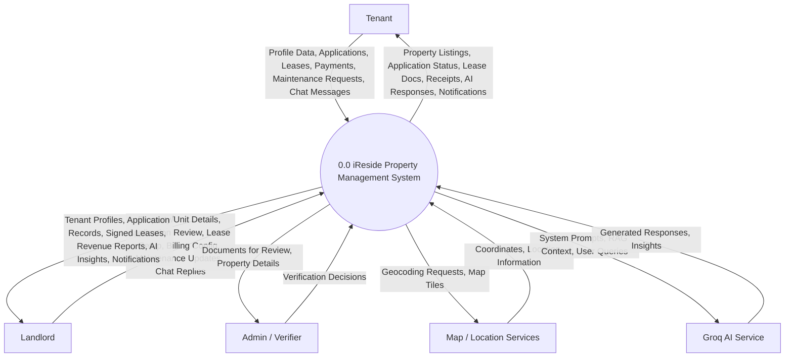

# iReside Data Flow Diagram — Level 0 (Context Diagram)

The Level 0 DFD (Context Diagram) represents the entire iReside system as a single process and illustrates its interactions with external entities.

## Description of Interactions

### 👤 Tenant
Tenants interact with the system to find housing and manage their residency. 
- **Inputs**: They provide personal information, submit applications for units, sign digital leases, deposit payments, and report maintenance issues.
- **Outputs**: They receive tailored property results, real-time updates on their requests, legal documents, and intelligent support via the iRis concierge.

### 🏢 Landlord
Landlords use the system as a business management tool.
- **Inputs**: They upload property data, review prospective tenants, configure automated billing, and respond to maintenance/chat.
- **Outputs**: The system provides them with verified tenant leads, financial analytics, signed legal contracts, and AI-driven portfolio insights.

### 🛡️ Admin / Verifier
A specialized role focused on platform integrity.
- **Inputs**: Approves or denies property/landlord verification requests.
- **Outputs**: Receives specific documents and property data that require manual oversight.

### 🗺️ Map / Location Services (External)
- **Inputs**: Latitude/Longitude or address strings from searched properties.
- **Outputs**: Visual map rendering and accurate geocoding for distance-based search.

### 🤖 Groq AI Service (External)
- **Inputs**: The system passes sanitized user messages combined with the relevant "Retrieval-Augmented Generation" (RAG) context.
- **Outputs**: The AI returns formatted text responses for the iRis assistant or structured data for landlord analytics.
