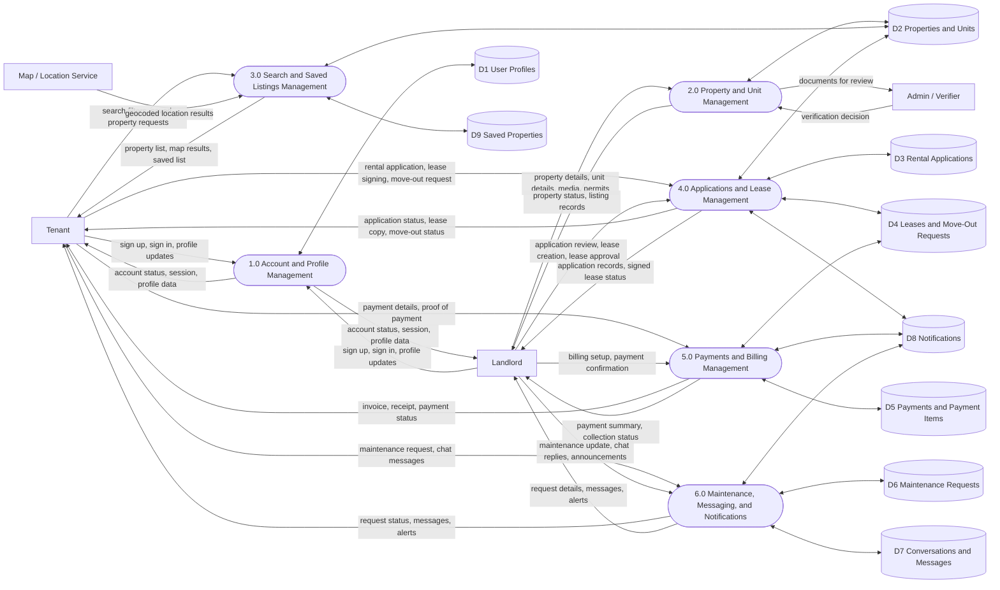

# iReside Level 1 DFD (Gane and Sarson)

This Level 1 DFD decomposes the iReside system into its main business processes based on the current application structure and database schema.

Note: Mermaid does not natively support every Gane and Sarson symbol, so this uses a close visual approximation:
- External entities: rectangles
- Processes: rounded rectangles with `1.0`, `2.0`, etc.
- Data stores: labeled store nodes `D1`, `D2`, etc.

## Process Decomposition

### 1.0 Account and Profile Management
- Handles registration, login, logout, and role-based profile access.
- Reads and updates `profiles`.

### 2.0 Property and Unit Management
- Handles landlord property onboarding, unit setup, media upload, and verification workflow.
- Uses `properties` and `units`.

### 3.0 Search and Saved Listings Management
- Handles rental browsing, map-based search, filters, and bookmarked properties.
- Uses `properties`, `units`, and `saved_properties`.

### 4.0 Applications and Lease Management
- Handles tenant applications, landlord review, lease creation, lease signing, and move-out workflow.
- Uses `applications`, `leases`, and `move_out_requests`.

### 5.0 Payments and Billing Management
- Handles rent/bill records, payment submission, landlord confirmation, and receipt/invoice status.
- Uses `payments` and `payment_items`.

### 6.0 Maintenance, Messaging, and Notifications
- Handles maintenance requests, tenant-landlord conversations, system messages, and alerts.
- Uses `maintenance_requests`, `conversations`, `messages`, and `notifications`.

## Data Store Key

- `D1` User Profiles
- `D2` Properties and Units
- `D3` Rental Applications
- `D4` Leases and Move-Out Requests
- `D5` Payments and Payment Items
- `D6` Maintenance Requests
- `D7` Conversations and Messages
- `D8` Notifications
- `D9` Saved Properties
