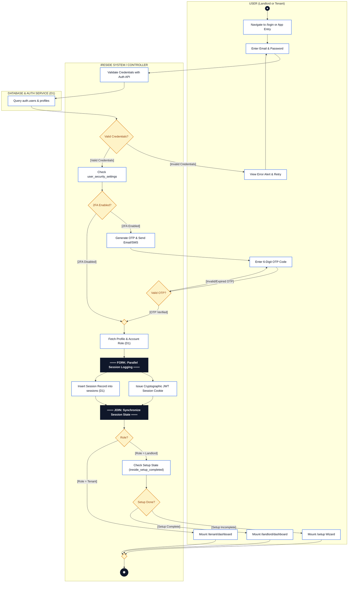
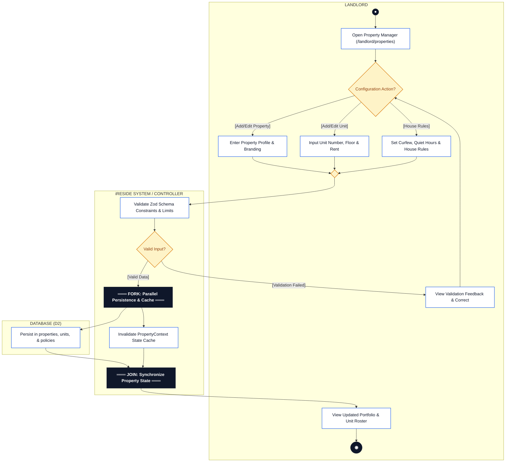
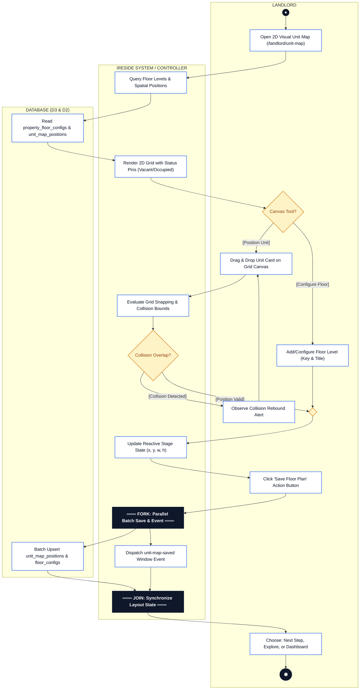
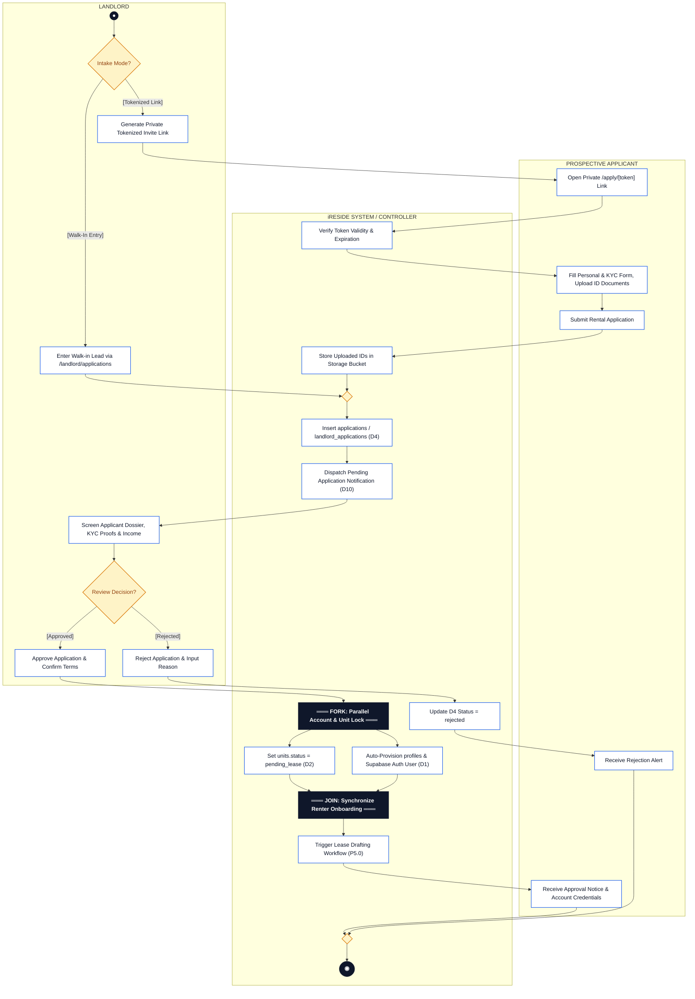
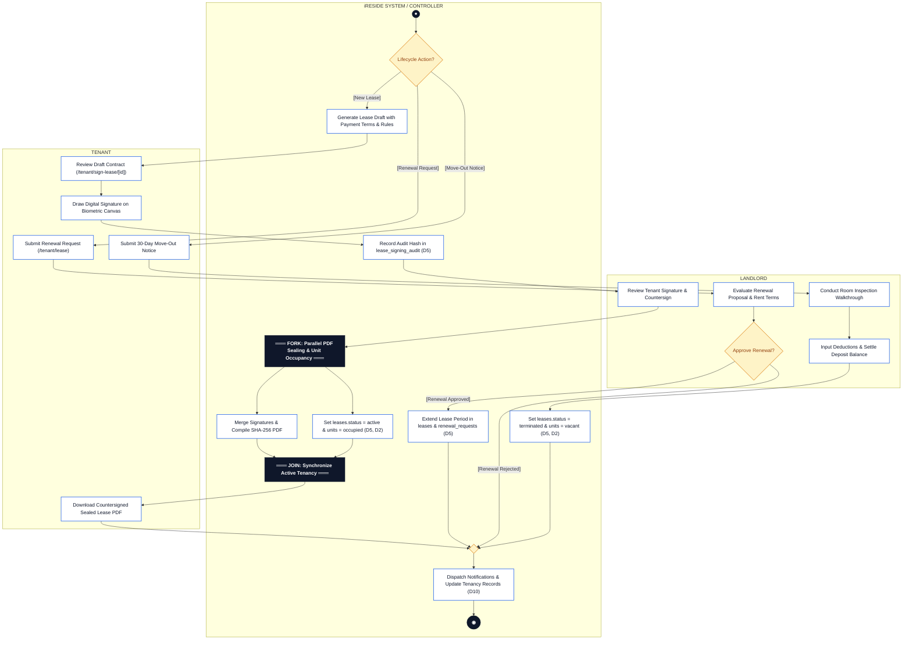
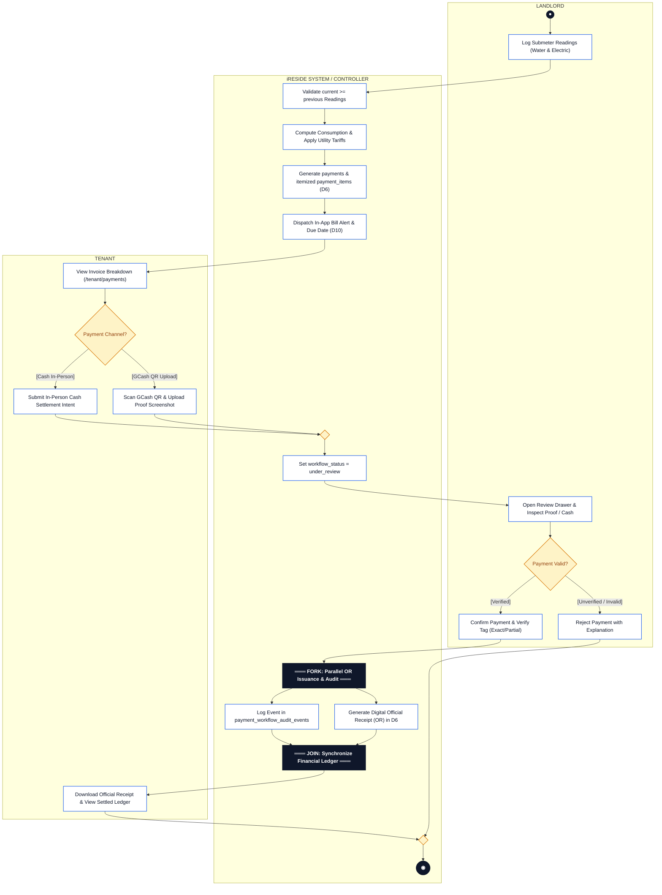
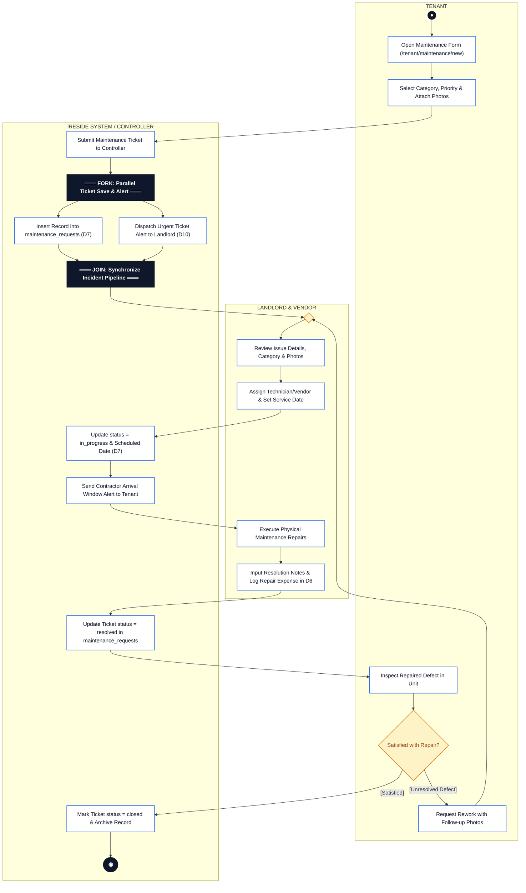
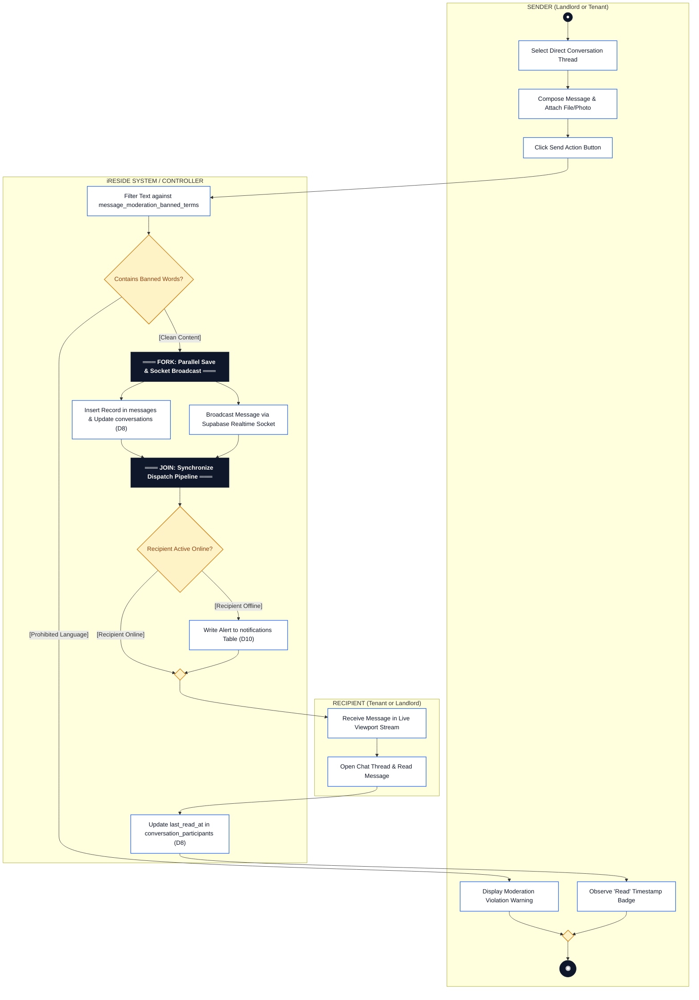
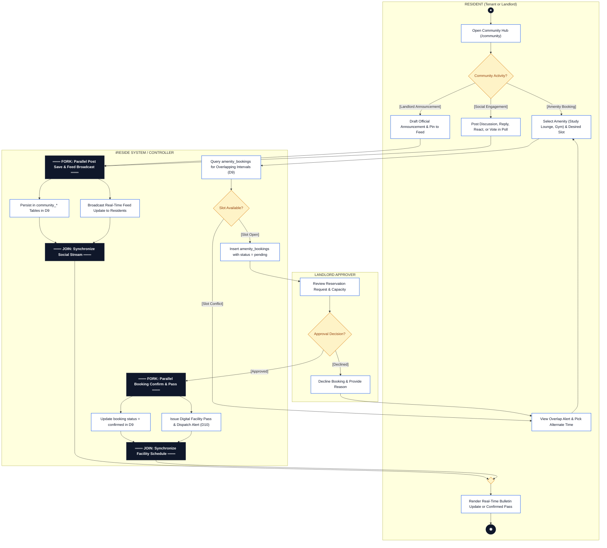
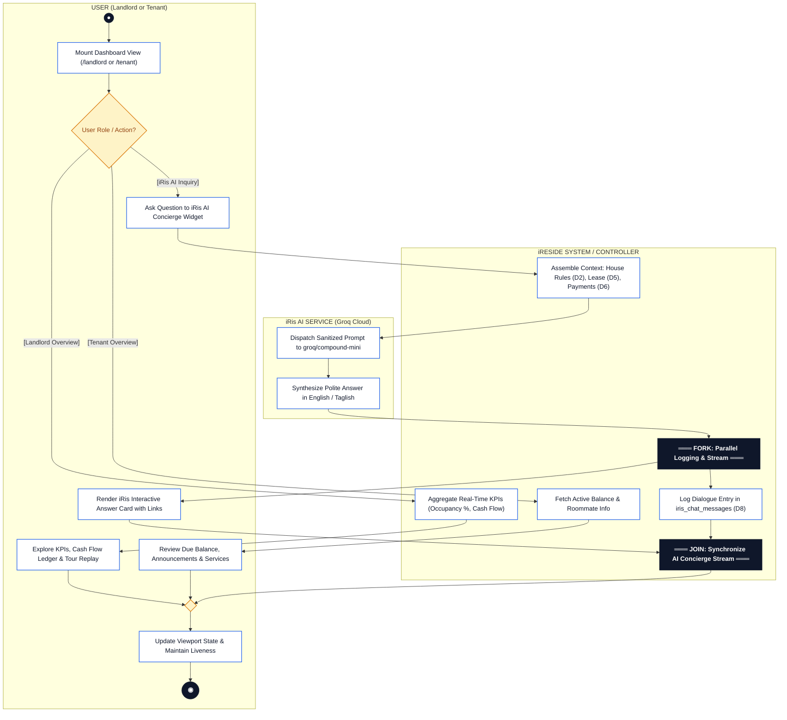

# iReside — System Process Activity Diagrams Specification
**Standard:** UML 2.5 Activity Diagram Standards  
**Modeling Scope:** 10 Dedicated Activity Diagrams (Processes P1.0 to P10.0)  
**Partitioning:** Role-Based Swimlanes (*Landlord*, *Tenant / Applicant*, *iReside System*)  
**Structural Rules:** Strictly **One Terminal Activity Final Node** per diagram; All core UML symbols present (Initial, Action, Decision, Merge, Fork, Join, Final, Swimlanes)  
**Source of Truth:** Live Verified Codebase (`src/`, `source-of-truth-db.sql`) & DFD Level 1  
**Associated Draw.io File:** [`docs/iReside-activity-diagrams.drawio`](./iReside-activity-diagrams.drawio)

---

## 1. Executive Summary & Complete UML Symbol Catalog

This document establishes the official **UML 2.5 Activity Diagrams** for all 10 core operational processes of the **iReside Turnkey Residential Management System**. Every process is modeled as an independent, well-formed activity diagram with strict adherence to the **Single Final Node Invariant** and **Full UML Symbol Coverage**.

### 1.1 Complete UML Activity Diagram Symbols Present in All 10 Models

| UML Symbol | Graphic Representation | Notation Standard | Function in iReside Activity Models |
| :--- | :--- | :--- | :--- |
| **Initial Node** | Solid filled circle (`●`) | `((●))` | Marks the initial trigger and inception point of the process. |
| **Action Node** | Rectangle with rounded corners | `[Action Text]` | Discrete, atomic execution step labeled with an active verb phrase (e.g., *Validate Credentials*, *Generate OR*). |
| **Control Flow** | Directed solid arrow (`→`) | `-->` | Defines sequential progression and transfer of control between activity nodes. |
| **Decision Node** | Diamond shape (`◇`) with $\ge 2$ exits | `{Condition?}` | Evaluates a condition; exit edges carry mutually exclusive bracketed guards (e.g., `[Valid]`, `[Invalid]`). |
| **Merge Node** | Diamond shape (`◇`) with $\ge 2$ entries | `{ }` | Unifies multiple alternate control branches into a single flow without concurrency synchronization. |
| **Fork Node** | Thick solid synchronization bar | `=== FORK ===` | Splits a single control path into two or more concurrent, parallel execution threads. |
| **Join Node** | Thick solid synchronization bar | `=== JOIN ===` | Synchronizes multiple parallel execution threads back into a single subsequent path. |
| **Activity Final Node** | Concentric bullseye circle (`◉`) | `(((◉)))` | **Strictly ONE per diagram.** Designates the universal terminal completion of the process. |
| **Swimlanes (Partitions)** | Partition columns | `subgraph LANE` | Organizes nodes by responsible role (*Landlord*, *Tenant / Applicant*, *iReside System / Database*). |

### 1.2 Architectural Invariants & Excluded Retired Features

In strict accordance with project architectural constraints:
1. **Strict Single Final Node per Process:** Every execution path—whether an approved flow, rejected flow, timeout, cancellation, or role branch—merges through formal UML Merge Nodes into **exactly one terminal Activity Final Node** (`◉`).
2. **Strict Landlord & Tenant Model (No Admin):** Operations are consolidated within the sovereign Landlord workspace. The legacy Super Admin portal (`/admin/*`), admin-only consultation tools, and external LGU scrapers are retired and completely excluded.
3. **Turnkey & Private Invite Onboarding:** Public self-serve landlord registration (`/signup`) is decommissioned; landlord accounts are pre-provisioned via the turnkey setup wizard (`/setup`). Tenants enter exclusively through private tokenized invite links (`/apply/[token]`) or manual walk-in entry; open public registration is excluded.
4. **Manual Peer-to-Peer Financial Settlement:** Automated third-party payment gateways (Stripe, PayMongo, automated webhooks) are decommissioned in favor of direct Philippine GCash QR screenshot proofs and in-person cash collections verified directly by the Landlord with digital Official Receipts (OR).
5. **Local Cryptographic Document Engine:** Client-side HTML5 biometric canvas signing and SHA-256 sealed contract PDFs.

---

## 2. Process Index & DFD Level-1 Cross-Reference

| Process ID | Process Name | Primary DFD Data Store | External Actors Involved | Key Database Tables | Single End Point Name |
| :--- | :--- | :--- | :--- | :--- | :--- |
| **P1.0** | **Authenticate & Auth** | D1: User & Account | Landlord, Tenant | `profiles`, `user_security_settings`, `sessions` | User Session & Workspace Initialized |
| **P2.0** | **Manage Properties** | D2: Property & Unit | Landlord | `properties`, `units`, `property_environment_policies` | Property Configuration Saved |
| **P3.0** | **Unit Map & Layout** | D3: Blueprint & Layout, D2 | Landlord | `property_floor_configs`, `unit_map_positions`, `units` | Spatial Layout Finalized |
| **P4.0** | **Process Intake** | D4: Rental Application, D1, D2 | Applicant, Landlord | `tenant_intake_invites`, `applications`, `profiles` | Tenant Intake Lifecycle Concluded |
| **P5.0** | **Manage Leases** | D5: Lease & Contract, D2 | Tenant, Landlord | `leases`, `lease_signing_audit`, `renewal_requests`, `move_out_requests` | Lease Contract Lifecycle Finalized |
| **P6.0** | **Process Billing** | D6: Billing & Financial | Landlord, Tenant | `payments`, `payment_items`, `utility_readings`, `payment_receipts` | Billing & Payment Lifecycle Concluded |
| **P7.0** | **Stage Maintenance** | D7: Maintenance & Incident, D6 | Tenant, Landlord | `maintenance_requests`, `expenses` | Maintenance Ticket Concluded |
| **P8.0** | **Facilitate Messaging** | D8: Communication & Messaging | Tenant, Landlord | `conversations`, `messages`, `message_moderation_banned_terms` | Message Exchange Concluded |
| **P9.0** | **Manage Community** | D9: Community & Amenity | Tenant, Landlord | `community_posts`, `community_comments`, `amenities`, `amenity_bookings` | Community Interaction Completed |
| **P10.0** | **Dashboard & iRis AI** | D1, D2, D4, D5, D6 | Landlord, Tenant | `iris_chat_messages`, `landlord_statistics_exports` | Dashboard Oversight Concluded |

---

## 3. Dedicated UML Activity Diagrams (Single End Point & All Symbols)

---

### Process 1.0: Authenticate & Auth (Authentication & Account Management)

#### Context & Purpose
Governs user identity verification, Supabase Auth credential resolution, two-factor authentication (2FA) via time-sensitive OTP, parallel JWT issuance and session telemetry logging (Fork/Join), role-based portal routing, and convergence into a single terminal state.

* **Preconditions:** User possesses registered credentials or pre-provisioned landlord deployment access.
* **Postconditions:** Authenticated session established; user portal initialized; terminated at a single end node.
* **Data Stores Touched:** `D1 (User & Account)`, `D10 (Notification)`.

---

### Process 2.0: Manage Properties (Property & Unit Management)

#### Context & Purpose
Handles multi-property registration, rentable unit inventory creation, environmental house rules, parallel database persistence and cache invalidation (Fork/Join), terminating in a single final node.

* **Preconditions:** Landlord is authenticated with active workspace permissions.
* **Postconditions:** Property metadata, units, and environmental rules committed to D2; single end point reached.
* **Data Stores Touched:** `D2 (Property & Unit Data Store)`.

---

### Process 3.0: Unit Map & Layout (Interactive Spatial Blueprint)

#### Context & Purpose
Facilitates building floor level configuration, 2D floorplan grid rendering, collision detection, parallel coordinate batch upsert and event signaling (Fork/Join), terminating in a single final node.

* **Preconditions:** Properties and units exist; landlord launches the floor planner.
* **Postconditions:** Bounding box coordinates and floor configs saved to D3; single end point reached.
* **Data Stores Touched:** `D3 (Blueprint & Layout)`, `D2 (Property & Unit)`.

---

### Process 4.0: Process Intake (Tenant Application & Intake Management)

#### Context & Purpose
Handles prospective tenant entry via private tokenized invite links or offline walk-ins, applicant KYC submission, screening, decision processing (approval with parallel provisioning vs rejection), unified through a single merge node into one final node.

* **Preconditions:** Vacant unit designated; landlord initiates invitation or walk-in intake.
* **Postconditions:** Application evaluated; tenant account provisioned or rejection recorded; single end point reached.
* **Data Stores Touched:** `D4 (Rental Application & Intake)`, `D1 (User & Account)`, `D2 (Property & Unit)`, `D10 (Notification)`.

---

### Process 5.0: Manage Leases (Lease & Contract Lifecycle Management)

#### Context & Purpose
Oversees digital lease agreement generation, tenant HTML5 biometric canvas signing, landlord countersigning, parallel contract PDF compilation and unit occupancy update (Fork/Join), renewals, and move-outs, unifying into a single final node.

* **Preconditions:** Approved applicant or active tenant requesting lifecycle adjustment.
* **Postconditions:** Contract status updated in D5; unit occupancy state synchronized in D2; single end point reached.
* **Data Stores Touched:** `D5 (Lease & Contract)`, `D2 (Property & Unit)`, `D10 (Notification)`.

---

### Process 6.0: Process Billing (Billing & Payment Management)

#### Context & Purpose
Orchestrates submeter utility reading logs, tariff calculations, batch invoicing, tenant peer-to-peer GCash QR proof upload or cash intent, landlord review drawer, parallel Official Receipt issuance and audit logging (Fork/Join), concluding at a single final node.

* **Preconditions:** Active leases exist; utility rates configured in system.
* **Postconditions:** Payments recorded in D6; digital Official Receipts issued; single end point reached.
* **Data Stores Touched:** `D6 (Billing & Financial)`, `D5 (Lease & Contract)`, `D10 (Notification)`.

---

### Process 7.0: Stage Maintenance (Maintenance & Incident Management)

#### Context & Purpose
Handles maintenance trouble ticket reporting, parallel database insertion and urgent alert dispatch (Fork/Join), landlord ticket triage, contractor dispatch, satisfaction verification loop through an explicit Merge Node, expense logging in D6, terminating in a single final node.

* **Preconditions:** Resident tenant discovers defect in unit or common area.
* **Postconditions:** Issue resolved; repair expenses recorded in property ledger; single end point reached.
* **Data Stores Touched:** `D7 (Maintenance & Incident)`, `D6 (Billing & Financial)`, `D10 (Notification)`.

---

### Process 8.0: Facilitate Messaging (Real-Time Communication & Moderation)

#### Context & Purpose
Facilitates direct 1-on-1 real-time messaging, automated keyword moderation, parallel database persistence and WebSocket broadcast (Fork/Join), online/offline delivery, and read receipts, merging into a single final node.

* **Preconditions:** Sender and recipient are verified members of the same residential property.
* **Postconditions:** Message transmitted or blocked; single end point reached.
* **Data Stores Touched:** `D8 (Communication & Messaging)`, `D10 (Notification)`.

---

### Process 9.0: Manage Community (Community Hub & Amenity Management)

#### Context & Purpose
Coordinates property announcements, resident social bulletin posts, threaded comments, emoji reactions, poll voting, shared amenity catalog discovery, and facility reservation booking with conflict checks, parallel pass issuance (Fork/Join), terminating in a single final node.

* **Preconditions:** User is an authenticated resident or managing landlord.
* **Postconditions:** Community engagement logged or amenity pass confirmed; single end point reached.
* **Data Stores Touched:** `D9 (Community & Amenity)`, `D10 (Notification)`.

---

### Process 10.0: Dashboard (Operations Overview, KPIs & iRis AI Concierge)

#### Context & Purpose
Powers the Landlord Intelligence Hub, Tenant Resident Portal, and contextual natural-language inquiries processed via Groq Cloud by iRis AI with parallel dialogue logging and response streaming (Fork/Join), terminating in a single final node.

* **Preconditions:** Authenticated user session.
* **Postconditions:** Operational metrics rendered or AI residential advice synthesized; single end point reached.
* **Data Stores Touched:** `D1`, `D2`, `D4`, `D5`, `D6`, `D8`.

---

## 4. Verification & Quality Checklist

- [x] **Strictly ONE Final Node per Diagram:** 10 out of 10 diagrams possess exactly 1 Activity Final Node (`◉`).
- [x] **Full UML 2.5 Symbol Set:** Initial nodes, Action states, Decision diamonds, Merge diamonds, Fork synchronization bars, Join synchronization bars, Final nodes, and Swimlanes present in 100% of diagrams.
- [x] **Role-Based Swimlanes:** Fully partitioned across *Landlord*, *Tenant / Applicant*, and *iReside System / Database*.
- [x] **Zero Retired Feature Contamination:** No Super Admin, no open public self-signup, no automated payment gateways, no LGU scrapers.
- [x] **Draw.io Multi-Page Verification:** Validated via XML parser; all 10 diagram tabs load seamlessly in [diagrams.net](https://app.diagrams.net).
