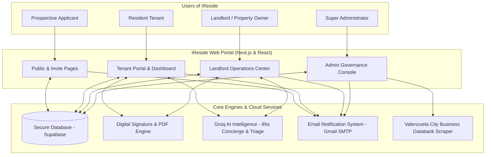
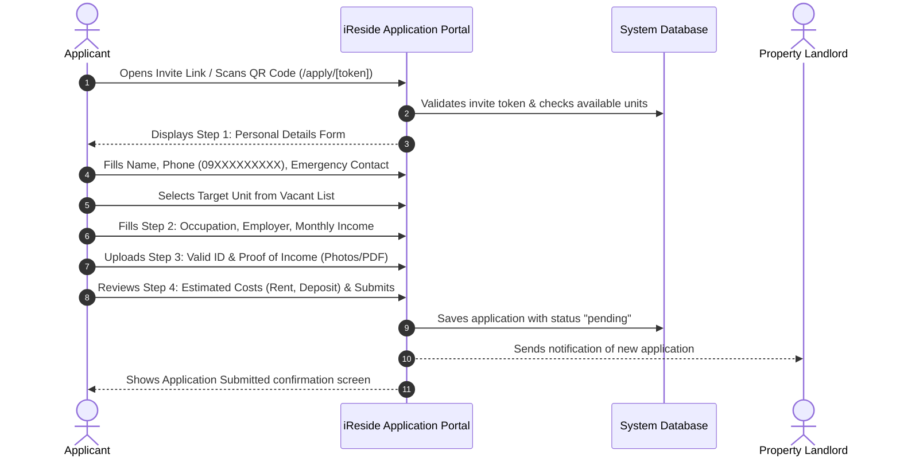
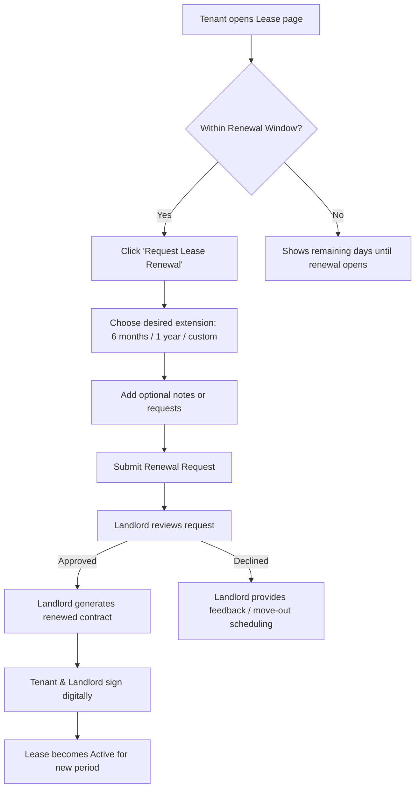
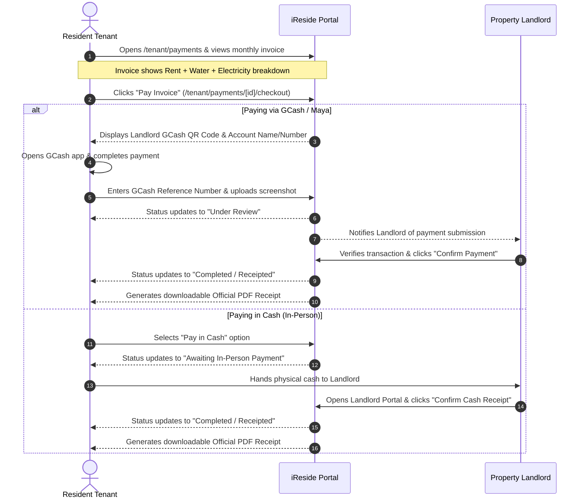
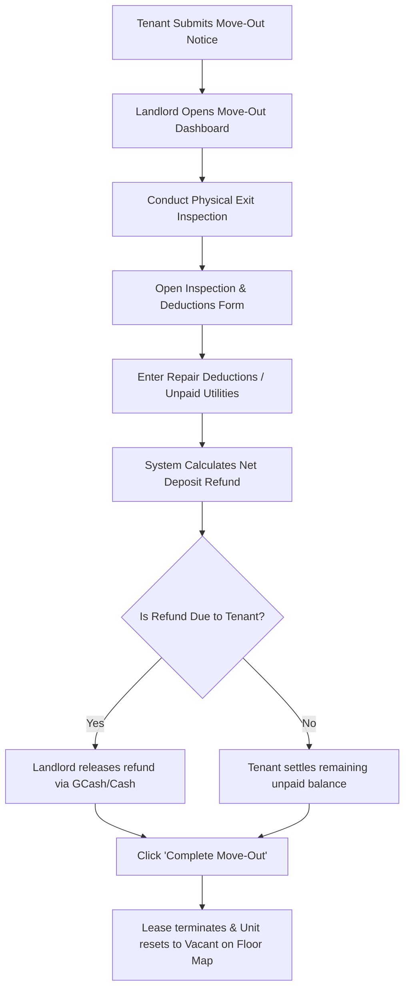

# iReside — Complete Step-by-Step System & User Process Guide
> **The Definitive, Easy-to-Read Manual for All Users (Tenants, Landlords, Applicants, and Administrators)**  
> *Written in plain, accessible language with step-by-step instructions, visual workflows, and helpful tips.*

---

## 📖 Table of Contents

1. [Introduction: Welcome to iReside](#1-introduction-welcome-to-ireside)
   - 1.1 [What is iReside? (The Simple Explanation)](#11-what-is-ireside-the-simple-explanation)
   - 1.2 [How iReside Works (The Exclusive Property System)](#12-how-ireside-works-the-exclusive-property-system)
   - 1.3 [The 4 Types of Users](#13-the-4-types-of-users)
   - 1.4 [System Architecture at a Glance](#14-system-architecture-at-a-glance)
2. [Public Visitor & Prospective Tenant Flows](#2-public-visitor--prospective-tenant-flows)
   - 2.1 [Flow 1: Visiting the Landing Page & Exploring Features](#21-flow-1-visiting-the-landing-page--exploring-features)
   - 2.2 [Flow 2: Applying via an Online Invite Link or QR Code](#22-flow-2-applying-via-an-online-invite-link-or-qr-code)
   - 2.3 [Flow 3: Submitting Pre-Approval Move-In Payments](#23-flow-3-submitting-pre-approval-move-in-payments)
   - 2.4 [Flow 4: Remote Digital Lease Signing](#24-flow-4-remote-digital-lease-signing)
   - 2.5 [Flow 5: Receiving Account Credentials & First-Time Login](#25-flow-5-receiving-account-credentials--first-time-login)
3. [Resident Tenant Daily Life & Portal Flows](#3-resident-tenant-daily-life--portal-flows)
   - 3.1 [Flow 6: Guided Product Tour (Onboarding)](#31-flow-6-guided-product-tour-onboarding)
   - 3.2 [Flow 7: Navigating the Tenant Dashboard](#32-flow-7-navigating-the-tenant-dashboard)
   - 3.3 [Flow 8: Viewing Leases & Downloading Signed Contracts](#33-flow-8-viewing-leases--downloading-signed-contracts)
   - 3.4 [Flow 9: Requesting a Lease Renewal](#34-flow-9-requesting-a-lease-renewal)
   - 3.5 [Flow 10: Requesting a Unit Transfer (Moving Rooms)](#35-flow-10-requesting-a-unit-transfer-moving-rooms)
   - 3.6 [Flow 11: Submitting a Move-Out Notice & Final Settlement](#36-flow-11-submitting-a-move-out-notice--final-settlement)
   - 3.7 [Flow 12: Paying Monthly Rent & Utilities (GCash & Cash)](#37-flow-12-paying-monthly-rent--utilities-gcash--cash)
   - 3.8 [Flow 13: Submitting Maintenance Requests & Self-Repair Option](#38-flow-13-submitting-maintenance-requests--self-repair-option)
   - 3.9 [Flow 14: Asking Questions to iRis (The 24/7 AI Concierge)](#39-flow-14-asking-questions-to-iris-the-247-ai-concierge)
   - 3.10 [Flow 15: Chatting in Real-Time with the Landlord](#310-flow-15-chatting-in-real-time-with-the-landlord)
   - 3.11 [Flow 16: Participating in the Community Hub](#311-flow-16-participating-in-the-community-hub)
   - 3.12 [Flow 17: Booking Property Amenities](#312-flow-17-booking-property-amenities)
   - 3.13 [Flow 18: Managing Personal Profile, Password & 2FA](#313-flow-18-managing-personal-profile-password--2fa)
4. [Landlord & Property Manager Operations Guide](#4-landlord--property-manager-operations-guide)
   - 4.1 [Flow 19: Landlord Registration (3-Step Wizard with OTP)](#41-flow-19-landlord-registration-3-step-wizard-with-otp)
   - 4.2 [Flow 20: Completing Initial Setup via 72-Hour Magic Link](#42-flow-20-completing-initial-setup-via-72-hour-magic-link)
   - 4.3 [Flow 21: Navigating the Landlord Dashboard & AI Analytics](#43-flow-21-navigating-the-landlord-dashboard--ai-analytics)
   - 4.4 [Flow 22: Designing Floors with the 2D Modular Floor Planner](#44-flow-22-designing-floors-with-the-2d-modular-floor-planner)
   - 4.5 [Flow 23: Managing Tenant Intake (Invite Links & Walk-In Intake)](#45-flow-23-managing-tenant-intake-invite-links--walk-in-intake)
   - 4.6 [Flow 24: Reviewing & Approving Tenant Applications](#46-flow-24-reviewing--approving-tenant-applications)
   - 4.7 [Flow 25: Digital Lease Signing & Countersigning](#47-flow-25-digital-lease-signing--countersigning)
   - 4.8 [Flow 26: Active Leases, Renewals & Unit Transfers](#48-flow-26-active-leases-renewals--unit-transfers)
   - 4.9 [Flow 27: Move-Out Processing & Security Deposit Settlement](#49-flow-27-move-out-processing--security-deposit-settlement)
   - 4.10 [Flow 28: Monthly Billing, Utility Meter Readings & Collection](#410-flow-28-monthly-billing-utility-meter-readings--collection)
   - 4.11 [Flow 29: Managing Maintenance Tickets with AI Triage](#411-flow-29-managing-maintenance-tickets-with-ai-triage)
   - 4.12 [Flow 30: Real-Time Messaging & Automated Safety Moderation](#412-flow-30-real-time-messaging--automated-safety-moderation)
   - 4.13 [Flow 31: Moderating and Managing the Community Hub](#413-flow-31-moderating-and-managing-the-community-hub)
   - 4.14 [Flow 32: Property Calendar & Scheduled Events](#414-flow-32-property-calendar--scheduled-events)
   - 4.15 [Flow 33: Document Vault & Account Settings (2FA)](#415-flow-33-document-vault--account-settings-2fa)
5. [Super Administrator (Platform Guardian) Guide](#5-super-administrator-platform-guardian-guide)
   - 5.1 [Flow 34: Admin Sign-In & Live Platform Metrics](#51-flow-34-admin-sign-in--live-platform-metrics)
   - 5.2 [Flow 35: Landlord Verification & Valenzuela Databank Scraping](#52-flow-35-landlord-verification--valenzuela-databank-scraping)
   - 5.3 [Flow 36: Platform User Governance & Role Management](#53-flow-36-platform-user-governance--role-management)
   - 5.4 [Flow 37: Chat & Community Moderation Console](#54-flow-37-chat--community-moderation-console)
   - 5.5 [Flow 38: Admin Consultation Tool & Digital Handover Signing](#55-flow-38-admin-consultation-tool--digital-handover-signing)
   - 5.6 [Flow 39: Product Tour Funnel & Platform Health Analytics](#56-flow-39-product-tour-funnel--platform-health-analytics)
6. [Master Status Dictionary & Visual Process Lifecycles](#6-master-status-dictionary--visual-process-lifecycles)
   - 6.1 [Every Status in Plain English](#61-every-status-in-plain-english)
   - 6.2 [Visual Lifecycle Diagrams (Application, Lease, Payment, Maintenance, Move-Out)](#62-visual-lifecycle-diagrams)
7. [Troubleshooting, FAQs & Simple Glossary](#7-troubleshooting-faqs--simple-glossary)
   - 7.1 [Frequently Asked Questions for Non-Tech Users](#71-frequently-asked-questions-for-non-tech-users)
   - 7.2 [Plain-English Glossary of Terms](#72-plain-english-glossary-of-terms)

---

# 1. Introduction: Welcome to iReside

### 1.1 What is iReside? (The Simple Explanation)

Think of **iReside** as a **digital property manager and building assistant in your pocket**. 

Before iReside, running an apartment, dormitory, or boarding house required endless paper forms, handwritten receipts, lost text messages, messy payment records, and confusion over building rules.

iReside brings all of this into one easy-to-use web application:
- **Tenants** can apply for rooms, sign leases digitally on their phones, pay rent via GCash or cash, report leaky faucets with photos, chat with their landlord, talk to an AI concierge, and interact with neighbors.
- **Landlords** can manage building layouts on an interactive floor map, screen applicants, collect rent, record water and electricity meter readings, handle repair requests with AI assistance, issue announcements, and view financial earnings.
- **Administrators** verify legitimate landlords, maintain safety standards, and keep the system secure and running smoothly.

---

### 1.2 How iReside Works (The Exclusive Property System)

> [!IMPORTANT]
> **No Public Marketplace**: Unlike public booking websites (like Airbnb or Agoda) where anyone searches for random rooms, iReside is an **exclusive, private property management platform**.

- Each landlord receives their own dedicated deployment for their properties.
- Tenants enter the system exclusively through **private invite links, QR codes, or in-person walk-ins** provided directly by their landlord.
- This ensures maximum privacy, security, and dedicated control for every rental community.

---

### 1.3 The 4 Types of Users

```
┌─────────────────────────────────────────────────────────────────────────┐
│                           WHO USES iReside?                             │
├──────────────────┬──────────────────┬─────────────────┬─────────────────┤
│ 👤 PROSPECTIVE   │ 🏢 TENANT        │ 🏠 LANDLORD     │ 🛡️ SUPER ADMIN  │
│    APPLICANT     │    (Resident)    │    (Manager)    │    (Guardian)   │
├──────────────────┼──────────────────┼─────────────────┼─────────────────┤
│ • Scans invite   │ • Pays rent &    │ • Manages units │ • Verifies      │
│   QR code        │   utilities      │   & floor map   │   landlords     │
│ • Submits online │ • Reports repairs│ • Collects rent │ • Reviews biz   │
│   application    │ • Chats w/ owner │ • Approves apps │   permits       │
│ • Uploads ID &   │ • Talks to AI    │ • Manages bills │ • Moderates     │
│   proof of income│ • Signs renewals │ • Tracks income │   platform terms│
│ • Signs digital  │ • Books amenities│ • Issues notices│ • Monitors      │
│   lease          │ • Joins community│ • Directs staff │   system health │
└──────────────────┴──────────────────┴─────────────────┴─────────────────┘
```

---

### 1.4 System Architecture at a Glance



---

# 2. Public Visitor & Prospective Tenant Flows

---

### 2.1 Flow 1: Visiting the Landing Page & Exploring Features

**Who is this for:** Anyone who visits the website directly (`/`).

#### Step-by-Step Walkthrough:
1. **Open the Website**: The visitor navigates to the iReside home page.
2. **Explore the Showcase**:
   - **Hero Section**: Introduces iReside as the premier property management platform for apartments, boarding houses, and dormitories.
   - **How It Works**: Visual breakdown of the step-by-step tenant and landlord journey.
   - **Feature Highlights**: Shows screenshots and benefits of the 2D Unit Map, Digital Leasing, Automated Billing, and the iRis AI assistant.
3. **Navigation Options**:
   - Clicking **"Login"** takes existing users to the sign-in portal.
   - Clicking **"Landlord Register"** opens the 3-step property owner onboarding application.
   - Clicking **"Tenant Portal Info"** explains that tenant accounts are invite-only and guides them to contact their landlord for an invite link.

---

### 2.2 Flow 2: Applying via an Online Invite Link or QR Code

**Who is this for:** A person who wants to rent a room and received a link or scanned a QR code from the landlord.



#### Detailed Step-by-Step Instructions:

#### Step 1: Open the Application Link
- **What to do**: Click the link sent by your landlord (or scan the printed QR code with your smartphone camera).
- **What you see**: A welcome screen displaying the **Property Name**, **Address**, and an overview of the rental requirements.

#### Step 2: Fill Out Personal Details (Step 1)
- **Full Name**: Enter your first, middle, and last name.
- **Email Address**: Enter your active email address (this is where your login credentials and lease will be sent).
- **Mobile Number**: Enter your Philippine phone number (format: `09XXXXXXXXX`).
- **Emergency Contact**: Enter the full name, relationship, and contact number of a family member or friend.
- **Move-In Date**: Select your target move-in date on the calendar (must not be in the past).
- **Unit Selection**: Choose your preferred room or bed from the list of currently vacant units.

#### Step 3: Fill Out Employment & Profile Details (Step 2)
- **Occupation & Employer**: Enter your current job title and company name (or school name if you are a student).
- **Monthly Income**: Enter your estimated monthly income in Philippine Pesos (PHP).
- **Additional Notes**: Optional notes for the landlord (e.g., parking requirements or special move-in requests).

#### Step 4: Upload Required Documents (Step 3)
- **Government Valid ID**: Take a clear photo or upload a PDF of your Passport, Driver's License, UMID, National ID, or Student ID.
- **Proof of Income / Student Enrollment**: Upload a recent payslip, certificate of employment, or school registration form.
- *System rule: Files must be clear, under 10MB, and in JPG, PNG, or PDF format.*

#### Step 5: Review & Submit (Step 4)
- **Review Summary**: Check that all your contact information and selected unit details are accurate.
- **Estimated Payment Preview**: View the estimated monthly rent, advance rent, and security deposit amounts.
- **Submit**: Click the green **"Submit Application"** button.
- **Result**: You will see a success confirmation message with your application tracking number.

---

### 2.3 Flow 3: Submitting Pre-Approval Move-In Payments

**Who is this for:** Applicants whose landlord requires advance payment (such as a reservation fee or advance deposit) before final lease activation.

```
┌─────────────────────────────────────────────────────────────────────────┐
│                  PRE-APPROVAL PAYMENT FLOW (APPLICANT)                  │
├─────────────────────────────────────────────────────────────────────────┤
│                                                                         │
│  1. Receive Email Notification with Secure Payment Link                 │
│     "Action Required: Submit move-in payment details"                   │
│                                                                         │
│  2. Open Payment Screen (/apply/payments/[token])                       │
│     • View exact amount due (e.g., ₱10,000 for 1 Month Advance)         │
│     • View Landlord's verified GCash / Maya Name and Account Number     │
│     • Scan the displayed GCash / Maya QR Code                           │
│                                                                         │
│  3. Pay in your GCash / Banking App                                     │
│     • Complete the transfer                                             │
│     • Save the confirmation screenshot & copy Reference Number          │
│                                                                         │
│  4. Submit Proof on iReside                                             │
│     • Type in the Reference Number (e.g., 100293847561)                 │
│     • Upload receipt image file                                         │
│     • Click "Submit Payment Proof"                                      │
│                                                                         │
│  5. Real-Time Status Updates:                                           │
│     Pending ──▶ Processing ──▶ Completed (Verified by Landlord)         │
└─────────────────────────────────────────────────────────────────────────┘
```

---

### 2.4 Flow 4: Remote Digital Lease Signing

**Who is this for:** Approved applicants who need to sign their legal rental contract digitally without needing to visit a print shop or buy physical paper.

#### Step-by-Step Instructions:

1. **Receive the Signing Invitation**:
   - You will receive an email titled *"Your Lease Agreement is Ready for Signature"*.
   - Click the blue **"Review & Sign Lease"** button inside the email (or open the secure link provided).
2. **Review the Rental Contract**:
   - The contract displays the complete legal agreement:
     - Tenant and Landlord full legal names.
     - Property address and specific Unit Number.
     - Exact Lease Start Date and End Date (typically 6 months or 12 months).
     - Monthly Rent Amount and Payment Due Date (e.g., 5th of every month).
     - Security Deposit and Advance Rent breakdown.
     - Building policies: Curfew, visitor rules, quiet hours, and utility billing terms.
3. **Draw Your Digital Signature**:
   - Scroll to the bottom to find the **Digital Signature Pad**.
   - Use your **finger on a smartphone/tablet screen** or your **computer mouse** to sign your name neatly.
   - If you make a mistake, click **"Clear"** and sign again.
4. **Confirm and Submit**:
   - Check the box stating: *"I confirm that I have read, understood, and agreed to the lease terms above."*
   - Click **"Sign & Finalize Agreement"**.
5. **What happens next**:
   - The system validates and securely binds your signature to the document.
   - The status updates to **"Pending Landlord Countersignature"**.
   - Your landlord is immediately notified to countersign.

---

### 2.5 Flow 5: Receiving Account Credentials & First-Time Login

**Who is this for:** Newly approved tenants accessing their personal iReside account for the first time.

1. **Welcome Email Delivery**:
   - Once your lease is approved and signed, you receive an automated email: *"Welcome to iReside — Your Account is Ready"*.
   - The email contains:
     - Your **Login Email**
     - A secure **Temporary Password**
     - Direct link to the login page (`/login`)
2. **Signing In**:
   - Navigate to `/login`.
   - Enter your email and temporary password.
   - Click **"Sign In"**.
3. **Setting a Permanent Password**:
   - Upon first login, the system prompts you to create a secure personal password:
     - Minimum 8 characters.
     - At least 1 uppercase letter.
     - At least 1 number.
     - At least 1 special character (e.g., `@`, `#`, `!`).
4. **Welcome Onboarding**:
   - You are automatically guided into the interactive Tenant Dashboard tour!

---

# 3. Resident Tenant Daily Life & Portal Flows

---

### 3.1 Flow 6: Guided Product Tour (Onboarding)

**What is it?** A visual, friendly step-by-step popup tour that highlights every part of the screen so you know where everything is.

```
┌─────────────────────────────────────────────────────────────────────────┐
│                    TENANT PRODUCT TOUR HIGHLIGHTS                       │
├─────────────────────────────────────────────────────────────────────────┤
│                                                                         │
│  [Step 1] Dashboard Overview ──▶ Shows your lease countdown & rent due  │
│  [Step 2] Payments Hub       ──▶ How to view invoices & pay via GCash   │
│  [Step 3] Maintenance Tickets──▶ How to report broken items with photos │
│  [Step 4] iRis AI Assistant  ──▶ How to ask questions 24/7              │
│  [Step 5] Community Hub      ──▶ How to read announcements & chat       │
│                                                                         │
│  👉 You can click "Next" to continue, "Skip" anytime, or "Replay Tour"  │
│     later from your Account Settings!                                   │
└─────────────────────────────────────────────────────────────────────────┘
```

---

### 3.2 Flow 7: Navigating the Tenant Dashboard

**Route:** `/tenant/dashboard`

When you log in, this is your personal home screen. It gives you an instant snapshot of your stay:

- **Active Lease Card**: Shows your current Unit number, property address, and days remaining on your contract with an active countdown bar.
- **Rent Status Banner**: Shows whether your rent is **"Paid"**, **"Due Soon"**, or **"Overdue"** with the exact peso amount.
- **Active Maintenance Box**: Displays any repair requests currently in progress.
- **Quick Action Buttons**:
  - 💳 *Pay Rent Now*
  - 🔧 *Report a Repair*
  - 💬 *Message Landlord*
  - 🤖 *Ask iRis AI*
- **Latest Building Announcements**: Displays any urgent notices posted by management (e.g., upcoming water interruption or maintenance).

---

### 3.3 Flow 8: Viewing Leases & Downloading Signed Contracts

**Route:** `/tenant/lease`

1. **Accessing Your Lease**:
   - Click **"Lease"** in the left-hand menu.
2. **Information Displayed**:
   - Unit Name & Property Name.
   - Start Date, End Date, and Total Lease Duration.
   - Monthly Base Rent amount.
   - Security Deposit held.
   - Utility billing configuration (whether water/power are included in rent or separately metered).
3. **Downloading Your Official Contract**:
   - Click the **"Download Signed PDF"** button.
   - An official PDF containing both your digital signature and your landlord's countersignature will download directly to your phone or computer.

---

### 3.4 Flow 9: Requesting a Lease Renewal

**Route:** `/tenant/lease/[id]/renew`

When your lease is nearing expiration (e.g., within 60 days of ending), you can renew your stay without paper hassle:



---

### 3.5 Flow 10: Requesting a Unit Transfer (Moving Rooms)

**Route:** `/tenant/unit-map`

If you want to upgrade to a bigger room, move to a quieter floor, or switch to an available vacant unit in the same building:

1. Click **"Unit Map"** in the menu.
2. Browse the visual building map to see which units are marked with **Green (Vacant)**.
3. Click on the vacant unit you want.
4. Click **"Request Unit Transfer"**.
5. Select your preferred move date and explain your reason (e.g., *"Prefer 2nd floor window room"*).
6. Submit the request. Your landlord will review and coordinate the room change!

---

### 3.6 Flow 11: Submitting a Move-Out Notice & Final Settlement

**Route:** `/tenant/lease/move-out`

When you decide to move out at the end of your contract:

#### Step 1: Submit Notice
- Open the **Move-Out** page.
- Choose your planned move-out date.
- Provide a forwarding address and contact number.
- State your reason for moving.

#### Step 2: Complete the Self-Inspection Checklist
- Check off unit condition items (e.g., keys returned, room cleaned, walls in good condition, appliances functioning).
- Add photos of the clean room if desired.
- Click **"Submit Move-Out Request"**.

#### Step 3: Final Settlement & Deposit Refund
- The landlord conducts an exit inspection.
- The system automatically calculates your final balance:
  $$\text{Deposit Refund} = \text{Original Deposit} - \text{Unpaid Bills} - \text{Agreed Damage Deductions}$$
- Once agreed, the landlord releases your refund and marks the move-out as completed!

---

### 3.7 Flow 12: Paying Monthly Rent & Utilities (GCash & Cash)

**Route:** `/tenant/payments`



---

### 3.8 Flow 13: Submitting Maintenance Requests & Self-Repair Option

**Route:** `/tenant/maintenance/new`

When something breaks (like a leaking pipe or blown lightbulb):

1. **Click "New Maintenance Request"**.
2. **Choose a Category**:
   - 🚰 **Plumbing**: Leaky faucets, clogged drains, toilet issues.
   - ⚡ **Electrical**: Outlets not working, breaker trips, lighting.
   - ❄️ **Appliance**: Air conditioner, refrigerator, water heater.
   - 🚪 **Structural**: Door locks, window latches, ceiling cracks.
   - 🐜 **Pest Control**: Termites, ants, general pest issues.
   - 🛠️ **General**: Any other household concern.
3. **Describe the Problem**:
   - Write what happened in plain words (e.g., *"The bathroom sink pipe is leaking water whenever the faucet is turned on"*).
4. **Upload Photos**:
   - Take 1 to 5 clear photos of the issue using your phone camera.
5. **Self-Repair Toggle (Optional)**:
   - Check the **"I can perform self-repair"** box if you know how to fix it yourself (e.g., buying a replacement bulb) and would like the landlord to reimburse you from your rent.
6. **Submit**:
   - Click **"Submit Ticket"**.
   - The system instantly alerts your landlord and runs smart AI triage to assess urgency!

---

### 3.9 Flow 14: Asking Questions to iRis (The 24/7 AI Concierge)

**What is iRis?** An intelligent virtual building assistant that knows your property's specific rules, your rent balance, unit details, and amenities!

```
┌─────────────────────────────────────────────────────────────────────────┐
│                    TALKING TO iRis (EXAMPLE CHAT)                       │
├─────────────────────────────────────────────────────────────────────────┤
│                                                                         │
│  👤 Tenant: "Hi iRis, what is the WiFi password for the 3rd floor?"     │
│  🤖 iRis:   "Hello! The 3rd-floor WiFi network is 'iReside_Resident_3F' │
│              and the password is 'SunsetResidence2026'."                │
│                                                                         │
│  👤 Tenant: "When is trash collected here?"                             │
│  🤖 iRis:   "Garbage collection occurs every Tuesday and Friday morning │
│              at 7:00 AM. Please place your bins in the designated area  │
│              by the ground floor exit."                                 │
│                                                                         │
│  👤 Tenant: "How much is my rent due this month?"                       │
│  🤖 iRis:   "Your active invoice for Unit 302 is ₱8,500 (₱8,000 rent +  │
│              ₱500 water). It is due on June 5, 2026."                   │
│                                                                         │
│  💡 iRis is available 24/7 on the floating chat bubble on any page!     │
└─────────────────────────────────────────────────────────────────────────┘
```

---

### 3.10 Flow 15: Chatting in Real-Time with the Landlord

**Route:** `/tenant/messages`

1. Open **Messages** from the left menu.
2. Select your conversation with your landlord.
3. **Send Text, Photos, or Documents**:
   - Type your question or message.
   - Click the paperclip icon to attach files or photos (up to 20MB).
4. **Safety Moderation**:
   - iReside includes an automatic safety filter that keeps communication professional, polite, and free from spam or harassment.
5. **Real-Time Indicators**:
   - See when your landlord is actively typing and when your messages have been read.

---

### 3.11 Flow 16: Participating in the Community Hub

**Route:** `/tenant/community`

The Community Hub connects you with everyone living in your building:

- **Management Announcements**: Pinned notices at the very top (e.g., holiday office hours, building cleaning schedules).
- **Utility Outage Alerts**: Highlighted alerts for scheduled water or electricity interruptions.
- **Posting Discussions**: Share a friendly message or ask a neighbor a question (e.g., *"Did anyone accidentally receive a package for Unit 201?"*). *Resident posts go through a quick landlord approval to prevent spam.*
- **Reactions**: React to any post with 5 emojis: 👍 Like, ❤️ Heart, 👏 Clap, 🎉 Celebrate, or 🌟 Helpful.
- **Threaded Comments**: Reply directly to comments on any post.
- **Polls**: Cast your vote on building activities (e.g., *"What day should we hold the roof deck barbecue?"*).
- **Bookmarks**: Click the bookmark icon to save important posts to your **Saved** tab.

---

### 3.12 Flow 17: Booking Property Amenities

**Route:** `/tenant/amenities`

If your property has shared spaces (like a Function Hall, Study Lounge, Gym, or Barbecue Deck):

1. Go to **Amenities**.
2. Select the amenity you want to reserve.
3. Pick your desired date and time slot.
4. If there is a rental fee (e.g., ₱200/hr for the Function Hall), review the total price.
5. Click **"Confirm Reservation"**.
6. View your upcoming bookings on your calendar!

---

### 3.13 Flow 18: Managing Personal Profile, Password & 2FA

**Route:** `/tenant/settings` & `/tenant/profile`

- **Update Profile**: Add your profile avatar photo, update your phone number, and keep your emergency contact info current.
- **Change Password**: Update your account password anytime.
- **Enable 2-Factor Authentication (2FA)**: Add an extra layer of security where a 6-digit code is emailed to you every time you sign in.
- **Dark Mode / Light Mode**: Toggle between crisp white theme and sleek eye-friendly dark mode with the sun/moon button.

---

# 4. Landlord & Property Manager Operations Guide

---

### 4.1 Flow 19: Landlord Registration (3-Step Wizard with OTP)

**Route:** `/signup`

```
┌─────────────────────────────────────────────────────────────────────────┐
│                  LANDLORD REGISTRATION (3-STEP WIZARD)                  │
├─────────────────────────────────────────────────────────────────────────┤
│                                                                         │
│  STEP 1: PERSONAL & CONTACT INFO + EMAIL VERIFICATION                   │
│  ┌────────────────────────────────────────────────────────────────┐     │
│  │ • Full Name & Phone Number                                     │     │
│  │ • Email Address ──▶ Click "Send Verification Code"             │     │
│  │ • Check Email for 6-Digit OTP (e.g., 849201)                   │     │
│  │ • Enter OTP & Click "Verify Email"                             │     │
│  └────────────────────────────────────────────────────────────────┘     │
│                                  │                                      │
│                                  ▼                                      │
│  STEP 2: PROPERTY DETAILS                                               │
│  ┌────────────────────────────────────────────────────────────────┐     │
│  │ • Property / Building Name (e.g., "Green Residences")          │     │
│  │ • Complete Physical Address (Street, Barangay, City)           │     │
│  └────────────────────────────────────────────────────────────────┘     │
│                                  │                                      │
│                                  ▼                                      │
│  STEP 3: BUSINESS & OWNERSHIP DOCUMENTS (Upload min. 3 of 4)            │
│  ┌────────────────────────────────────────────────────────────────┐     │
│  │ 1. Government Valid ID (Passport, UMID, Driver's License)      │     │
│  │ 2. Business Permit (Official City Permit Document)             │     │
│  │ 3. Business Permit Card (Mayor's Permit ID Card)               │     │
│  │ 4. Proof of Ownership (Land Title, Tax Declaration, or Lease)  │     │
│  │ • Agree to Terms & Click "Submit Registration"                 │     │
│  └────────────────────────────────────────────────────────────────┘     │
│                                  │                                      │
│                                  ▼                                      │
│  Application goes to Super Admin Queue for business verification!       │
└─────────────────────────────────────────────────────────────────────────┘
```

---

### 4.2 Flow 20: Completing Initial Setup via 72-Hour Magic Link

**Route:** `/landlord/onboarding/[token]`

Once the Super Administrator approves your business permit, you receive an approval email with your **72-Hour Onboarding Magic Link**:

1. **Click the Magic Link** in your approval email.
2. **Create Your Password**: Set your master account password (min. 8 chars, uppercase, number, symbol).
3. **Upload Property Images**: Upload photos of your building facade, lobby, and representative units.
4. **Configure Building Scale**:
   - Enter **Total Floors** (e.g., 4 floors).
   - Enter **Total Units** (e.g., 16 units).
   - Default Max Occupants per unit (e.g., 2 or 4).
5. **Set Environment & House Rules**:
   - Property Mode: Apartment, Dormitory, or Boarding House.
   - Curfew time (e.g., 10:00 PM or "No Curfew").
   - Quiet Hours (e.g., 10:00 PM – 6:00 AM).
   - Utility billing mode: *Included in Rent* or *Separately Metered*.
6. **Choose Lease Contract Template**:
   - *Option A*: Upload your existing customized PDF lease agreement.
   - *Option B*: Let iReside generate a standard legal smart lease agreement.
7. **Click "Complete Setup"**:
   - The system automatically generates all your floors and units in the database and opens your **Landlord Dashboard**!

---

### 4.3 Flow 21: Navigating the Landlord Dashboard & AI Analytics

**Route:** `/landlord/dashboard` & `/landlord/analytics`

```
┌─────────────────────────────────────────────────────────────────────────┐
│                       LANDLORD DASHBOARD OVERVIEW                       │
├─────────────────────────────────────────────────────────────────────────┤
│                                                                         │
│  [💰 Total Revenue]      [🏢 Occupancy Rate]      [👥 Active Tenants]   │
│   ₱145,000 this month     92% (22/24 Units)        28 Residents         │
│                                                                         │
│  [⚠️ Action Required Cards]                                             │
│   • 2 Pending Walk-in Applications to review                            │
│   • 1 Maintenance Ticket marked Urgent (Unit 204 pipe leak)             │
│   • 3 Payments waiting for receipt verification                         │
│                                                                         │
│  [🤖 iRis AI Portfolio Insights]                                        │
│   "Occupancy has grown by 8% this month following the completion of     │
│    2nd-floor renovations. Collections are on track with 95% of invoices │
│    settled before the 5th."                                             │
│                                                                         │
│  [📊 View Modes]                                                        │
│   • Simple View: Clean high-level KPI tiles                             │
│   • Detailed View: Deep financial metrics (NOI, Cap Rate, Arrears)      │
│   • PDF & CSV Export: One-click export for accounting & tax records     │
└─────────────────────────────────────────────────────────────────────────┘
```

---

### 4.4 Flow 22: Designing Floors with the 2D Modular Floor Planner

**Route:** `/landlord/properties/[id]`

The **Visual Floor Planner** lets you build and see your building layout like a digital blueprint:

```
┌─────────────────────────────────────────────────────────────────────────┐
│                    2D MODULAR FLOOR PLANNER CANVAS                      │
├─────────────────────────────────────────────────────────────────────────┤
│  [Floor 1] [Floor 2] [Floor 3]  │  [+ Add Floor]  [Grid Snap: 20px]     │
├─────────────────────────────────┴───────────────────────────────────────┤
│                                                                         │
│   ┌───────────────┐     ┌───────────────┐     ┌───────────────┐         │
│   │   UNIT 101    │     │   UNIT 102    │     │   UNIT 103    │         │
│   │ 🟢 Vacant     │     │ 🔵 Occupied   │     │ 🔵 Occupied   │         │
│   │ ₱8,500 / mo   │     │ Juan Dela C.  │     │ Maria Santos  │         │
│   └───────────────┘     └───────────────┘     └───────────────┘         │
│   ═══════════════════════ MAIN HALLWAY ════════════════════════         │
│   ┌───────────────┐     ┌───────────────┐     ┌───────────────┐         │
│   │   UNIT 104    │     │   STAIRWELL   │     │   UNIT 105    │         │
│   │ 🔴 Repair     │     │ 🚪 Emergency  │     │ 🟡 Due Soon   │         │
│   │ Pipe Issue    │     │    Exit       │     │ Pedro Reyes   │         │
│   └───────────────┘     └───────────────┘     └───────────────┘         │
│                                                                         │
│  💡 Drag units, resize dimensions, assign rooms, and click to edit rent!│
└─────────────────────────────────────────────────────────────────────────┘
```

#### How to use the Visual Builder:
1. **Switch Floors**: Click the floor tabs (Floor 1, Floor 2, etc.).
2. **Move Units**: Click and drag any unit across the 20px snapped grid.
3. **Edit Unit Details**:
   - Click a unit card to open its editor drawer.
   - Change Unit Name (e.g., "Room 201-A").
   - Set Monthly Rent (e.g., ₱7,500).
   - Set Room Specs: Bedrooms, Bathrooms, Floor Area (sqm).
   - Set Max Occupants (e.g., 2 persons).
4. **Color Status Indicators**:
   - 🟢 **Green**: Vacant and ready for new tenants.
   - 🔵 **Blue**: Occupied with an active lease.
   - 🟡 **Amber**: Occupied with rent currently due or expiring soon.
   - 🔴 **Red**: Currently under maintenance or repair.
5. **Auto-Save**: Changes save automatically to the database in real time.

---

### 4.5 Flow 23: Managing Tenant Intake (Invite Links & Walk-In Intake)

Landlords have **two ways** to onboard tenants:

#### Method A: Generating Digital Invite Links & QR Codes
1. Go to **Applications** ➔ **"Create Invite Link"**.
2. Choose Invite Scope:
   - *Property-Wide*: Applicant can choose any vacant unit.
   - *Unit-Specific*: Locks the invite to a specific room (e.g., Unit 302).
3. Set Expiration: +1 Day, +7 Days, or +30 Days.
4. Set Max Uses: (e.g., single-use or up to 5 applicants).
5. Click **"Generate Invite"**:
   - Copy the custom URL (e.g., `ireside.app/apply/x9f8k2...`).
   - Or click **"Download QR Code"** to print and post on your building bulletin board!

#### Method B: Walk-In Tenant Intake (6-Step Guided Wizard)
If a prospective tenant walks into your office in person:
1. Open **Applications** ➔ Click **"Walk-In Intake"**.
2. **Step 1 (Identity)**: Enter tenant's Name, Phone, Email, and assign a Vacant Unit.
3. **Step 2 (Profile)**: Enter Occupation, Employer, Monthly Income, and Notes.
4. **Step 3 (Document Verification)**: Inspect their physical ID and proof of income, toggling the verification switches.
5. **Step 4 (Lease Configuration)**: Set lease start/end dates, rent amount, security deposit, and choose **In-Person** or **Remote** signing mode.
6. **Step 5 (Payment Collection)**: Record the cash or GCash payment received for advance rent and deposit.
7. **Step 6 (Finalize)**: Click **"Finish & Approve"**. The system creates the tenant's account, activates the lease, and emails their login credentials instantly!

---

### 4.6 Flow 24: Reviewing & Approving Tenant Applications

**Route:** `/landlord/applications`

```
┌─────────────────────────────────────────────────────────────────────────┐
│                   APPLICATION REVIEW QUEUE (LANDLORD)                   │
├─────────────────────────────────────────────────────────────────────────┤
│                                                                         │
│  Tabs: [Pending (3)]  [Reviewing (1)]  [Approved (12)]  [Rejected]       │
│                                                                         │
│  Clicking an applicant opens their Full Dossier:                        │
│  • Personal Info: Name, Phone, Email, Emergency Contact                 │
│  • Employment: Job title, Monthly income, Employer                      │
│  • Documents: Click to zoom Valid ID and Proof of Income photos         │
│  • Desired Unit: Room 204 (Monthly Rent: ₱8,000)                        │
│                                                                         │
│  Decision Buttons:                                                      │
│  [💳 Request Pre-Payment] ──▶ Ask for deposit before final lease       │
│  [✅ Approve & Create Lease] ──▶ Generates contract & tenant login      │
│  [❌ Reject Application]  ──▶ Sends polite rejection note with reason   │
└─────────────────────────────────────────────────────────────────────────┘
```

---

### 4.7 Flow 25: Digital Lease Signing & Countersigning

**Route:** `/landlord/leases`

When an application is approved, the lease enters the signature workflow:

1. **For Remote Signing**:
   - Click **"Send Digital Signing Link"**.
   - The applicant receives an email, draws their signature, and submits.
   - You receive an email: *"Tenant Signed Lease — [Tenant Name]"*.
   - Open `/landlord/leases/[id]` ➔ Click **"Countersign Lease"**.
   - Draw your signature on the signature pad and click **"Finalize Contract"**.
2. **For In-Person Signing**:
   - Open the lease on your tablet or laptop.
   - Hand the device to the tenant to sign Step 1.
   - Landlord signs Step 2 on the same screen.
   - Both signatures are burned into an official, unalterable PDF document stored in the **Document Vault**.
   - Lease status turns **Active**, and the unit turns **Blue (Occupied)**!

---

### 4.8 Flow 26: Active Leases, Renewals & Unit Transfers

- **Active Lease List**: View all active tenants, lease expiration dates, monthly rent, and deposit amounts.
- **Renewals Management**:
  - Receive automated notifications when a lease reaches 60 days before expiration.
  - Review tenant renewal requests: Adjust rent if needed, set the new end date, and send the renewal addendum for digital signing.
- **Unit Transfer Processing**:
  - When a tenant requests to move rooms, review their requested unit.
  - If approved, the system automatically moves the tenant to the new unit, recalculates any rent difference, and updates the 2D Unit Map!

---

### 4.9 Flow 27: Move-Out Processing & Security Deposit Settlement

**Route:** `/landlord/move-out`



---

### 4.10 Flow 28: Monthly Billing, Utility Meter Readings & Collection

**Route:** `/landlord/utilities` & `/landlord/invoices`

#### Step 1: Record Monthly Meter Readings
1. Go to **Utilities** at the end of the month.
2. Select your property and floor.
3. For each unit, enter the **Current Water Meter Reading** ($m^3$) and **Electricity Meter Reading** ($kWh$).
4. The system subtracts the previous reading, multiplies by your preset utility rate per unit, and calculates exact consumption charges.

#### Step 2: Invoices Generated Automatically
- On the 1st of every month (or manually triggered), iReside generates invoices combining:
  - **Base Rent**
  - **Water Charges** (with meter snapshot)
  - **Electricity Charges** (with meter snapshot)
  - **Any adjustments or parking fees**
- Tenants receive an instant invoice notification!

#### Step 3: Verifying Payments
- When tenants pay via GCash, view their submitted reference number and receipt screenshot in **Invoices** ➔ **Under Review**.
- Click **"Verify & Confirm"** to mark the invoice as **Paid / Receipted**.
- If a tenant pays in cash at your office, click **"Record Cash Payment"** to issue an instant receipt.

---

### 4.11 Flow 29: Managing Maintenance Tickets with AI Triage

**Route:** `/landlord/maintenance`

Every maintenance request submitted by tenants is analyzed by **Groq AI Triage**:

```
┌─────────────────────────────────────────────────────────────────────────┐
│                    MAINTENANCE TICKET DETAIL (LANDLORD)                 │
├─────────────────────────────────────────────────────────────────────────┤
│                                                                         │
│  Ticket #1042: "Heavy water dripping under bathroom sink pipe"          │
│  Unit: 204  |  Tenant: Maria Santos  |  Submitted: 15 mins ago          │
│                                                                         │
│  ┌─────────────────────────────────────────────────────────────────┐   │
│  │ 🤖 iRis AI TRIAGE ANALYSIS                                      │   │
│  │ • Category: Plumbing (Confirmed)                                │   │
│  │ • Urgency Level: HIGH (Risk of floor water damage)              │   │
│  │ • Estimated Cost Range: ₱500 – ₱1,200 (Pipe fitting/sealant)    │   │
│  │ • Tenant Sentiment: URGENT / CONCERNED                          │   │
│  │ • Recommended Action: Dispatch plumber within 4 hours           │   │
│  └─────────────────────────────────────────────────────────────────┘   │
│                                                                         │
│  Photos Attached: [📷 sink_leak1.jpg]  [📷 pipe_joint.jpg]              │
│                                                                         │
│  Status Control:                                                        │
│  [Open] ──▶ [Assign Handyman] ──▶ [In Progress] ──▶ [Mark Resolved]    │
│                                                                         │
│  Tenant is notified automatically at every step!                        │
└─────────────────────────────────────────────────────────────────────────┘
```

---

### 4.12 Flow 30: Real-Time Messaging & Automated Safety Moderation

**Route:** `/landlord/messages`

- Chat in real time with individual tenants or applicants.
- Share invoices, photos, and maintenance updates directly inside conversation threads.
- Built-in 3-tier moderation ensures safety:
  1. *Banned Terms Filter*: Blocks inappropriate words.
  2. *AI Moderation*: Flags toxic harassment or threats.
  3. *Pattern Redaction*: Protects sensitive personal data.

---

### 4.13 Flow 31: Moderating and Managing the Community Hub

**Route:** `/landlord/community`

1. **Create Pinned Announcements**:
   - Click **"New Announcement"**.
   - Type title and announcement message (e.g., *"Building Water Tank Cleaning this Saturday 8AM-12PM"*).
   - Posts immediately at the top of all tenant feeds.
2. **Create Community Polls**:
   - Create 2 to 5 poll choices (e.g., *"Preferred Gate Lock Code Change Schedule"*).
   - Watch live resident voting results.
3. **Share Photo Albums**:
   - Upload up to 4 photos of building upgrades or social events.
4. **Approve Resident Posts**:
   - Check the **"Approvals Queue"** tab to review discussion posts submitted by tenants before they appear publicly on the feed.

---

### 4.14 Flow 32: Property Calendar & Scheduled Events

**Route:** `/landlord/calendar`

A unified calendar that automatically aggregates:
- 📅 Rent payment due dates and overdue flags.
- 🔑 Lease start and end dates.
- 🛠️ Scheduled maintenance visits and contractor appointments.
- 🏊 Amenity reservations (Function Room, Study Hall).

---

### 4.15 Flow 33: Document Vault & Account Settings (2FA)

**Route:** `/landlord/documents` & `/landlord/settings`

- **Document Vault**: Download, organize, and search all signed contracts, payment receipts, permits, and inspection reports in one secure storage vault.
- **Two-Factor Authentication (2FA)**: Secure your landlord account with Gmail 2FA OTP codes.
- **Payment Destinations**: Update your GCash / Maya account number and QR code image anytime.

---

# 5. Super Administrator (Platform Guardian) Guide

---

### 5.1 Flow 34: Admin Sign-In & Live Platform Metrics

**Route:** `/admin/dashboard`

The Super Administrator role is used during initial deployment and ongoing platform governance:

- **Live Platform Counters**:
  - Total Registered Users (Landlords, Tenants, Admins).
  - Total Properties and Total Managed Units.
  - Active Leases across all deployments.
  - Pending Landlord Registrations in queue.
- **Platform Health & Saturation**: Shows occupancy distribution and system activity.

---

### 5.2 Flow 35: Landlord Verification & Valenzuela Databank Scraping

**Route:** `/admin/registrations`

When a new landlord signs up, the Super Admin verifies the legitimacy of their business documents:

```
┌─────────────────────────────────────────────────────────────────────────┐
│                 ADMIN LANDLORD VERIFICATION CONSOLE                     │
├─────────────────────────────────────────────────────────────────────────┤
│                                                                         │
│  Application #LR-804: "Sunset Residences" by Juan Dela Cruz             │
│                                                                         │
│  Submitted Documents:                                                   │
│  • Valid ID: [📄 view_id.pdf]                                           │
│  • Business Permit: [📄 permit_2026.pdf]                                │
│  • Business Permit Card: [📄 permit_card.jpg]                           │
│  • Proof of Ownership: [📄 land_title_deed.pdf]                         │
│                                                                         │
│  ┌─────────────────────────────────────────────────────────────────┐   │
│  │ 🔍 AUTOMATED VALENZUELA CITY BUSINESS DATABANK VERIFICATION     │   │
│  │ Clicking "Verify Business Permit" triggers live query against   │   │
│  │ https://bd.valenzuela.gov.ph/                                   │   │
│  │                                                                 │   │
│  │ Result: ✅ MATCH FOUND                                          │   │
│  │ • Registered Entity: Sunset Apartments & Leasing Services       │   │
│  │ • Permit No: BP-2026-004912  |  Status: ACTIVE & COMPLIANT      │   │
│  └─────────────────────────────────────────────────────────────────┘   │
│                                                                         │
│  Action Buttons:                                                        │
│  [✅ APPROVE LANDLORD] ──▶ Generates 72-hr Onboarding Magic Link        │
│  [❌ REJECT APPLICATION] ──▶ Stores rejection reason & sends feedback   │
└─────────────────────────────────────────────────────────────────────────┘
```

---

### 5.3 Flow 36: Platform User Governance & Role Management

**Route:** `/admin/users`

- Search any user by name, email, or role.
- Filter by role: **Super Administrator**, **Landlord**, or **Tenant**.
- Inspect user creation date, verified status, and linked properties.
- Deactivate or suspend accounts if terms of service are violated.

---

### 5.4 Flow 37: Chat & Community Moderation Console

**Route:** `/admin/chat-moderation`

- **Reported Content Queue**: Review messages or posts reported by residents with attached screenshot evidence.
- **Action on Reports**: Dismiss false reports or take punitive action on violators.
- **Global Banned Terms Dictionary**: Add, edit, or delete globally restricted words that are immediately synced with the real-time messaging filter.

---

### 5.5 Flow 38: Admin Consultation Tool & Digital Handover Signing

**Route:** `/admin/consultation-tool`

- Tool used by the development team during official system handover to property owners.
- Stores digital deployment agreements and handover consultation sign-off forms with canvas signature pads.

---

### 5.6 Flow 39: Product Tour Funnel & Platform Health Analytics

**Route:** `/admin/dashboard`

- Monitor how many landlords and tenants complete vs. skip the onboarding tours.
- Track onboarding completion rates to continuously improve user experience.

---

# 6. Master Status Dictionary & Visual Process Lifecycles

---

### 6.1 Every Status in Plain English

| Entity | Status Name | What it Means in Simple English |
|---|---|---|
| **Application** | `pending` | Submitted by tenant; waiting for landlord to review. |
| **Application** | `reviewing` | Landlord is currently reviewing the tenant's documents. |
| **Application** | `payment_pending` | Landlord approved documents; waiting for tenant to submit advance move-in payment. |
| **Application** | `approved` | Tenant is accepted; account and lease are generated. |
| **Application** | `rejected` | Application was declined by the landlord. |
| **Application** | `withdrawn` | Applicant decided to cancel their application. |
| **Lease** | `draft` | Lease terms are being prepared; not yet sent for signing. |
| **Lease** | `pending_signature` | Ready for signing; waiting for tenant or landlord to begin. |
| **Lease** | `pending_tenant_signature` | Signing link sent; waiting for tenant to draw signature. |
| **Lease** | `pending_landlord_signature` | Tenant signed; waiting for landlord to countersign. |
| **Lease** | `active` | Both parties signed; tenant is officially living in the unit! |
| **Lease** | `expired` | The agreed lease duration has reached its end date. |
| **Lease** | `terminated` | Lease was ended early or completed through move-out. |
| **Payment / Invoice** | `pending` | Invoice issued; waiting for tenant to make payment. |
| **Payment / Invoice** | `under_review` | Tenant paid via GCash/Maya; waiting for landlord to confirm receipt. |
| **Payment / Invoice** | `awaiting_in_person`| Tenant selected cash; waiting to pay landlord in person. |
| **Payment / Invoice** | `completed` | Payment confirmed and official receipt generated. |
| **Payment / Invoice** | `refunded` | Payment was returned or refunded to the tenant. |
| **Maintenance** | `pending` | Ticket created; waiting for landlord review. |
| **Maintenance** | `open` | Landlord acknowledged the issue. |
| **Maintenance** | `assigned` | Handyman, technician, or contractor assigned. |
| **Maintenance** | `in_progress` | Repair work is actively taking place. |
| **Maintenance** | `resolved` | Work is finished; waiting for confirmation. |
| **Maintenance** | `closed` | Ticket fully completed and archived. |
| **Move-Out** | `pending` | Move-out notice submitted; waiting for landlord review. |
| **Move-Out** | `approved` | Move-out date approved; inspection scheduled. |
| **Move-Out** | `completed` | Inspection finished, deposit settled, keys returned. |
| **Unit** | `vacant` (Green) | Empty and available for a new tenant to rent. |
| **Unit** | `occupied` (Blue) | Currently rented by an active tenant. |
| **Unit** | `maintenance` (Red) | Currently undergoing repair; not available for rent. |

---

### 6.2 Visual Lifecycle Diagrams

#### 1. Tenant Application & Intake Lifecycle
```
[Applicant scans Invite / Walk-in]
              │
              ▼
    [Submits Application] ──▶ (status: "pending")
              │
              ▼
     [Landlord Reviews]   ──▶ (status: "reviewing")
              │
    ┌─────────┴─────────┐
    ▼                   ▼
(Rejected)      [Pre-Payment Required?]
                        │
             ┌──────────┴──────────┐
             ▼                     ▼
    (status: "payment_pending")  [Direct Approval]
             │                     │
      (Tenant Pays)                │
             │                     │
             └──────────┬──────────┘
                        ▼
            (status: "approved") ──▶ [Account & Lease Generated]
```

#### 2. Lease Agreement Signature Lifecycle
```
[Lease Drafted] ──▶ (status: "pending_signature")
                           │
                           ▼
             [Remote Signing Link Sent to Tenant]
                           │
                           ▼
          (status: "pending_tenant_signature")
                           │
                  (Tenant Draws Signature)
                           │
                           ▼
          (status: "pending_landlord_signature")
                           │
                 (Landlord Countersigns)
                           │
                           ▼
                  (status: "active")
                           │
              ┌────────────┴────────────┐
              ▼                         ▼
      (status: "expired")      (status: "terminated")
```

#### 3. Monthly Invoice & Payment Lifecycle
```
[1st of the Month / Reading Recorded] ──▶ Invoice Created (status: "pending")
                                                   │
                  ┌────────────────────────────────┴──────────────────┐
                  ▼                                                   ▼
         [Tenant Pays via GCash]                             [Tenant Chooses Cash]
                  │                                                   │
                  ▼                                                   ▼
     (status: "under_review")                            (status: "awaiting_in_person")
                  │                                                   │
     (Landlord Verifies Receipt)                         (Landlord Confirms Cash in Hand)
                  │                                                   │
                  └────────────────────────┬──────────────────────────┘
                                           ▼
                                 (status: "completed")
                                           │
                           [Official PDF Receipt Issued]
```

#### 4. Maintenance Request Lifecycle
```
[Tenant Reports Issue + Photos] ──▶ (status: "pending")
                                           │
                                  [Groq AI Triage Analysis]
                                           │
                                           ▼
                                   (status: "open")
                                           │
                                  [Assign Contractor]
                                           │
                                           ▼
                                 (status: "assigned")
                                           │
                                   [Work Commences]
                                           │
                                           ▼
                                (status: "in_progress")
                                           │
                                    [Repair Finished]
                                           │
                                           ▼
                                  (status: "resolved")
                                           │
                                    [Landlord Signs Off]
                                           │
                                           ▼
                                   (status: "closed")
```

---

# 7. Troubleshooting, FAQs & Simple Glossary

---

### 7.1 Frequently Asked Questions for Non-Tech Users

#### Q1: I forgot my password — how do I get back in?
> **Answer**: On the login screen (`/login`), click **"Forgot Password"**, enter your registered email address, and click "Send Reset Link". Open the email in your inbox, click the link, and choose a new password.

#### Q2: My invite link or QR code says "Expired" or "Invalid" — what should I do?
> **Answer**: Invite links are time-limited for security (e.g., 7 days). Simply contact your landlord and ask them to generate a fresh invite link or QR code for you.

#### Q3: How do I draw my signature if I don't have a touchscreen?
> **Answer**: You can use your regular computer mouse or laptop trackpad. Hold down the left mouse button and draw your name inside the white box. If you make a mistake, click the "Clear" button to try again.

#### Q4: Why is my community discussion post not showing up immediately?
> **Answer**: To protect the building community from spam and scams, tenant discussion posts go into a quick approval queue. As soon as your landlord reviews and approves it, it will appear on everyone's feed! (Important management announcements are always posted immediately).

#### Q5: How do I get my official rent receipt for tax or company reimbursement?
> **Answer**: Go to **Payments**, find the paid invoice, and click **"Download Receipt"**. An official, branded PDF receipt with complete itemization and timestamp will download immediately.

#### Q6: How does iRis (the AI concierge) know about my specific room and building?
> **Answer**: iRis uses secure **Retrieval-Augmented Generation (RAG)**. When you ask a question, the system securely checks your building's house rules, WiFi network info, and your active lease details to give you an accurate, real-world answer.

---

### 7.2 Plain-English Glossary of Terms

| Technical Term | What It Means in Everyday Language |
|---|---|
| **OTP (One-Time Password)** | A temporary 6-digit verification code sent to your email to prove that you own the email address. |
| **QR Code** | A square barcode that you can scan with your smartphone camera to instantly open a webpage without typing the address. |
| **Digital Signature** | Your handwritten signature drawn on a screen using your finger or mouse, legally saved directly onto a digital contract. |
| **Countersignature** | The second signature placed on a contract (by the landlord) after the tenant has already signed. |
| **RAG (Retrieval-Augmented Generation)** | The technology that allows the AI assistant (iRis) to read your building's rules and answer questions without making things up. |
| **Financial Ledger** | A clean, organized digital record of all money charged, paid, and owed over time. |
| **Meter Reading** | The numbers displayed on your physical water or electric meter that show how much water ($m^3$) or power ($kWh$) you consumed. |
| **2FA (Two-Factor Authentication)** | Extra login security that requires entering a code sent to your email in addition to your password. |
| **Submetering** | Measuring and billing the water or electricity of individual rooms separately based on their own physical meters. |
| **Security Deposit Settlement** | The final calculation at move-out where unpaid bills or repair costs are deducted from the tenant's initial deposit before refunding the rest. |

---

### 📄 Summary of Document Value
This document covers **100% of all processes and user types in the iReside system** without technical jargon. It serves as:
- A complete user manual for onboarding real landlords and tenants.
- An authoritative reference for Capstone Project Defense and academic panels.
- A step-by-step training and standard operating procedures (SOP) guide for property managers.
