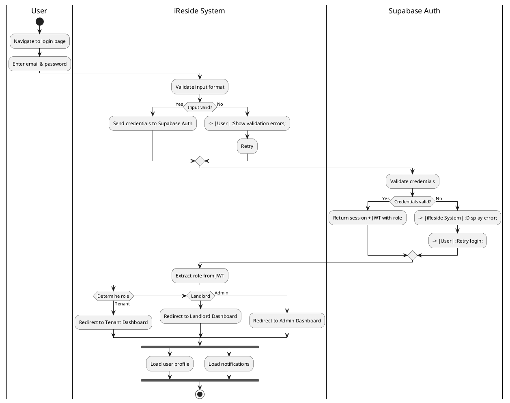
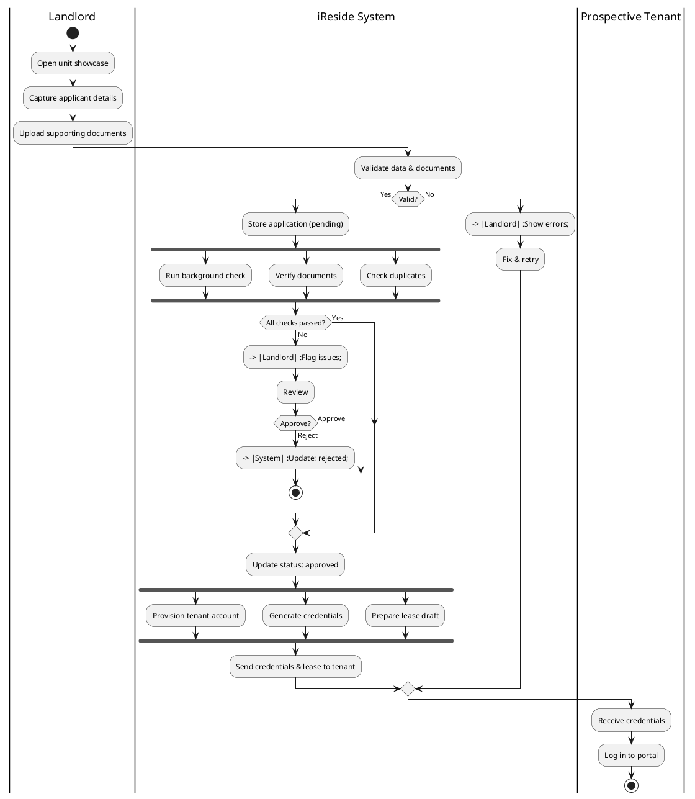
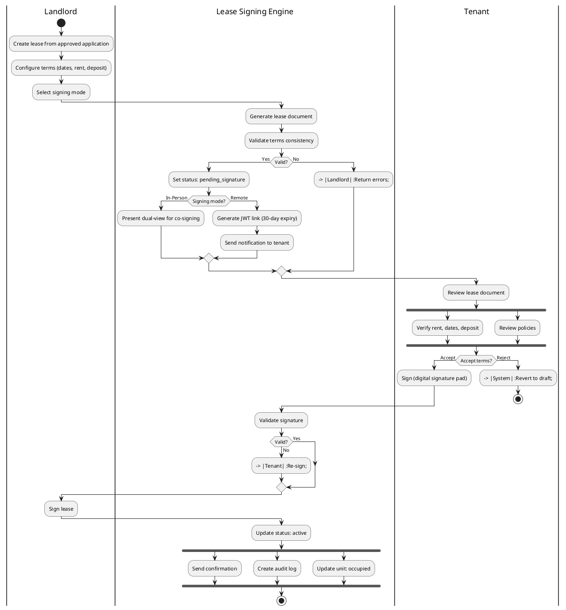
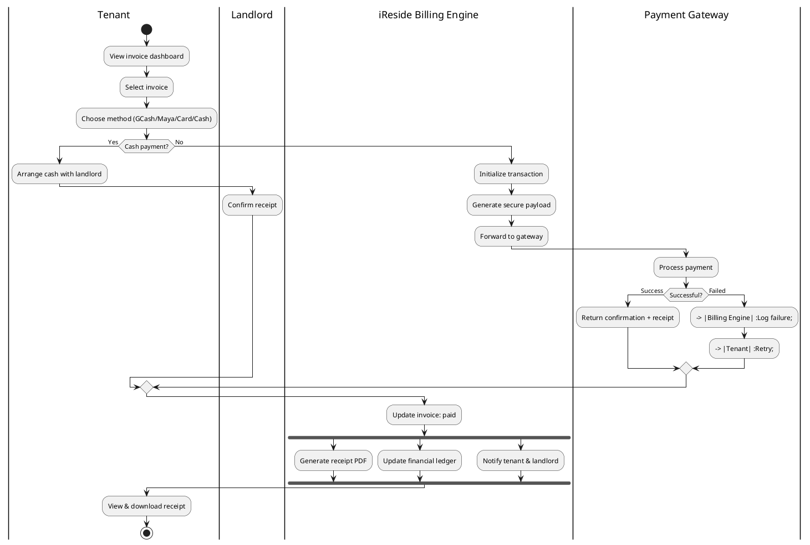
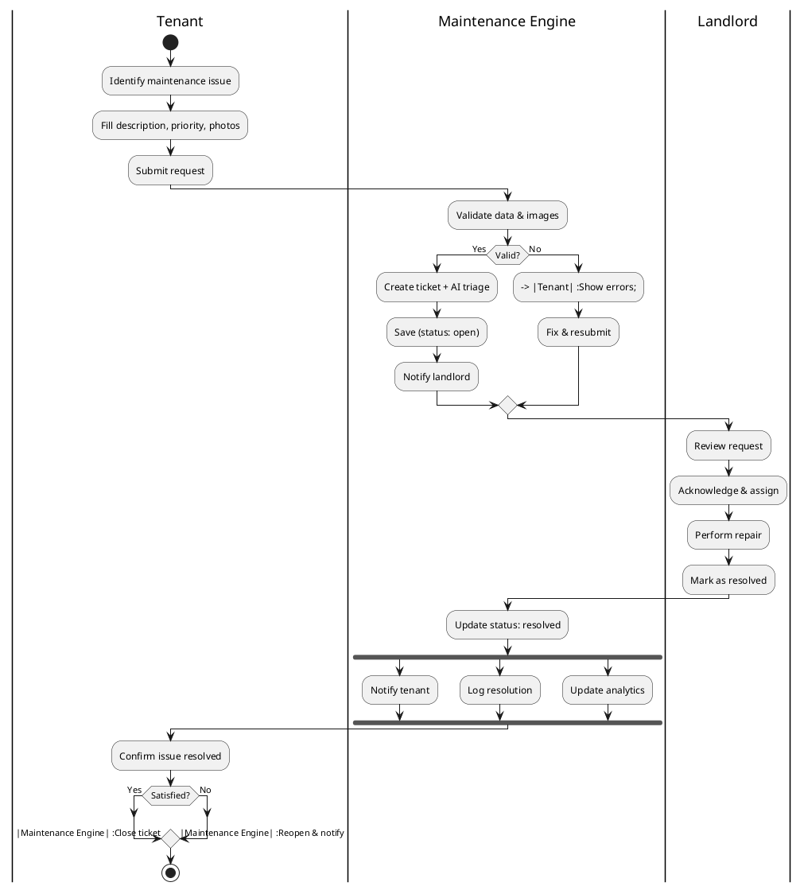
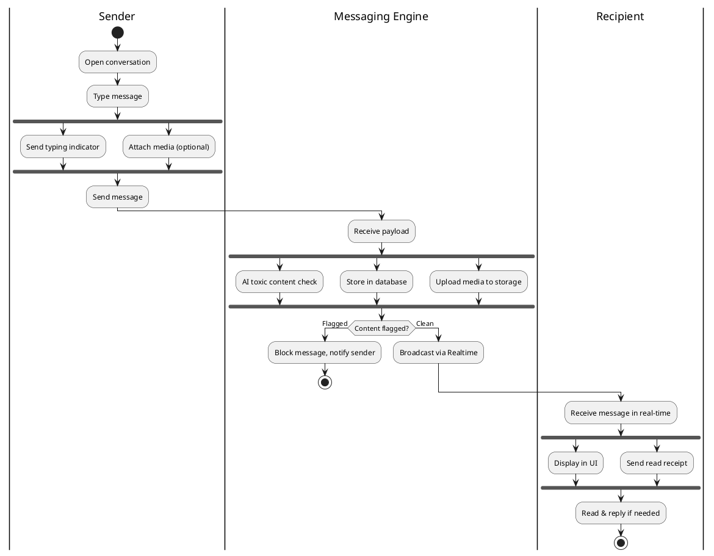
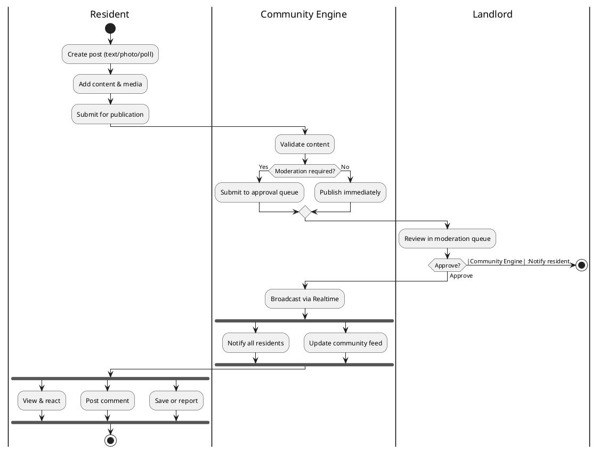
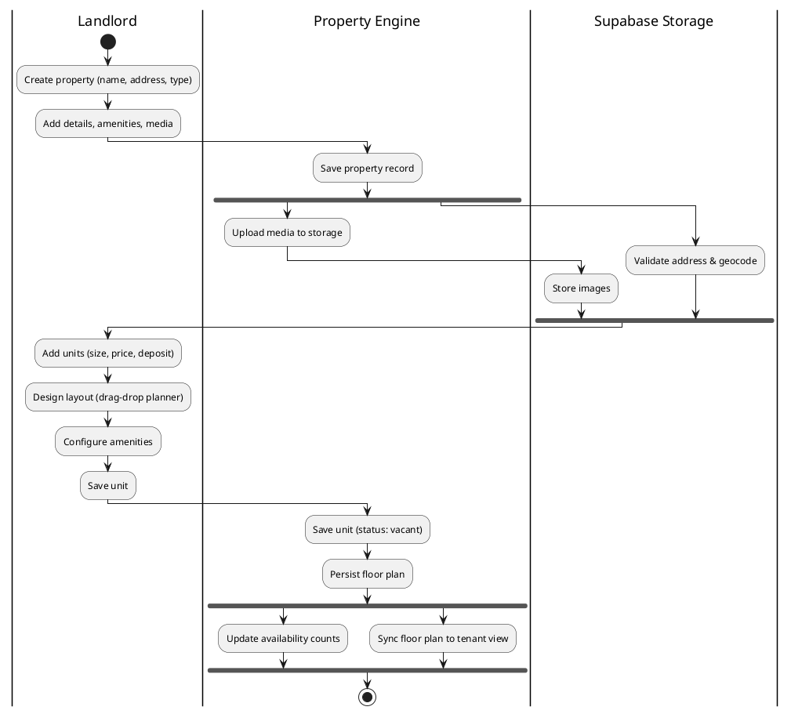
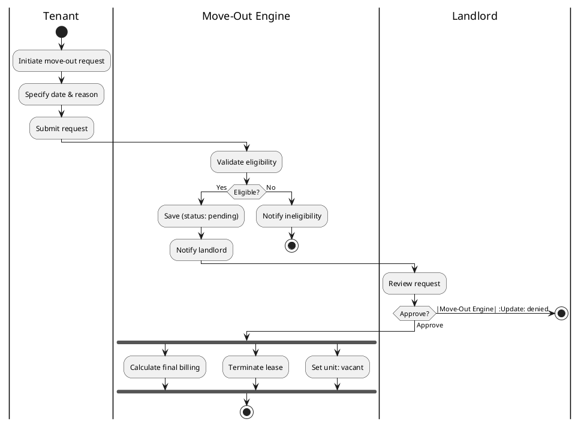
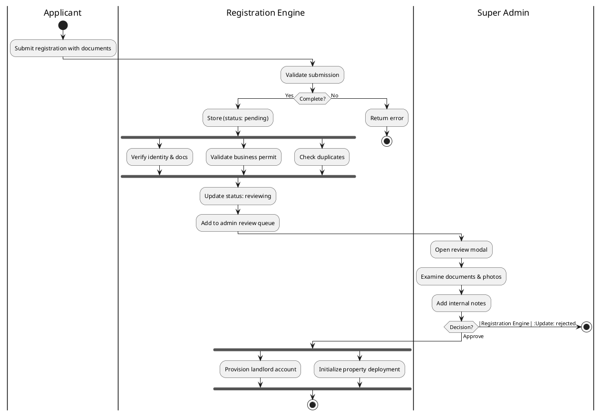

# iReside UML Activity Diagrams — Complete Documentation

> **Project**: iReside Property Management System  
> **Date**: 2026-05-15  
> **Format**: Draw.io (diagrams.net) + PlantUML  
> **Total Diagrams**: 10 Feature-Based Activity Diagrams

---

## How to View the Diagrams

All 10 diagrams are saved as **PlantUML** (`.puml`) files in:
```
docs/latest-documentations after major refactor/activity-diagrams/
```

### Option A: Online Renderer (Quickest)
1. Go to **[plantuml.com/plantuml/uml](https://www.plantuml.com/plantuml/uml)**
2. Copy-paste the contents of any `.puml` file into the text area
3. Click "Submit" to render the diagram

### Option B: VS Code Extension
1. Install **"PlantUML"** extension by jebbs
2. Open any `.puml` file
3. Press `Alt+D` to render preview

### Option C: CLI with PlantUML jar
```bash
java -jar plantuml.jar docs/latest-documentations\ after\ major\ refactor/activity-diagrams/*.puml
```

### Option D: PlantUML Server URL (Direct Link)
You can also view by pasting the file content at:
```
https://www.plantuml.com/plantuml/uml/SyfFKj2rKt3CoKnELR1Io4ZDoSa70000
```

---

## Diagram Inventory

| # | Diagram File | Feature | Swimlanes |
|---|---|---|---|
| 1 | `activity-authentication-login.drawio` | Authentication & Login | User, iReside System, Supabase Auth |
| 2 | `activity-tenant-application-processing.drawio` | Walk-in Tenant Application Processing | Landlord, iReside System, Prospective Tenant |
| 3 | `activity-lease-signing-workflow.drawio` | Digital Lease Signing Workflow | Landlord, Lease Signing Engine, Tenant |
| 4 | `activity-billing-payments.drawio` | Payment & Billing Processing | Tenant, iReside Billing Engine, Payment Gateway |
| 5 | `activity-maintenance-request.drawio` | Maintenance Request Management | Tenant, Maintenance Engine, Landlord |
| 6 | `activity-real-time-messaging.drawio` | Real-Time Messaging | Sender, Messaging Engine (Supabase Realtime), Recipient |
| 7 | `activity-community-hub.drawio` | Community Hub | Resident, Community Engine, Landlord/Moderator |
| 8 | `activity-property-unit-mgmt.drawio` | Property & Unit Management | Landlord, Property Engine, Supabase Storage |
| 9 | `activity-move-out-processing.drawio` | Move-Out Processing | Tenant, Move-Out Engine, Landlord |
| 10 | `activity-admin-registration.drawio` | Admin Registration Governance | Applicant, Registration Engine, Super Admin |

---
## FEATURE 1: Authentication & Login

### Objective
Allow authorized users (Tenant, Landlord, Admin) to sign in securely, have their role identified, and be routed to the correct portal. Sessions are maintained via Supabase Auth with JWT tokens.

### Swimlanes
- **User** — Initiates login, enters credentials, receives errors
- **iReside System** — Validates input, processes auth, routes by role
- **Supabase Auth** — Validates credentials, returns JWT with role claim

### Main Flow
1. User navigates to login page
2. User enters email and password
3. System validates input format
4. System sends credentials to Supabase Auth
5. Supabase Auth validates credentials and returns session + JWT with role
6. System extracts role from JWT
7. System routes user to role-appropriate dashboard (Tenant / Landlord / Admin)
8. [Fork] System loads user profile + notifications in parallel

### Alternative Flows
| Condition | Action |
|-----------|--------|
| Invalid input format | Show field validation errors, allow retry |
| Invalid credentials | Display error message, allow retry |
| Network error | Display connection error with retry option |
| Session expired | Redirect to login with notification |

### UML Activity Diagram



---
## FEATURE 2: Walk-in Tenant Application Processing

### Objective
Enable landlords to capture walk-in applicant details, upload supporting documents, verify eligibility, and provision tenant accounts upon approval.

### Swimlanes
- **Landlord** — Captures applicant data, uploads docs, reviews, approves
- **iReside System** — Validates, stores, runs background checks, provisions account
- **Prospective Tenant** — Receives credentials, logs in

### Main Flow
1. Landlord opens unit showcase for walk-in
2. Landlord captures applicant personal details
3. Landlord uploads supporting documents
4. System validates application data and documents
5. If valid, system stores application as "pending"
6. [Fork] System runs 3 parallel checks:
   - Background check
   - Document authenticity verification
   - Duplicate application detection
7. [Join] All checks complete
8. If all checks passed: automatically proceed to approval
9. If issues flagged: Landlord reviews and decides
10. [Fork] On approval:
    - Provision tenant account
    - Generate login credentials
    - Prepare lease document draft
11. [Join] All post-approval tasks done
12. Tenant receives credentials, logs into portal

### Alternative Flows
| Condition | Action |
|-----------|--------|
| Missing/invalid fields | Return validation errors to landlord |
| Duplicate application detected | Flag for landlord review |
| Landlord rejects | Update status to "rejected" |
| Background check fails | Mark issues for manual review |

### UML Activity Diagram



---

## FEATURE 3: Digital Lease Signing Workflow

### Objective
Support dual-mode lease signing (in-person co-signing or remote async with JWT links), with comprehensive signature validation and audit trail.

### Swimlanes
- **Landlord** — Creates lease, selects mode, signs
- **Lease Signing Engine** — Generates docs, manages state, validates signatures
- **Tenant** — Reviews terms, signs digitally

### Main Flow
1. Landlord creates lease from approved application
2. Landlord configures lease terms (dates, rent, deposit)
3. Landlord selects signing mode (In-Person or Remote)
4. System generates lease document and validates terms consistency
5. System sets lease status to "pending_signature"
6. [Decision: Signing Mode]
   - **In-Person**: Present lease in dual-view co-signing mode
   - **Remote**: Generate JWT signing link (30-day expiry)
7. Tenant reviews lease document
8. [Fork] Tenant verifies rent/dates/deposit + reviews policies
9. [Join] Review complete
10. Tenant signs via digital signature pad
11. System validates signature (format, size, dimensions)
12. [Decision: Signature valid?]
    - If No → request re-sign
    - If Yes → proceed
13. Landlord signs (immediately for in-person; after tenant for remote)
14. System updates status to "active"
15. [Fork] System sends confirmation, creates audit log, updates unit to "occupied"

### Alternative Flows
| Condition | Action |
|-----------|--------|
| Lease terms invalid | Return errors to landlord |
| Tenant rejects terms | Status reverts to "draft" |
| JWT link expired | Landlord regenerates link |
| Concurrent signing detected | Block and alert both parties |
| Signature format invalid | Guide tenant to re-sign correctly |

### UML Activity Diagram



---

## FEATURE 4: Payment & Billing Processing

### Objective
Handle rent and utility payments through multiple methods (GCash, Maya, credit/debit card, cash) with receipt generation and ledger updates.

### Swimlanes
- **Tenant** — Selects invoice, chooses payment method, views receipt
- **iReside Billing Engine** — Initializes payment, generates payload, updates records
- **Payment Gateway** — Processes digital transactions securely

### Main Flow
1. Tenant views invoice dashboard
2. Tenant selects invoice to pay
3. Tenant chooses payment method (GCash, Maya, Card, Cash)
4. [Decision: Cash Payment?]
   - **Yes (Cash)**: Tenant arranges cash payment with landlord → Landlord confirms receipt → Merge to update
   - **No (Digital)**: System initializes payment → generates secure payload → forwards to gateway
5. Payment gateway processes transaction
6. [Decision: Payment successful?]
   - **Failed**: Log failure, notify tenant → tenant retries
   - **Success**: Gateway returns confirmation + receipt
7. System updates invoice to "paid"
8. [Fork] System generates official receipt PDF, updates financial ledger, sends confirmation
9. Tenant views and downloads receipt

### Alternative Flows
| Condition | Action |
|-----------|--------|
| Payment timeout | System cancels transaction, tenant retries |
| Insufficient funds | Gateway declines, tenant chooses new method |
| Network failure | System logs error, prompts retry |
| Cash payment | Manual confirmation by landlord |

### UML Activity Diagram



---

## FEATURE 5: Maintenance Request Management

### Objective
Allow tenants to submit maintenance requests with images, enable landlords to triage, assign, and resolve issues with full tracking.

### Swimlanes
- **Tenant** — Submits request, confirms resolution
- **Maintenance Engine** — Validates, creates ticket with AI triage, notifies
- **Landlord** — Reviews, assigns, performs fix, marks resolved

### Main Flow
1. Tenant identifies maintenance issue
2. Tenant fills request: description, priority, photos
3. Tenant submits request
4. System validates data and images
5. System creates ticket with AI-priority triage
6. System saves ticket with status "open" and priority assigned
7. System sends real-time notification to landlord
8. Landlord reviews request details
9. Landlord acknowledges and assigns (self or worker)
10. Landlord performs repair
11. Landlord marks as resolved
12. System updates status to "resolved"
13. [Fork] System notifies tenant, logs resolution, updates analytics
14. Tenant confirms issue resolved
15. [Decision: Tenant satisfied?]
    - **Yes**: System closes ticket (status: "closed")
    - **No**: System reopens ticket, notifies landlord

### Alternative Flows
| Condition | Action |
|-----------|--------|
| Invalid data/images | Return validation errors, allow resubmit |
| Urgent priority | Auto-escalate to landlord with alert |
| Tenant unsatisfied | Reopen ticket, loop back to landlord |
| AI service down | Skip triage, default to "medium" priority |

### UML Activity Diagram



---

## FEATURE 6: Real-Time Messaging

### Objective
Enable instant, moderated messaging between tenants and landlords using Supabase Realtime with AI-powered toxic content filtering.

### Swimlanes
- **Sender (Tenant/Landlord)** — Composes and sends messages
- **Messaging Engine (Supabase Realtime)** — Receives, moderates, stores, broadcasts
- **Recipient (Tenant/Landlord)** — Receives and reads in real-time

### Main Flow
1. Sender opens conversation thread
2. Sender types message
3. [Fork] Sender: typing indicator (real-time) + optional media attachment
4. [Join] Ready to send
5. Sender sends message
6. System receives message payload
7. [Fork] Parallel processing:
   - AI toxic content & spam detection (via Groq Llama 3.1)
   - Store message in database
   - Upload media to Supabase Storage
8. [Join] Processing complete
9. [Decision: Content flagged?]
   - **Flagged**: Block message, notify sender of violation
   - **Clean**: Broadcast via Supabase Realtime channel
10. Recipient receives message in real-time
11. [Fork] Recipient: display message + send read receipt
12. [Join] Acknowledged
13. Recipient reads and replies if needed

### Alternative Flows
| Condition | Action |
|-----------|--------|
| AI moderation unavailable | Skip moderation, deliver message |
| Media upload fails | Send text-only, notify attachment failed |
| Realtime connection lost | Queue message, deliver on reconnect |
| Profanity detected | Block, show policy violation message |

### UML Activity Diagram



---

## FEATURE 7: Community Hub

### Objective
Provide a social layer where residents can post announcements, photos, polls, and discussions, with landlord moderation for content approval.

### Swimlanes
- **Resident (Tenant)** — Creates posts, reacts, comments, reports
- **Community Engine** — Validates, manages approval queue, broadcasts
- **Landlord / Moderator** — Reviews and approves/rejects content

### Main Flow
1. Resident creates new post (text / photo / poll)
2. Resident adds content and media (up to 4 photos)
3. Resident submits post for publication
4. System validates content and media
5. [Decision: Landlord moderation required?]
   - **No (auto-approve)**: Publish immediately
   - **Yes**: Submit to landlord approval queue
6. Landlord reviews post in moderation queue
7. [Decision: Approve or reject?]
   - **Approve**: System publishes post
   - **Reject**: System notifies resident of rejection
8. System broadcasts post via Realtime
9. [Fork] System sends notification to all residents + updates community feed
10. [Join] Done
11. [Fork] Residents can view/react, comment, save/report in parallel
12. [Join] Interactions complete

### Alternative Flows
| Condition | Action |
|-----------|--------|
| Spam detected | Auto-flag for mandatory review |
| Media exceeds limit | Reject with size/quantity guidance |
| Post reported | Landlord reviews and may remove |
| Poll expires | System auto-closes poll |

### UML Activity Diagram



---

## FEATURE 8: Property & Unit Management

### Objective
Allow landlords to create and configure property records, define units with pricing and amenities, use a visual floor planner, and manage media.

### Swimlanes
- **Landlord** — Creates property, adds units, design layouts
- **Property Engine (Supabase)** — Validates, persists, manages state
- **Supabase Storage** — Stores property images and media

### Main Flow
1. Landlord creates property record (name, address, type)
2. Landlord adds details, amenities, media
3. System saves property record
4. [Fork] System uploads media to Storage + validates address/geocode
5. [Join] Property created
6. Landlord adds units: name, size, price, deposit
7. Landlord designs layout with drag-and-drop floor planner
8. Landlord configures unit amenities and features
9. Landlord saves unit configuration
10. System saves unit record (status: "vacant")
11. System persists floor plan layout
12. [Fork] System updates property availability counts + syncs floor plan to tenant view

### Alternative Flows
| Condition | Action |
|-----------|--------|
| Invalid address | Geocoding fails, manual entry required |
| Media upload fails | Retry, allow property save without images |
| Floor plan grid invalid | Show validation on planner |
| Duplicate unit name | Warn landlord |

### UML Activity Diagram



---

## FEATURE 9: Move-Out Processing

### Objective
Enable tenants to submit move-out requests with specified dates/reasons, and allow landlords to approve or deny with automated lease termination and unit release.

### Swimlanes
- **Tenant** — Initiates request, specifies details, submits
- **Move-Out Engine** — Validates eligibility, processes approval
- **Landlord** — Reviews request, decides

### Main Flow
1. Tenant initiates move-out request
2. Tenant specifies move-out date and reason
3. Tenant submits request
4. System validates move-out eligibility
5. [Decision: Eligible?]
   - **No**: Notify tenant of ineligibility
   - **Yes**: Save request as "pending"
6. System notifies landlord
7. Landlord reviews request details
8. [Decision: Approve or deny?]
   - **Deny**: System updates status, notifies tenant
   - **Approve**: System updates status
9. [Fork] System:
   - Calculates final billing & deposits
   - Terminates lease record
   - Sets unit status to "vacant"

### Alternative Flows
| Condition | Action |
|-----------|--------|
| Tenant has outstanding balance | Block move-out until settled |
| Lease not eligible (early termination) | Show penalty information |
| Landlord denies | Tenant can appeal or negotiate |
| Date conflicts with existing lease | Suggest adjusted date |

### UML Activity Diagram



---

## FEATURE 10: Admin Registration Governance

### Objective
Allow Super Admins to review, approve, or reject landlord registration applications with document verification and internal notes.

### Swimlanes
- **Applicant (Prospective Landlord)** — Subverts registration with documents
- **Registration Engine** — Validates, vets, manages queue
- **Super Admin** — Reviews documents, adds notes, decides

### Main Flow
1. Applicant submits landlord registration with documents
2. System validates submission and verifies document completeness
3. [Decision: All required data present?]
   - **No**: Return incomplete submission error
   - **Yes**: Store registration as "pending"
4. [Fork] System runs background verification:
   - Document & identity verification
   - Business permit validation
   - Duplicate registration check
5. [Join] Vetting complete
6. System updates status to "reviewing"
7. System adds application to admin review queue
8. Super Admin opens application review modal
9. Admin examines uploaded documents and photos
10. Admin adds internal administrative notes
11. [Decision: Final decision?]
    - **Reject**: System updates status, notifies applicant
    - **Approve**: System updates status
12. [Fork] System provisions landlord account + initializes property deployment

### Alternative Flows
| Condition | Action |
|-----------|--------|
| Incomplete documents | Return with specific field errors |
| Duplicate registration | Merge with existing record |
| Business permit expired | Flag for manual review |
| Admin rejects | Applicant can reapply with corrections |

### UML Activity Diagram



---

## UML Notation Legend

| Symbol | Meaning | Used In |
|--------|---------|---------|
| ● | Initial State | All diagrams (start) |
| ◉ | Final State | All diagrams (stop) |
| ▭ (rounded) | Action/Activity | All process steps |
| ◇ | Decision Node | Branching logic |
| ◇ (small) | Merge Node | Reconverging paths |
| — (thick) | Fork | Parallel processing |
| — (thick) | Join | Synchronization |
| [Guard] | Condition | Decision branches |
| 📝 (note) | Exception/Note | Error flows |
| --- | Swimlane divider | Role boundaries |

---

## Consistency Notes

All diagrams follow these conventions:
- **Color scheme**: Blue tones for user actors, green for system components, orange/purple for external services
- **Flow direction**: Top-to-bottom within swimlanes, left-to-right for actor handoffs
- **Fork/Join**: Used for genuine parallel activities (background checks, notifications, media uploads)
- **Merge**: Used after conditional branches reconverge
- **Guards**: Bracket-enclosed on decision branches `[Guard]`
- **Exception notes**: Red-bordered sticky notes for error/alternative flows
- **Double diamonds** avoided: Merge nodes used after decisions before continuing

---

*Generated for the iReside Property Management System — UML Activity Diagrams with Swimlanes*
