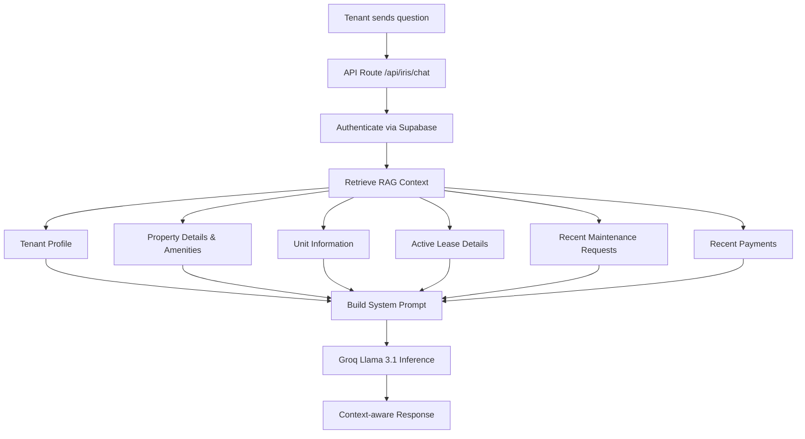
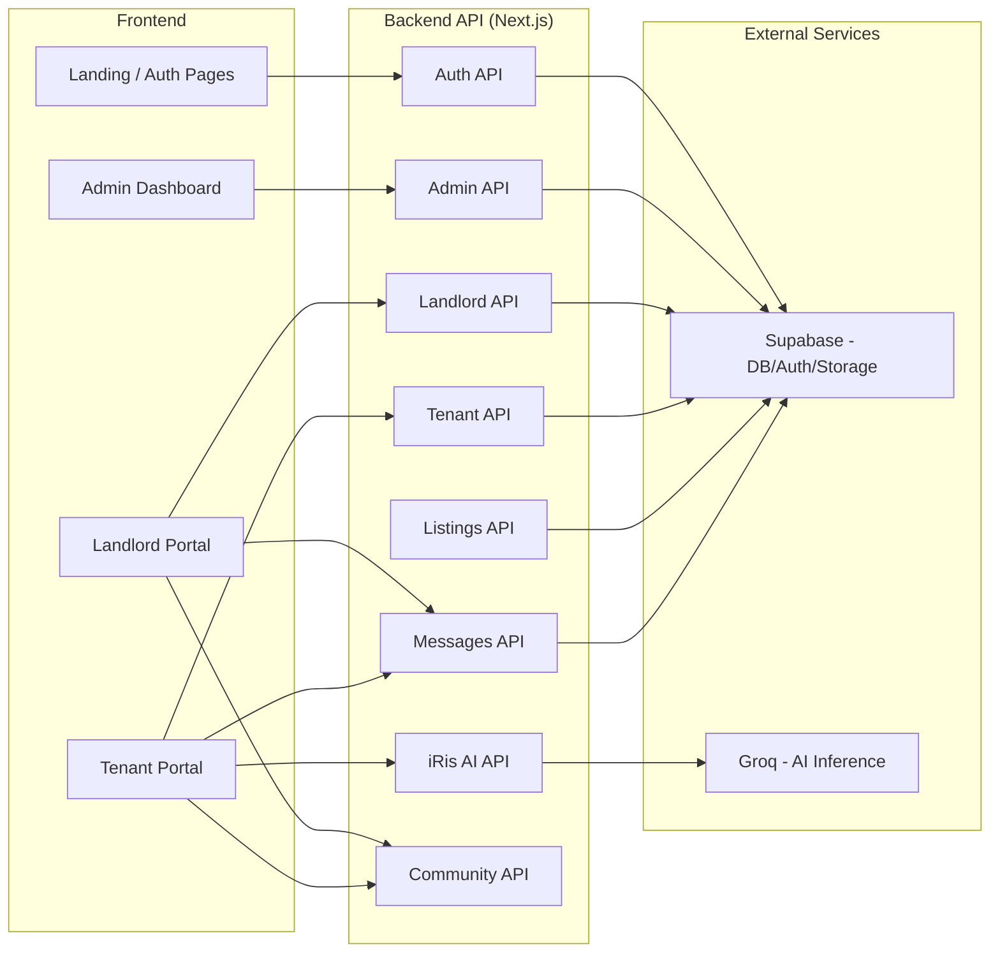

# iReside — Major Functions & Features Overview

## 🎯 System Philosophy & Core Refactor

> [!IMPORTANT]
> **Adviser-Mandated Refactor**: Following the last consultation, the system has been fundamentally refactored. It is no longer a public-facing marketplace (e.g., Airbnb for apartments).
>
> iReside is now an **exclusive deployment system for landlords**:
> - **Deployment-Based Model**: The development team deploys and hands over independent property instances to landlords.
> - **Landlord as Owner & Admin**: Each landlord independently manages their own property deployment (no centralized operator).
> - **Limited Maintenance Scope**: Development team handles only initial deployment, critical security patches, and optional paid updates.
> - **Self-Sufficient Operations**: Landlords operate their properties autonomously after deployment.
> - **No Public Discovery**: There is **no unit listing, searching, or public discovery** of listings/properties/units.

---

## O. Deployment Ownership & Maintenance Boundaries

> [!IMPORTANT]
> **Addressing the Turnover Problem**: Unlike traditional capstone projects with a dedicated institutional client (school, company, barangay), iReside serves generalized landlords—individual property owners who cannot collectively receive a centralized system handover. To resolve this, the project adopts a **Deployment-Based Delivery Model** that establishes clear ownership boundaries while ensuring system viability.

### Deployment Model Overview

The study **does not establish a centralized institutional operator** such as a barangay office, homeowners association, or government agency. Instead, the platform follows a deployment-based delivery model:

| Aspect | Traditional SaaS | iReside Deployment Model |
|--------|------------------|--------------------------|
| **Operator** | Centralized company | Each landlord (individual) |
| **Updates** | Continuous, mandatory | On-request, paid optional |
| **Support** | Dedicated team | Limited scope (see below) |
| **Scaling** | Enterprise-level | Single-property deployment |

### Landlord as Independent Administrator

Upon deployment, **participating landlords become the independent administrators** of their own operational environments:

- **Self-Sufficiency**: Landlords manage their own properties, tenants, and day-to-day operations
- **No Dependency on Development Team**: Once deployed, the system operates independently
- **Local Ownership**: Each property deployment is isolated and autonomously managed

### Development Team Responsibilities (Limited Scope)

The development team's obligations are **strictly bounded** to:

| Responsibility | Scope | Description |
|----------------|-------|-------------|
| **Initial Deployment** | ✅ Included | Provisioning and setting up the system for the landlord |
| **Critical Security Updates** | ✅ Included | Patching vulnerabilities that could compromise tenant data |
| **Optional Paid Updates** | ⚠️ Paid Add-on | Feature enhancements or customizations requested by the landlord |
| **Bug Fixes (Deployment Defects)** | ✅ Included | Errors introduced during initial deployment |

### What's Outside Scope

The study explicitly **does not evaluate or provide**:

- ❌ Continuous feature development after deployment
- ❌ Large-scale operational staffing or enterprise support teams
- ❌ Long-term commercial SaaS operations model
- ❌ Enterprise-level customer support infrastructure
- ❌ Nationwide deployment scalability testing
- ❌ Centralized platform maintenance beyond security patches

### Paid Update Model (Sustainability)

Landlords may request **optional paid services** subject to separate arrangements:

- Custom feature development
- Additional property deployments
- Advanced analytics or integrations
- Priority support tickets

This model ensures:
1. **No ongoing free support burden** on the development team
2. **Sustainable maintenance pathway** for landlords needing custom work
3. **Clear boundaries** between deployment obligations and extended services

### Panel Defense Summary

> [!TIP]
> **For Panelists**: If questioned about turnover, ownership, or maintenance:
> 
> 1. **The "Generalized Client" Problem**: Unlike a school or company, landlords are not a single entity—they cannot collectively receive a centralized system
> 2. **Solution**: Each landlord receives their own independently operated deployment
> 3. **Development Team Role**: One-time deployment + security maintenance only
> 4. **Sustainability**: Optional paid updates provide a path for extended services without perpetual obligation
> 5. **No "Abandoned System" Risk**: Critical security patches remain the development team's responsibility

---

## 🏗️ Architecture & Tech Stack

| Layer | Technology |
|---|---|
| **Framework** | Next.js 16 (App Router) + TypeScript |
| **Frontend** | React 19, Tailwind CSS 4, Radix UI, Framer Motion |
| **Backend / DB** | Supabase (PostgreSQL, Auth, Real-time, Storage) |
| **AI Intelligence** | Groq Llama 3.1 8B via OpenAI SDK (RAG-powered) |
| **Drag & Drop** | @dnd-kit/core + @dnd-kit/utilities |
| **Security** | Supabase Auth + Row-Level Security (RLS) |

---

## 👤 User Roles & Their Functions

The system serves **3 distinct user roles** (plus the development team as temporary Super Admin during deployment):

> [!NOTE]
> **Super Administrator Role**: During the initial deployment phase, the development team acts as Super Administrator to provision the landlord's environment. Post-deployment, this role may be transferred to a designated landlord administrator or retained by the development team for security oversight.

### 1. 🛡️ Super Administrator (Development Team)

| Function | Description |
|---|---|
| **Live Metrics Dashboard** | View real-time KPIs: Total Users, Properties, Leases, Pending Reviews |
| **Registration Pipeline** | Monitor application flow (Pending → Reviewing → Approved) |
| **User Management** | Role-specific filter pills (All, Tenant, Landlord, Admin), combined search + filter |
| **Registration Review** | Status filter tabs, detailed review modals, document/photo inspection |
| **Application Processing** | Add internal admin notes, update status with icon-coded badges |
| **Secure Sign-out** | Destructive sign-out from administrator sidebar |

### 2. 🏠 Landlord

#### Dashboard & Analytics
| Function | Description |
|---|---|
| **AI-Driven KPI Insights** | AI-generated performance summaries |
| **Simplified / Detailed Mode** | Toggle between overview and detailed analytics |
| **Primary KPIs** | Earnings, Active Tenants, Occupancy Rate, Pending Issues |
| **Extended KPIs** | Maintenance Cost, Lease Renewals, Portfolio Value |
| **Featured Property Analytics** | Total Sales, Views, MOM Growth, Occupancy Rate |
| **Date Range Filtering** | Presets (7D, 30D, 90D, 1Y) + custom start/end dates |
| **PDF Report Generation** | iReside-branded reports for portfolio performance |
| **CSV Export** | Downloadable data for auditing |
| **Export History** | Chronological log of all generated reports |

#### Modular Floor Planner (Visual Builder)
| Function | Description |
|---|---|
| **Drag-and-Drop Builder** | Structural engine for designing property layouts |
| **Grid Snapping** | Precise 20px grid alignment system |
| **Interactive Manipulation** | Position corridors, units, and room spaces |
| **Real-Time Save** | Persistent state saved to Supabase backend |

#### Property & Tenant Management
| Function | Description |
|---|---|
| **Maintenance Dashboard** | Track all repair tickets with priority status |
| **Maintenance Gallery** | Multi-image galleries and descriptions per ticket |
| **Lease Tracking** | Monitor active lease progress with live charts |
| **Document Vault** | Store master agreements, reports, amendments |
| **Renewal Eligibility** | Dynamic calculation of renewal windows |
| **Tenant Communication** | Direct messaging + one-click calling |
| **Financial Ledger** | Monitor overdue/pending invoices |
| **Payment Breakdowns** | View Base Rent, Water, Electricity components |
| **Invoice Management** | Create and track invoices |
| **Community Board** | Manage building community posts |

### 3. 🏢 Tenant

#### Residency Management
| Function | Description |
|---|---|
| **Digital Lease Signing** | Signature-ready digital leases |
| **Document Vault** | Access signed reports and amendments |
| **Lease Overview** | View lease details, terms, and status |
| **Unit Map (Read-Only)** | Visual representation of building layout |
| **Unit Transfer Requests** | Request transfer to vacant units from the unit map |
| **Move-Out Requests** | Submit move-out requests digitally |

#### Maintenance & Payments
| Function | Description |
|---|---|
| **Maintenance Requests** | Submit tickets with image uploads |
| **Repair Ticket Tracking** | Real-time status updates |
| **Financial Ledger** | View monthly dues and balances |
| **Payment History** | Chronological transaction logs |

#### Communication
| Function | Description |
|---|---|
| **Messaging Portal** | Real-time chat with landlord (typing indicators, read receipts) |
| **File/Media Sharing** | Send and receive files in conversation threads |
| **iRis AI Assistant** | Context-aware AI chatbot for building support |
| **Natural Language Queries** | Ask about amenities, rules, lease details via RAG |

#### Onboarding & Tours
| Function | Description |
|---|---|
| **Product Tours** | Interactive guided tours for Dashboard, Messages, Lease, Community |
| **Onboarding Flow** | Step-by-step introduction for new tenants |

---

## 🏘️ Community Hub (Shared Module)

The Community Hub is a centralized space for building-wide engagement, shared by both Landlords and Tenants with role-based capabilities.

#### Post Types & Creation
| Function | Description |
|---|---|
| **Discussion Posts** | Text-based community threads |
| **Photo Albums** | Image galleries (up to 4 photos) for visual updates |
| **Resident Polls** | Create and participate in interactive community polls |
| **Management Notices** | Pinned announcements for building-wide updates |
| **Utility Alerts** | Auto-styled notifications for water/power/maintenance outages |

#### Engagement & Interaction
| Function | Description |
|---|---|
| **Multi-Reactions** | Like, Heart, Thumbs Up, Clap, and Celebration reactions |
| **Threaded Comments** | Real-time discussion threads on any community post |
| **Post Saving** | Bookmark important discussions for quick access |
| **Content Reporting** | User-driven moderation for spam or harassment |

#### Management & Moderation (Landlords/Admins Only)
| Function | Description |
|---|---|
| **Approval Queue** | Review and approve/reject resident posts before they go live |
| **Property Filtering** | View and manage community content for specific buildings |
| **Moderation Dashboard** | Centralized tab for handling pending resident content |

---

## 🤖 iRis AI Assistant (Key Feature)

The **iRis** AI assistant is a standout feature powered by **Groq Llama 3.1 8B** with RAG capabilities:

- **Full-page chat interface** + **Floating chat widget**
- **Conversation history** support
- **Zero-cost inference** via Groq's free tier
- **Content moderation** with toxic content filtering

---

## 📨 Messaging System

- Real-time landlord ↔ tenant messaging
- Typing indicators and status tracking
- File and media sharing within threads
- AI-powered message moderation
- Contacts sidebar with conversation management

---

## 🔐 Cross-Cutting Concerns (All Users)

| Concern | Implementation |
|---|---|
| **Authentication** | Supabase Auth (secure login/logout) |
| **Data Isolation** | Database-level Row-Level Security (RLS) |
| **AI Moderation** | Real-time toxic content filtering |
| **UI Transitions** | Framer Motion animations |
| **Loading States** | Skeleton loaders for data-heavy views |
| **Typography** | Geist + Rethink Sans fonts |
| **Responsive Design** | Mobile-responsive across all modules |

---

## 📂 System Module Map

---

## 📊 Summary by the Numbers

| Metric | Count |
|---|---|
| **User Roles** | 3 (Super Admin, Landlord, Tenant) |
| **Frontend Modules** | 4 (Auth, Admin, Landlord, Tenant) |
| **API Domains** | 12+ (auth, admin, landlord, tenant, listings, messages, iris, community, etc.) |
| **Landlord Features** | 24 specific capabilities |
| **Tenant Features** | 12 specific capabilities |
| **Community Features** | 12 core engagement capabilities |
| **Admin Features** | 13 specific capabilities |
| **AI Capabilities** | RAG, chat, content moderation |

---

## 📋 Deployment Model Summary

| Deployment Aspect | Value |
|---|---|
| **Delivery Model** | Deployment-Based (not centralized SaaS) |
| **Post-Deployment Operator** | Individual Landlord (independent) |
| **Development Team Role** | Limited: Deployment + Security + Paid Updates |
| **Ongoing Feature Updates** | Optional paid add-ons only |
| **Client Generalization Solution** | Per-landlord deployment handover |

---

## 🎓 For the Panel: Key Points to Remember

1. **The Problem**: Landlords are generalized clients—they cannot collectively receive a centralized system handover (unlike a school or company that would be the sole client)

2. **The Solution**: Deployment-Based Delivery—each landlord receives their own independently operated instance

3. **Development Team Boundaries**:
   - ✅ Deploy the system
   - ✅ Security patches (critical)
   - ✅ Optional paid customizations

4. **Sustainability**: Paid update model ensures extended services are available without perpetual obligation

5. **No Abandoned System Risk**: Security maintenance remains the development team's responsibility
