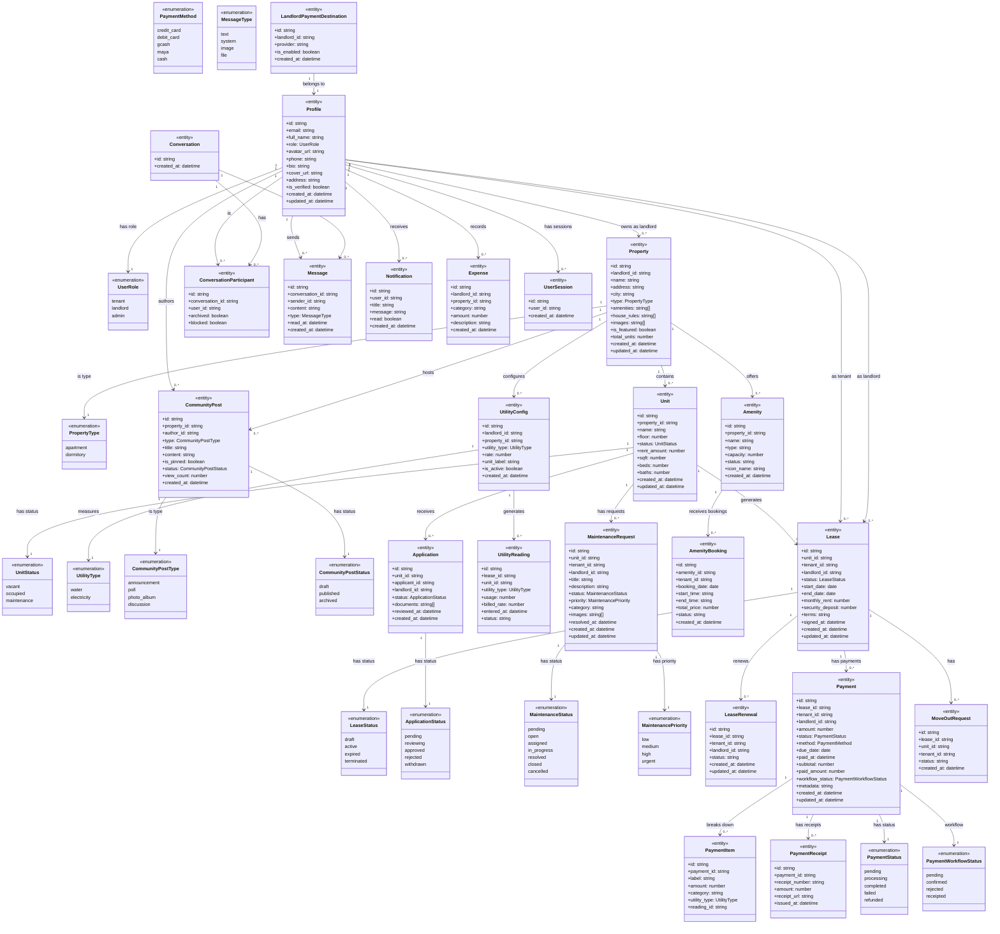

# iReside Class Diagram (Mermaid) — Excluding Iris AI

```mermaid
classDiagram
    direction TB

    %% ========== ENUMS ==========
    class UserRole {
        <<enumeration>>
        tenant
        landlord
        admin
    }

    class PropertyType {
        <<enumeration>>
        apartment
        dormitory
    }

    class UnitStatus {
        <<enumeration>>
        vacant
        occupied
        maintenance
    }

    class LeaseStatus {
        <<enumeration>>
        draft
        active
        expired
        terminated
    }

    class PaymentStatus {
        <<enumeration>>
        pending
        processing
        completed
        failed
        refunded
    }

    class PaymentMethod {
        <<enumeration>>
        credit_card
        debit_card
        gcash
        maya
        cash
    }

    class PaymentWorkflowStatus {
        <<enumeration>>
        pending
        confirmed
        rejected
        receipted
    }

    class UtilityType {
        <<enumeration>>
        water
        electricity
    }

    class ApplicationStatus {
        <<enumeration>>
        pending
        reviewing
        approved
        rejected
        withdrawn
    }

    class MaintenanceStatus {
        <<enumeration>>
        pending
        open
        assigned
        in_progress
        resolved
        closed
        cancelled
    }

    class MaintenancePriority {
        <<enumeration>>
        low
        medium
        high
        urgent
    }

    class MessageType {
        <<enumeration>>
        text
        system
        image
        file
    }

    class CommunityPostType {
        <<enumeration>>
        announcement
        poll
        photo_album
        discussion
    }

    class CommunityPostStatus {
        <<enumeration>>
        draft
        published
        archived
    }

    %% ========== CORE ENTITIES ==========

    class Profile {
        <<entity>>
        +id: string
        +email: string
        +full_name: string
        +role: UserRole
        +avatar_url: string
        +phone: string
        +bio: string
        +cover_url: string
        +address: string
        +is_verified: boolean
        +created_at: datetime
        +updated_at: datetime
    }

    class Property {
        <<entity>>
        +id: string
        +landlord_id: string
        +name: string
        +address: string
        +city: string
        +type: PropertyType
        +amenities: string[]
        +house_rules: string[]
        +images: string[]
        +is_featured: boolean
        +total_units: number
        +created_at: datetime
        +updated_at: datetime
    }

    class Unit {
        <<entity>>
        +id: string
        +property_id: string
        +name: string
        +floor: number
        +status: UnitStatus
        +rent_amount: number
        +sqft: number
        +beds: number
        +baths: number
        +created_at: datetime
        +updated_at: datetime
    }

    class Lease {
        <<entity>>
        +id: string
        +unit_id: string
        +tenant_id: string
        +landlord_id: string
        +status: LeaseStatus
        +start_date: date
        +end_date: date
        +monthly_rent: number
        +security_deposit: number
        +terms: string
        +signed_at: datetime
        +created_at: datetime
        +updated_at: datetime
    }

    class LeaseRenewal {
        <<entity>>
        +id: string
        +lease_id: string
        +tenant_id: string
        +landlord_id: string
        +status: string
        +created_at: datetime
        +updated_at: datetime
    }

    class Payment {
        <<entity>>
        +id: string
        +lease_id: string
        +tenant_id: string
        +landlord_id: string
        +amount: number
        +status: PaymentStatus
        +method: PaymentMethod
        +due_date: date
        +paid_at: datetime
        +subtotal: number
        +paid_amount: number
        +workflow_status: PaymentWorkflowStatus
        +metadata: string
        +created_at: datetime
        +updated_at: datetime
    }

    class PaymentItem {
        <<entity>>
        +id: string
        +payment_id: string
        +label: string
        +amount: number
        +category: string
        +utility_type: UtilityType
        +reading_id: string
    }

    class PaymentReceipt {
        <<entity>>
        +id: string
        +payment_id: string
        +receipt_number: string
        +amount: number
        +receipt_url: string
        +issued_at: datetime
    }

    class LandlordPaymentDestination {
        <<entity>>
        +id: string
        +landlord_id: string
        +provider: string
        +is_enabled: boolean
        +created_at: datetime
    }

    class UtilityConfig {
        <<entity>>
        +id: string
        +landlord_id: string
        +property_id: string
        +utility_type: UtilityType
        +rate: number
        +unit_label: string
        +is_active: boolean
        +created_at: datetime
    }

    class UtilityReading {
        <<entity>>
        +id: string
        +lease_id: string
        +unit_id: string
        +utility_type: UtilityType
        +usage: number
        +billed_rate: number
        +entered_at: datetime
        +status: string
    }

    class MaintenanceRequest {
        <<entity>>
        +id: string
        +unit_id: string
        +tenant_id: string
        +landlord_id: string
        +title: string
        +description: string
        +status: MaintenanceStatus
        +priority: MaintenancePriority
        +category: string
        +images: string[]
        +resolved_at: datetime
        +created_at: datetime
        +updated_at: datetime
    }

    class Amenity {
        <<entity>>
        +id: string
        +property_id: string
        +name: string
        +type: string
        +capacity: number
        +status: string
        +icon_name: string
        +created_at: datetime
    }

    class AmenityBooking {
        <<entity>>
        +id: string
        +amenity_id: string
        +tenant_id: string
        +booking_date: date
        +start_time: string
        +end_time: string
        +total_price: number
        +status: string
        +created_at: datetime
    }

    class Application {
        <<entity>>
        +id: string
        +unit_id: string
        +applicant_id: string
        +landlord_id: string
        +status: ApplicationStatus
        +documents: string[]
        +reviewed_at: datetime
        +created_at: datetime
    }

    class MoveOutRequest {
        <<entity>>
        +id: string
        +lease_id: string
        +unit_id: string
        +tenant_id: string
        +status: string
        +created_at: datetime
    }

    class Conversation {
        <<entity>>
        +id: string
        +created_at: datetime
    }

    class ConversationParticipant {
        <<entity>>
        +id: string
        +conversation_id: string
        +user_id: string
        +archived: boolean
        +blocked: boolean
    }

    class Message {
        <<entity>>
        +id: string
        +conversation_id: string
        +sender_id: string
        +content: string
        +type: MessageType
        +read_at: datetime
        +created_at: datetime
    }

    class Notification {
        <<entity>>
        +id: string
        +user_id: string
        +title: string
        +message: string
        +read: boolean
        +created_at: datetime
    }

    class CommunityPost {
        <<entity>>
        +id: string
        +property_id: string
        +author_id: string
        +type: CommunityPostType
        +title: string
        +content: string
        +is_pinned: boolean
        +status: CommunityPostStatus
        +view_count: number
        +created_at: datetime
    }

    class Expense {
        <<entity>>
        +id: string
        +landlord_id: string
        +property_id: string
        +category: string
        +amount: number
        +description: string
        +created_at: datetime
    }

    class UserSession {
        <<entity>>
        +id: string
        +user_id: string
        +created_at: datetime
    }

    %% ========== RELATIONSHIPS ==========

    %% Auth
    Profile "1" --> "1" UserRole : has role
    Profile "1" --> "0..*" Property : owns as landlord
    Profile "1" --> "0..*" Lease : as landlord
    Profile "1" --> "0..*" Lease : as tenant

    %% Property chain
    Property "1" --> "0..*" Unit : contains
    Property "1" --> "0..*" Amenity : offers
    Property "1" --> "0..*" UtilityConfig : configures
    Property "1" --> "0..*" CommunityPost : hosts
    Property "1" --> "1" PropertyType : is type
    Unit "1" --> "1" UnitStatus : has status

    %% Lease chain
    Unit "1" --> "0..*" Lease : generates
    Lease "1" --> "1" LeaseStatus : has status
    Lease "1" --> "0..*" LeaseRenewal : renews
    Lease "1" --> "0..*" Payment : has payments
    Lease "1" --> "0..*" MoveOutRequest : has

    %% Payment chain
    Payment "1" --> "0..*" PaymentItem : breaks down
    Payment "1" --> "0..*" PaymentReceipt : has receipts
    Payment "1" --> "1" PaymentStatus : has status
    Payment "1" --> "1" PaymentWorkflowStatus : workflow
    LandlordPaymentDestination "1" --> "1" Profile : belongs to

    %% Utility chain
    UtilityConfig "1" --> "0..*" UtilityReading : generates
    UtilityConfig "1" --> "1" UtilityType : measures

    %% Maintenance
    Unit "1" --> "0..*" MaintenanceRequest : has requests
    MaintenanceRequest "1" --> "1" MaintenanceStatus : has status
    MaintenanceRequest "1" --> "1" MaintenancePriority : has priority

    %% Amenity
    Amenity "1" --> "0..*" AmenityBooking : receives bookings

    %% Application
    Unit "1" --> "0..*" Application : receives
    Application "1" --> "1" ApplicationStatus : has status

    %% Messaging
    Conversation "1" --> "0..*" ConversationParticipant : has
    Conversation "1" --> "0..*" Message : contains
    Profile "1" --> "0..*" Message : sends
    Profile "1" --> "0..*" ConversationParticipant : is

    %% Community
    Profile "1" --> "0..*" CommunityPost : authors
    CommunityPost "1" --> "1" CommunityPostType : is type
    CommunityPost "1" --> "1" CommunityPostStatus : has status

    %% Notification / Admin
    Profile "1" --> "0..*" Notification : receives
    Profile "1" --> "0..*" Expense : records
    Profile "1" --> "0..*" UserSession : has sessions
```
